# Azure Identity & Governance Implementation – CloudNova

## Project Overview

This project demonstrates the implementation of Azure identity, access control, governance, cost management, and resource protection for a fictional organization called **CloudNova**.

The environment was built and tested hands-on using Microsoft Azure.

## Project Highlights

- Implemented **Microsoft Entra ID** users and security groups for role-based access management.
- Configured **Azure RBAC** using Contributor, Reader, and Cost Management Reader roles following least-privilege principles.
- Enforced the `Department = IT` organizational standard using **Azure Policy** and validated enforcement through a blocked non-compliant deployment.
- Applied **resource groups and tagging** to organize resources and establish governance standards.
- Configured an **Azure monthly budget and cost alert** for cloud cost monitoring.
- Implemented **Delete and Read-only resource locks** and validated protection by testing a blocked resource deletion.

---

## Business Scenario

CloudNova needed a structured Azure environment where users could receive appropriate permissions, resources followed organizational standards, cloud spending could be monitored, and production resources were protected from accidental changes.

---

## Project Objectives

- Manage users and security groups with Microsoft Entra ID
- Implement least-privilege access with Azure RBAC
- Organize resources using resource groups and tags
- Enforce tagging standards with Azure Policy
- Configure Azure budgets and cost alerts
- Protect production resources with resource locks

---

## Azure Environment

| Azure Service | Implementation |
|---|---|
| Microsoft Entra ID | Users and security groups |
| Azure RBAC | Role-based access using groups |
| Resource Groups | Resource organization and governance |
| Azure Policy | Required `Department = IT` tag |
| Azure Cost Management | Monthly budget and spending alert |
| Resource Locks | Delete and Read-only protection |

---

# Implementation

## 1. Microsoft Entra ID – Users and Security Groups

Created Microsoft Entra ID users and security groups to organize access based on job responsibilities.

**Implemented:**
- Created CloudNova user accounts
- Created role-based security groups
- Assigned users to appropriate groups
- Prepared groups for Azure RBAC

### Evidence

**User Creation**

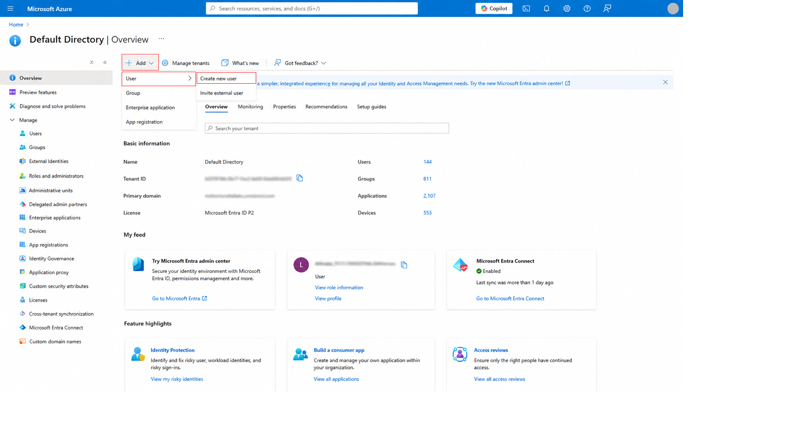

**User Account Configuration**

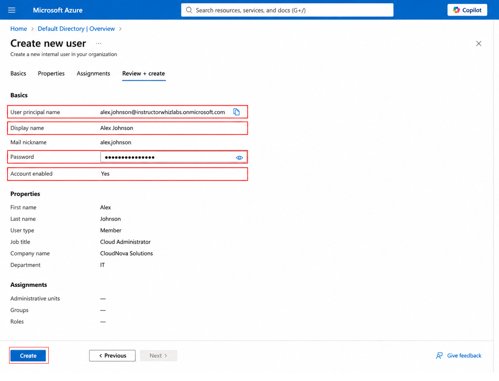

**Security Groups**

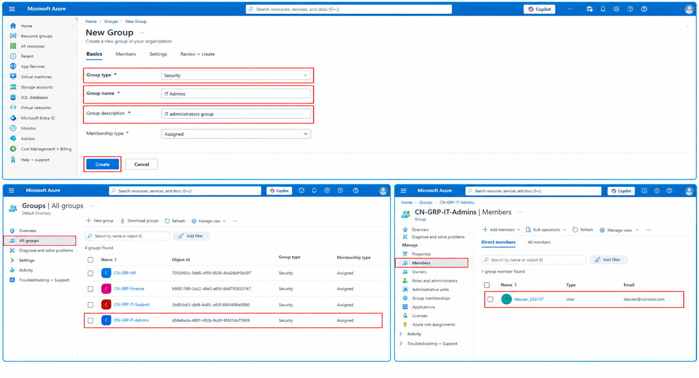

---

## 2. Azure Role-Based Access Control (RBAC)

Configured Azure RBAC to provide least-privilege access based on CloudNova job responsibilities.

**Role assignments:**
- IT Administrators → **Contributor**
- IT Support → **Reader**
- Finance → **Cost Management Reader**

### Evidence

**IT Administrators – Contributor**

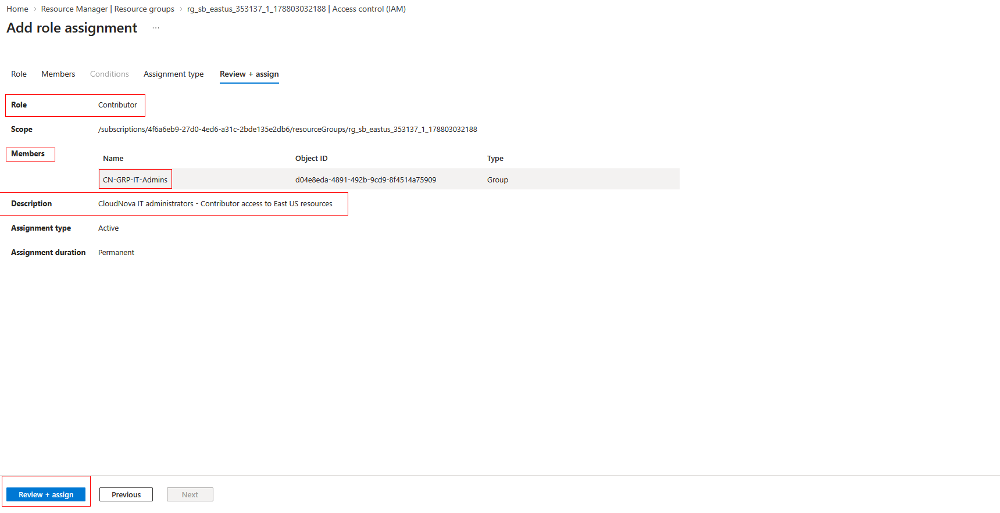

**IT Support – Reader**

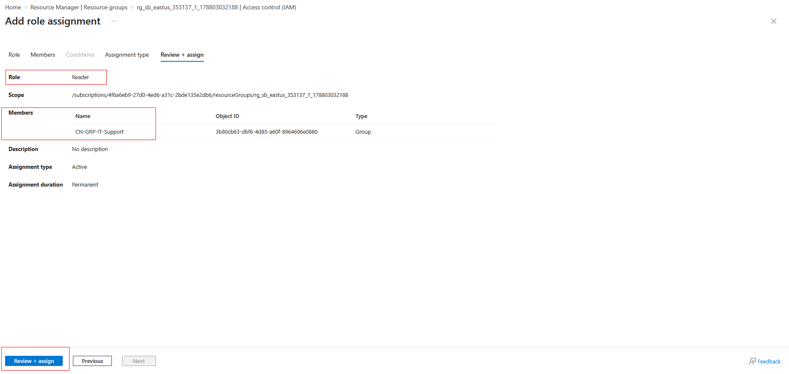

**Finance – Cost Management Reader**

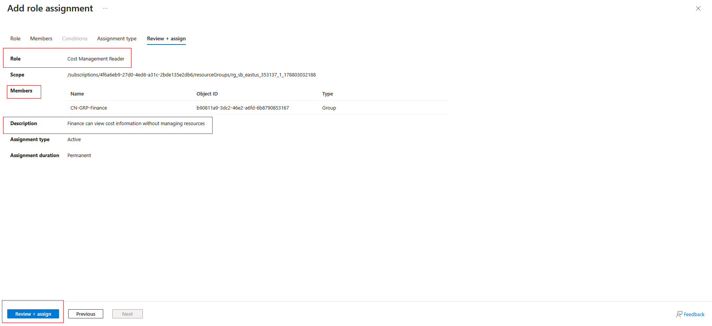

---

## 3. Azure Resource Groups and Resource Tagging

Used resource groups and tags to organize CloudNova resources and apply consistent organizational metadata.

**Implemented:**
- Organized Azure resources using resource groups
- Applied organizational tags
- Used the `Department` tag for governance
- Verified tag configuration

### Evidence

**Resource Group Tags**

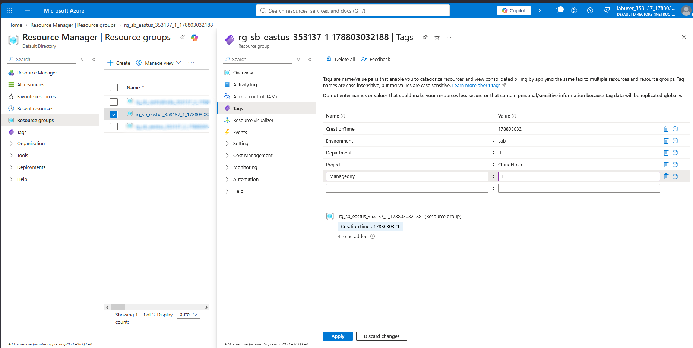

**Tag Validation**

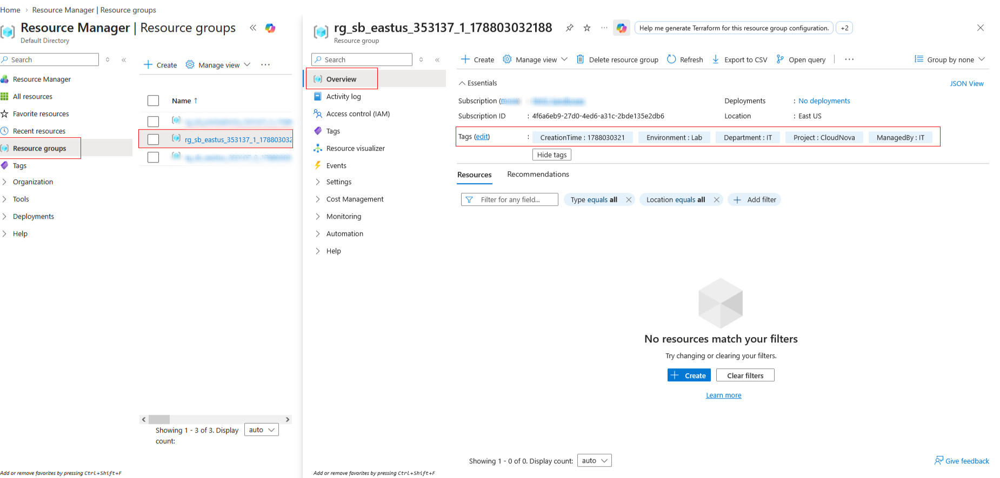

---

## 4. Azure Policy and Tag Enforcement

Implemented Azure Policy to require the `Department = IT` tag within the governed Azure scope.

**Implemented:**
- Assigned the required-tag policy
- Configured `Department = IT`
- Added a custom non-compliance message
- Tested a deployment without the required tag
- Verified that Azure Policy blocked the non-compliant deployment
- Added the required tag to satisfy the policy

### Evidence

**Policy Assignment Scope**

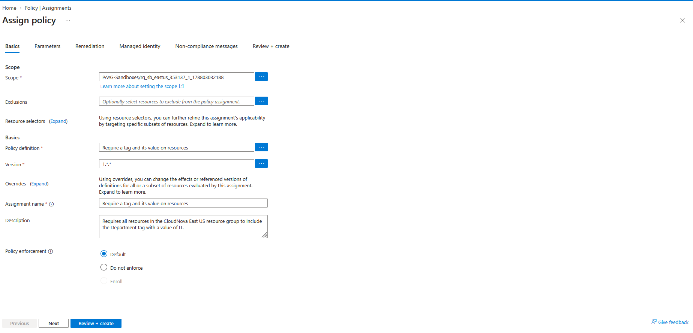

**Required Tag Parameters**

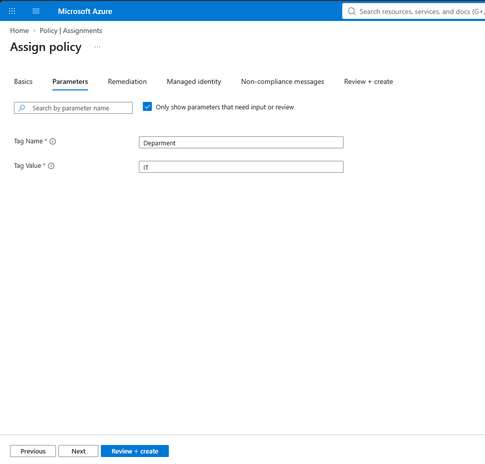

**Non-Compliance Message**

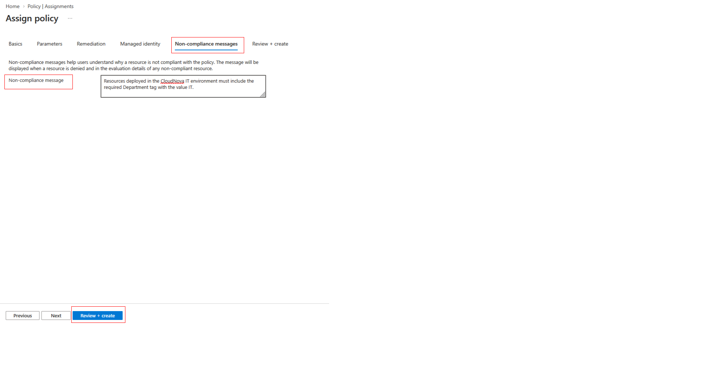

**Policy Enforcement**

Azure Policy blocked a resource configuration that did not meet the required tagging standard.

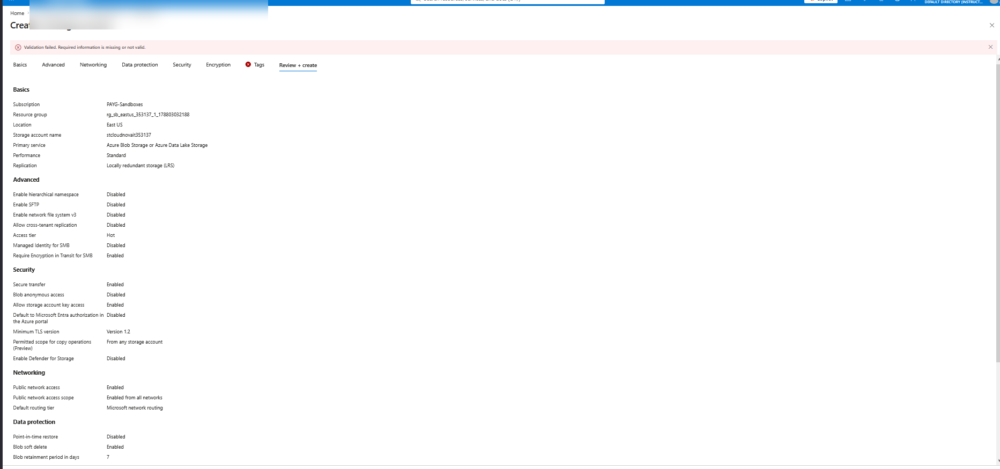

**Policy Compliance**

The required `Department = IT` tag was added to satisfy the policy requirement.

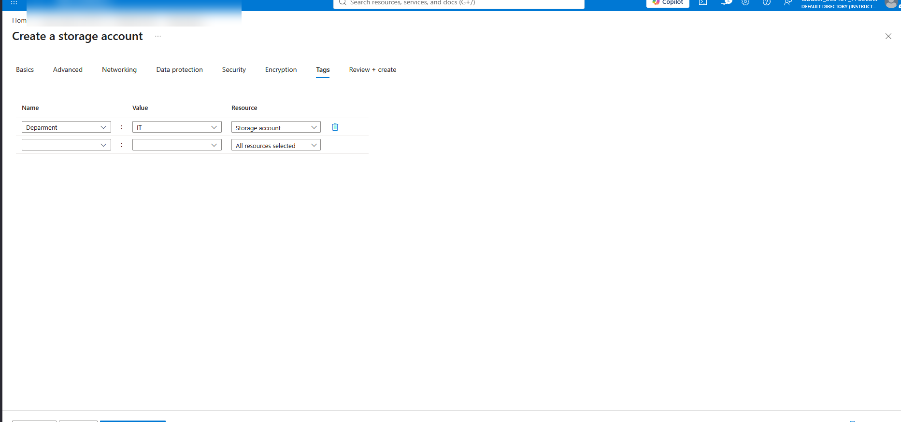

---

## 5. Azure Cost Management and Budgets

Configured Azure Cost Management to monitor CloudNova spending and establish budget notifications.

**Implemented:**
- Created a monthly Azure budget
- Configured a spending threshold
- Added an alert recipient
- Reviewed the completed budget configuration

### Evidence

**Budget Configuration**

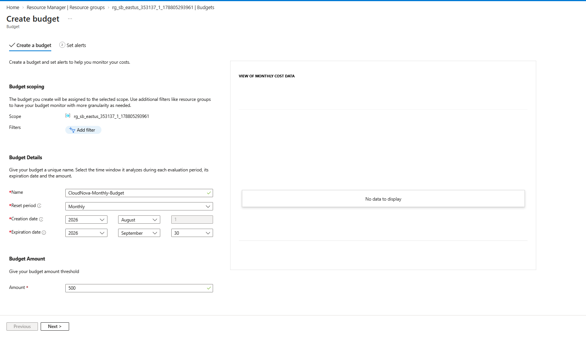

**Budget Alert**

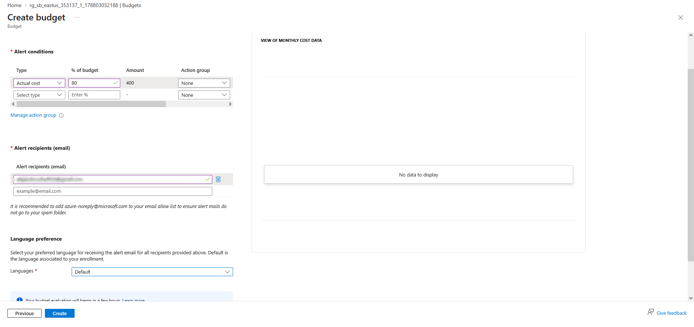

**Budget Validation**

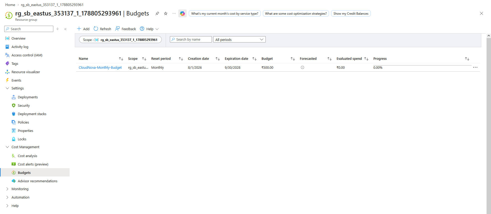

---

## 6. Azure Resource Locks

Implemented Azure Resource Locks to protect CloudNova production resources from accidental administrative changes and deletion.

**Implemented:**
- Configured a **Delete** lock
- Configured a **Read-only** lock
- Applied protection at the resource group scope
- Tested resource deletion while the scope was locked
- Verified that Azure blocked the deletion attempt

### Evidence

**Production Resource Locks**

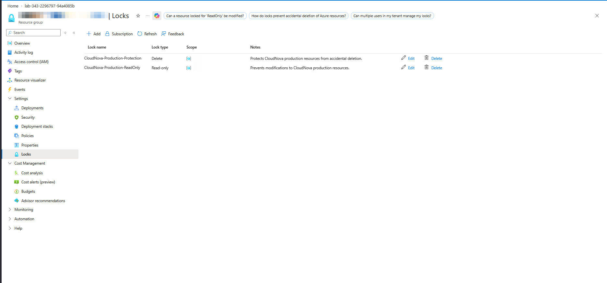

**Test Virtual Machine**

A virtual machine was deployed within the environment for resource-lock validation.

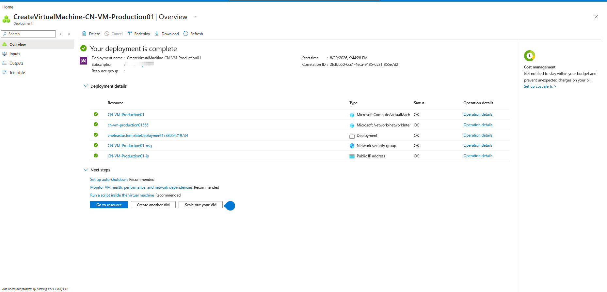

**Lock Validation**

Azure blocked the VM deletion attempt because the resource scope was protected by a resource lock.

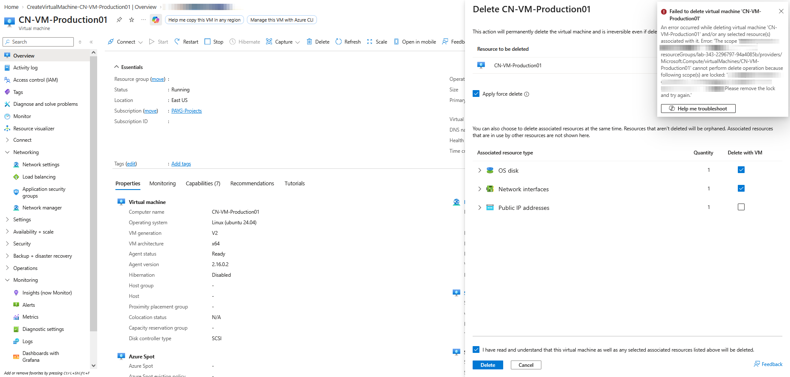

---

# Skills Demonstrated

- Microsoft Azure
- Microsoft Entra ID
- Azure Role-Based Access Control (RBAC)
- Azure Resource Groups
- Azure Resource Tagging
- Azure Policy
- Azure Cost Management
- Azure Resource Locks
- Least-Privilege Access
- Cloud Governance

---

## Project Summary

This project demonstrates hands-on experience implementing core Azure identity and governance controls, including access management, policy enforcement, cost monitoring, organizational tagging, and resource protection.
