# Azure Policy Governance and Compliance Project

## Project Overview

This project demonstrates the implementation of an Azure governance framework using Azure Policy.

The goal was to control where resources could be deployed, enforce required tagging standards, identify non-compliant resources, test policies safely before enforcement, remediate existing resources, and centralize multiple governance controls through a custom Policy Initiative.

The environment was built and validated hands-on in Microsoft Azure.

---

## Project Highlights

- Created separate compliant and non-compliant test environments for Azure Policy validation.
- Implemented an **Allowed Locations** policy restricting deployments to **East US**.
- Tested **Do Not Enforce** mode to evaluate compliance without blocking deployments.
- Enabled policy enforcement and validated a blocked deployment in **West US 2**.
- Implemented a mandatory **Environment** tag policy and validated denial of resources missing the required tag.
- Configured a **Modify** policy and remediation task to automatically inherit the `Environment` tag from the resource group.
- Used a **system-assigned managed identity** to support policy remediation.
- Created a custom **Corporate Governance Initiative** combining location, tagging, and storage security controls.
- Added custom non-compliance messages to provide clear remediation guidance.
- Validated centralized compliance reporting across multiple policies and resources.

---

## Business Scenario

A company has multiple teams deploying Azure resources across a shared subscription.

Without centralized governance, teams could:

- Deploy resources in unapproved Azure regions.
- Create resources without required business tags.
- Introduce inconsistent configurations.
- Create configuration drift over time.
- Require administrators to manually identify and correct governance violations.

The organization needed a centralized governance framework that could automatically evaluate, enforce, and remediate resource configuration standards.

---

## Business Requirements

The governance solution needed to:

- Restrict resource deployments to approved Azure regions.
- Require standardized resource tagging.
- Detect non-compliant resources.
- Test governance controls before fully enforcing them.
- Automatically remediate selected configuration issues.
- Provide centralized compliance visibility.
- Group multiple governance controls into a single assignable policy initiative.

- ---

## Azure Resources and Services Used

- Azure Policy
- Policy Assignments
- Policy Initiatives
- Policy Compliance and Remediation
- Managed Identities
- Resource Groups
- Storage Accounts
- Azure Tags

  ---

## Architecture and Governance Scope

```text
Azure Subscription
│
├── RG-Policy-Compliant
│   ├── Environment = Production
│   └── Department = IT
│
└── RG-Policy-NonCompliant
    ├── Policy testing
    ├── Non-compliant deployments
    └── Remediation validation
```

---

# Implementation

## 1. Created the Governance Test Environment

Two resource groups were created to support controlled governance testing:

- `RG-Policy-Compliant`
- `RG-Policy-NonCompliant`

The compliant resource group was configured with:

```text
Environment = Production
Department = IT
```

### Validation

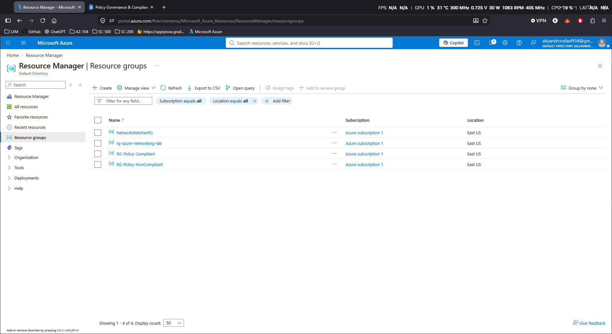

## 2. Implemented Allowed Locations Policy

The built-in Azure Policy definition:

`Allowed locations`

was assigned with:

```text
Allowed location = East US
```

### Validation

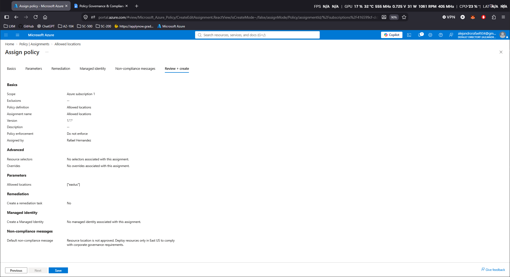

## 3. Tested Do Not Enforce vs Enforced Policy

A test storage account was deployed in:

```text
West US 2
```
### Validation

The first validation step used `Do Not Enforce` mode. A storage account was intentionally deployed in `West US 2`, which violated the approved-region requirement, but the deployment was still allowed to complete.

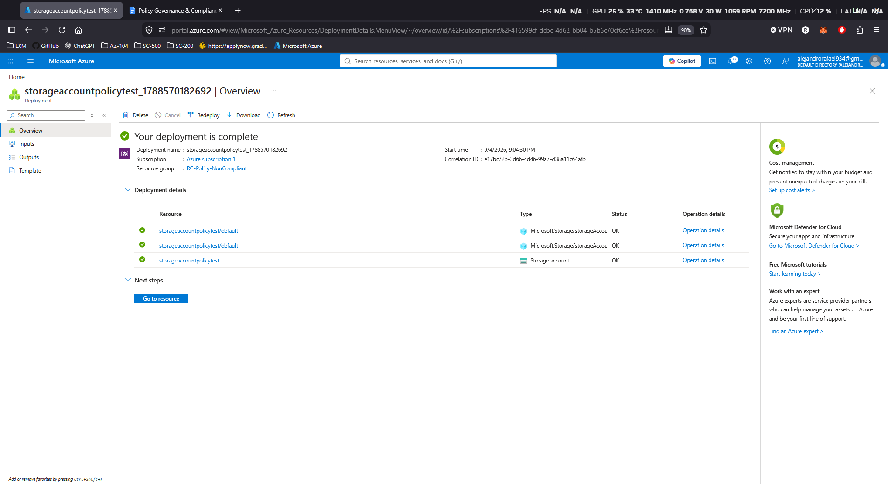

Azure Policy then evaluated the deployed resource and identified it as non-compliant with the `Allowed locations` policy.

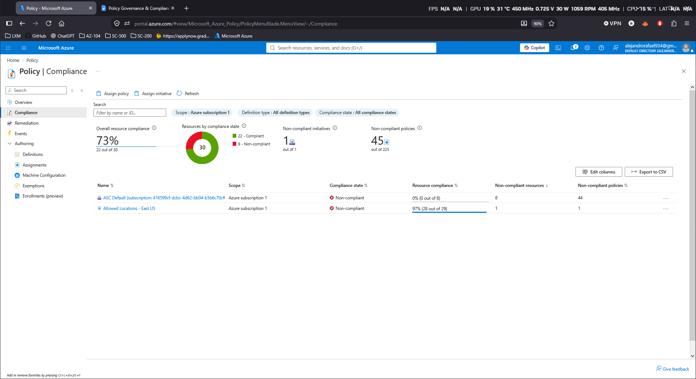

The resource-level compliance details confirmed that the storage account violated the location restriction because it was deployed outside the approved `East US` region.

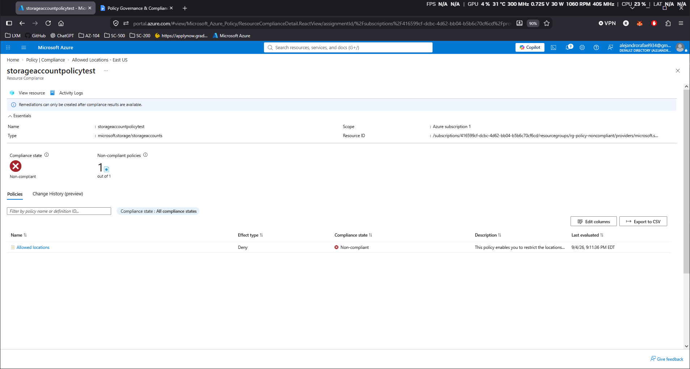

After validating the policy safely, enforcement was enabled. A new deployment attempt in `West US 2` was immediately rejected by Azure Policy.

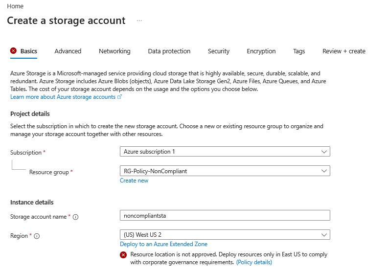

The final validation error confirmed that the deployment failed specifically because the resource location did not meet the corporate governance requirement.

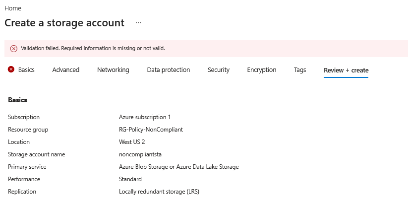

## 4. Implemented Mandatory Environment Tagging

The built-in Azure Policy definition:

`Require a tag on resources`

was assigned to the test resource group.

The required tag was configured as:

```text
Environment
```

### Validation

The `Require a tag on resources` policy was assigned to the test resource group with `Environment` configured as the required tag.

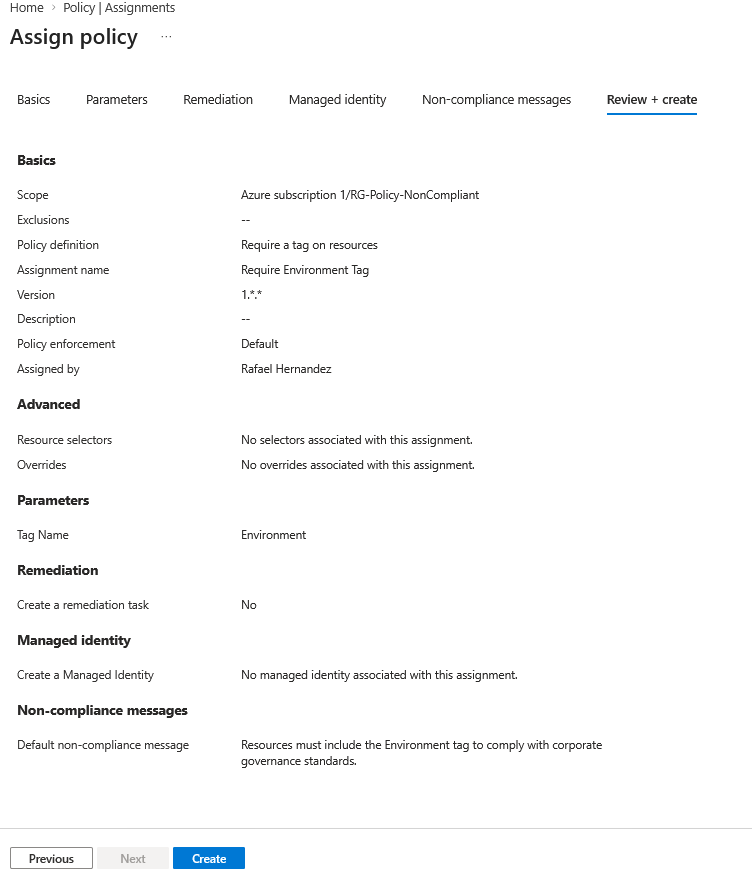

A storage account was then created without the required `Environment` tag. Azure Policy evaluated the request during deployment and blocked it because the required governance metadata was missing.

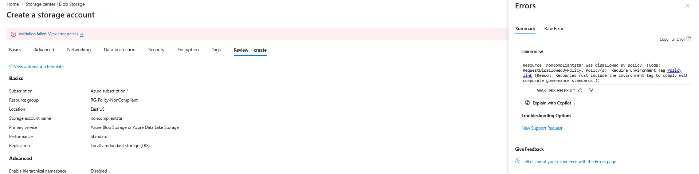

This confirmed that the tagging policy was actively enforcing resource metadata standards at deployment time.

## 5. Configured Tag Remediation

The resource group `RG-Policy-NonCompliant` was configured with:

```text
Environment = Development
```
### Validation

The resource group configuration confirmed that `Environment = Development` was available as the source tag for inheritance.

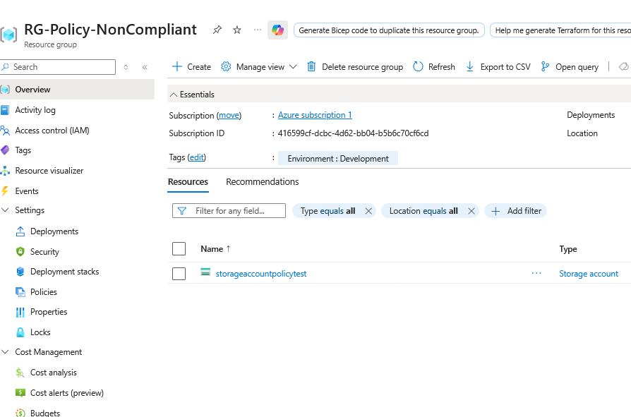


## 6. Created a Corporate Governance Initiative

A custom Azure Policy Initiative was created and named:

`Corporate Governance Initiative`

The purpose of the initiative was to group multiple governance controls into a single framework that could be assigned and monitored together.

The initiative included:

```text
Corporate Governance Initiative
├── Allowed locations
├── Require a tag on resources
├── Require a tag and its value on resources
└── Storage accounts should prevent shared key access
```

### Validation

The initiative configuration confirmed that all four policy definitions were grouped into the `Corporate Governance Initiative`.

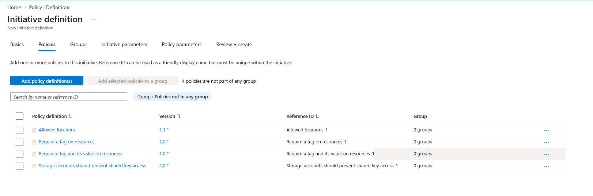

The completed initiative definition confirmed the initiative name, category, and included governance policies before assignment.

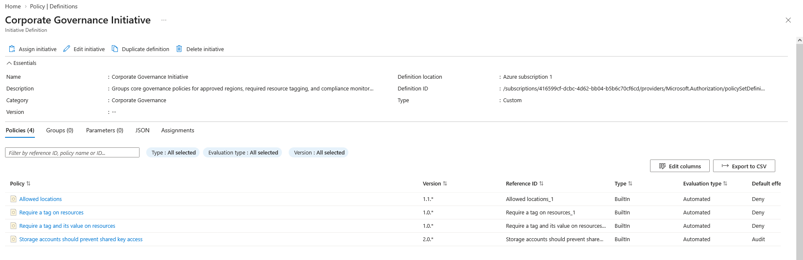

## 7. Added Custom Non-Compliance Messages

Custom non-compliance messages were configured for the initiative policies so users could clearly understand why a resource failed governance checks.

Examples included:

```text
Resource location is not approved. Deploy resources only in East US.
```
### Validation

The initiative assignment confirmed that each included policy had a custom non-compliance message configured to explain the specific governance violation.

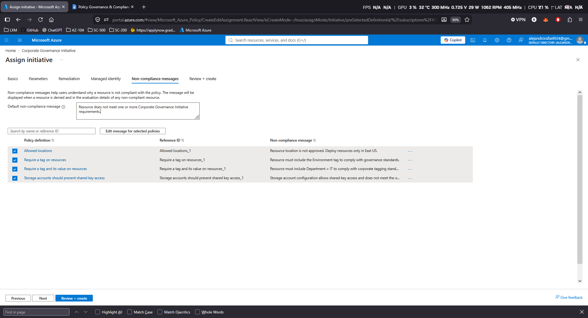


## 8. Assigned and Validated the Corporate Governance Initiative

The `Corporate Governance Initiative` was assigned to:

`RG-Policy-NonCompliant`

This allowed all four governance controls to be evaluated together at a single scope.

Azure Policy compliance reporting then identified the existing storage account as non-compliant with multiple controls, including:

- Deployment outside the approved `East US` region.
- Missing `Department = IT`.
- Shared key access still enabled.

The `Environment` tag requirement was already compliant because the earlier remediation task had successfully added:

```text
Environment = Development
```

### Validation

The centralized assignments view confirmed that the individual policy assignments and the `Corporate Governance Initiative - Test Scope` assignment were active within the governance environment.

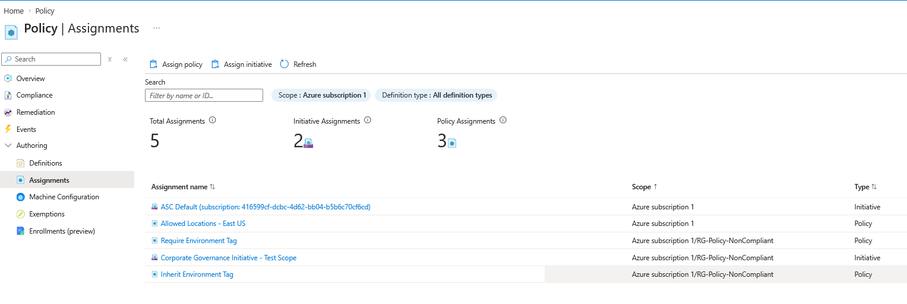

Azure Policy then evaluated both storage accounts against the four policies in the initiative. The results showed that one resource was compliant while the original test resource remained non-compliant with several controls.

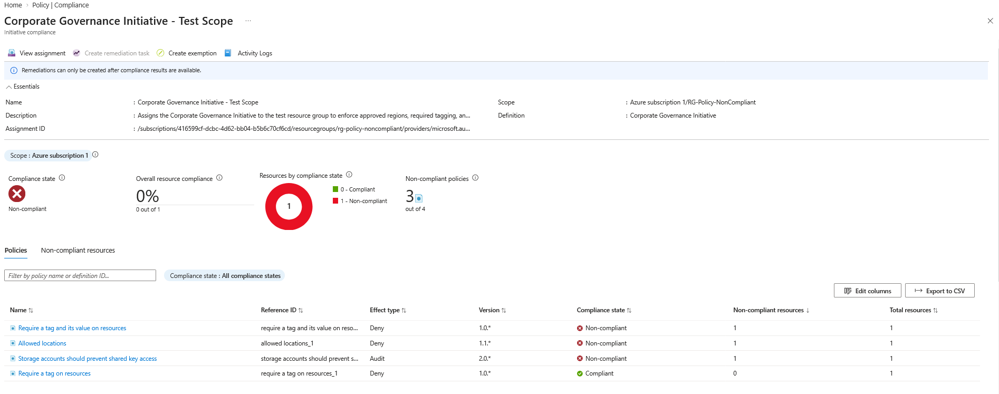

The final compliance view showed **50% resource compliance**, with one compliant resource and one remaining non-compliant resource. The original `storageaccountpolicytest` in `West US 2` was clearly identified as the remaining governance exception.

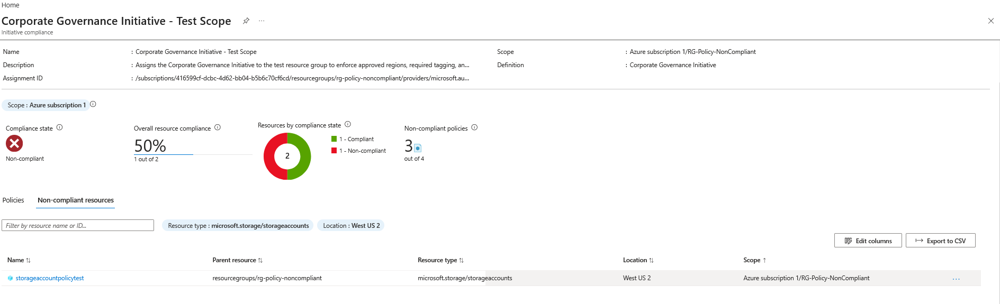

This final validation demonstrated centralized compliance monitoring across multiple policies and resources within a single Azure Policy Initiative.

## Project Summary

This project demonstrated the design and implementation of an Azure Policy governance framework for enforcing organizational standards across Azure resources.

The solution included approved-region enforcement, mandatory resource tagging, safe policy testing with `Do Not Enforce`, active denial of non-compliant deployments, automated remediation using the `Modify` effect, and centralized governance through a custom Policy Initiative.

The final environment showed how Azure Policy can detect, prevent, remediate, and centrally monitor compliance issues across multiple resources while reducing manual administrative effort.
