# Enterprise RBAC & Identity Lifecycle Project | Microsoft Azure

<p align="center">
  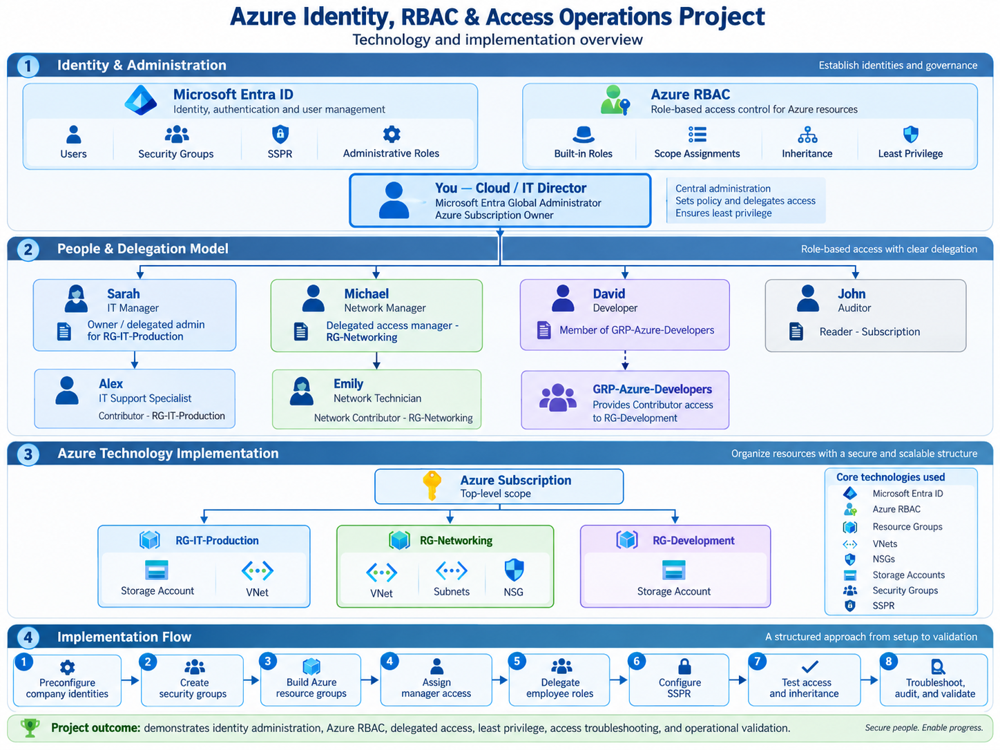
</p>

## Project Overview

This project role-plays an existing small-business Microsoft Azure environment in which the organization, employees, Microsoft Entra identities, Azure subscription, departmental resource groups, and supporting resources are treated as already established.

The required users, groups, resource groups, and test resources were preconfigured as lab prerequisites so the project could focus on the day-to-day operational responsibilities of an Azure Administrator rather than basic environment creation.

The project was structured around simulated business tickets, access requests, employee changes, troubleshooting cases, and security incidents.

Each department participated in its own role-play scenario involving managers, employees, Azure RBAC permissions, and departmental resources.

Where appropriate, I signed in using the relevant manager and employee accounts to validate that permissions worked from the user's perspective rather than relying only on administrator-side IAM configuration.

The objective was to simulate realistic identity and access operations while maintaining least privilege, controlled delegation, separation of duties, and auditable access management.

---

## Project Highlights

- Implemented Azure RBAC across subscription and resource-group scopes using Owner, Contributor, Network Contributor, and Reader.
- Configured delegated administration with RBAC conditions limiting which roles department managers could assign and to whom.
- Performed separate operational role-play scenarios for IT Production, Networking, and Development.
- Tested IT Production resource access through a storage-related employee scenario.
- Tested Networking permissions through Network Security Group administration.
- Implemented Microsoft Entra security-group-based access for Development.
- Validated permissions using the relevant manager and employee accounts.
- Configured and tested Microsoft Entra Self-Service Password Reset.
- Simulated employee onboarding, department transfer, offboarding, soft deletion, restoration, and return to work.
- Investigated excessive privilege and suspicious administrative activity through Azure Activity Log.
- Troubleshot hidden effective access caused by simultaneous direct and group-based role assignments.
- Performed final subscription and departmental access reviews to confirm least privilege.

---

## Business Scenario

The organization is a small business already operating in Microsoft Azure.

The company maintains three operational departments:

- IT Production
- Networking
- Development

Each department has a manager responsible for its Azure resources and employees who require different levels of access.

Normal administrative work begins through simulated tickets, access requests, employee changes, or incidents.

Department managers handle approved operational requests within their delegated authority, while the Azure Administrator maintains final responsibility for subscription-level governance and privileged access.

An independent auditor also has read-only access to review permissions and administrative activity.

The project demonstrates how these responsibilities interact during normal business operations as well as during security incidents and employee lifecycle events.

---

## Environment and Roles

| Identity | Business Role | Azure / Entra Responsibility |
|---|---|---|
| Rafael | Cloud / IT Director / Azure Administrator | Subscription Owner and final authority for access and governance |
| Cloud Admin | Microsoft Entra Administrator | Identity, authentication, and Entra administration |
| Sarah | IT Manager | Manages `RG-IT-Production` |
| Alex | IT Support Specialist | Contributor access to `RG-IT-Production` |
| Michael | Network Manager | Manages `RG-Networking` |
| Emily | Network Technician | Network Contributor within `RG-Networking` |
| David | Developer | Development access through `GRP-Azure-Developers` |
| Chris | Employee / Department Transfer | Initially Development, later transferred to Networking |
| John | Auditor | Subscription Reader for independent access reviews |

---

## Departmental Azure Structure

```text
Azure Subscription
│
├── RG-IT-Production
│   ├── Sarah — Owner / Delegated Manager
│   └── Alex — Contributor
│
├── RG-Networking
│   ├── Michael — Owner / Delegated Manager
│   └── Emily — Network Contributor
│
└── RG-Development
    └── GRP-Azure-Developers — Contributor
        ├── David
        └── Chris

John — Reader at Subscription
Rafael — Owner at Subscription
```

## 1. IT Production Department Role-Play

A simulated operational request required the IT Production team to manage resources within its departmental resource group.

Instead of giving the IT Manager unrestricted subscription-level control, Sarah received scoped administrative authority over `RG-IT-Production`.

Her Owner role included an Azure RBAC condition that restricted her role-assignment authority so that she could delegate only the approved Contributor role to the appropriate IT employee.


Sarah then delegated Contributor access to Alex, the IT Support Specialist.

The scenario moved beyond reviewing IAM from the administrator account. The relevant employee account was used to validate that Alex could actually work with the IT Production resources available to him.

A storage-related administrative scenario was used to verify that his Contributor access functioned as expected while remaining scoped to the IT Production environment.

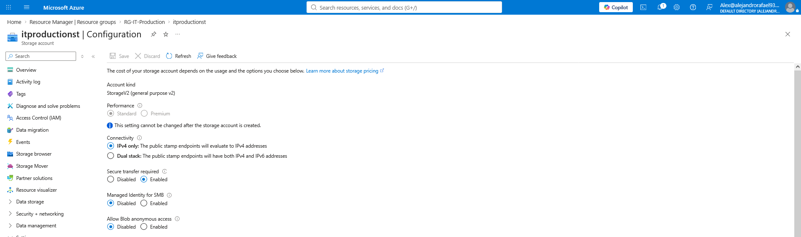

### Outcome

The IT Production role-play demonstrated:

- ticket-driven access administration
- scoped departmental ownership
- controlled RBAC delegation
- Contributor-level employee access
- storage-resource access validation
- least-privilege administration

- ---

## 2. Networking Department Role-Play

A simulated Networking access request required the department to manage network resources within `RG-Networking`.

Michael, acting as Network Manager, received scoped administrative responsibility for the Networking resource group.

His delegated authority was restricted so that he could manage approved Networking access without receiving unrestricted control over the Azure subscription.

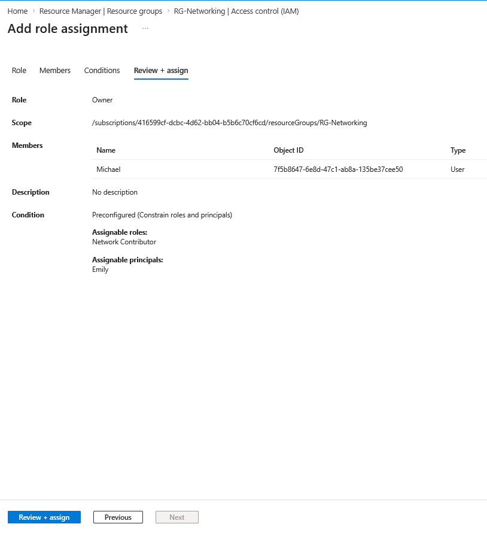

Emily, acting as Network Technician, received Network Contributor access appropriate to her responsibilities.

The scenario then moved from IAM configuration into a real Networking task.

Using Emily's account, Network Security Group permissions were tested directly to verify that she could work with NSG rules and perform the expected Networking administration within her assigned scope.

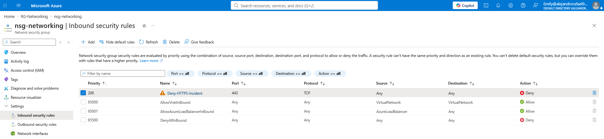

### Outcome

The Networking role-play demonstrated:

- delegated departmental administration
- Network Contributor RBAC
- Network Security Group administration
- validation from the assigned employee account
- scoped network permissions
- least-privilege access

---

## 3. Development Department Role-Play

The Development department used a group-based access model instead of assigning Contributor directly to every developer.

A Microsoft Entra security group named `GRP-Azure-Developers` was used to manage Development access centrally.

The group received Contributor access to `RG-Development`.

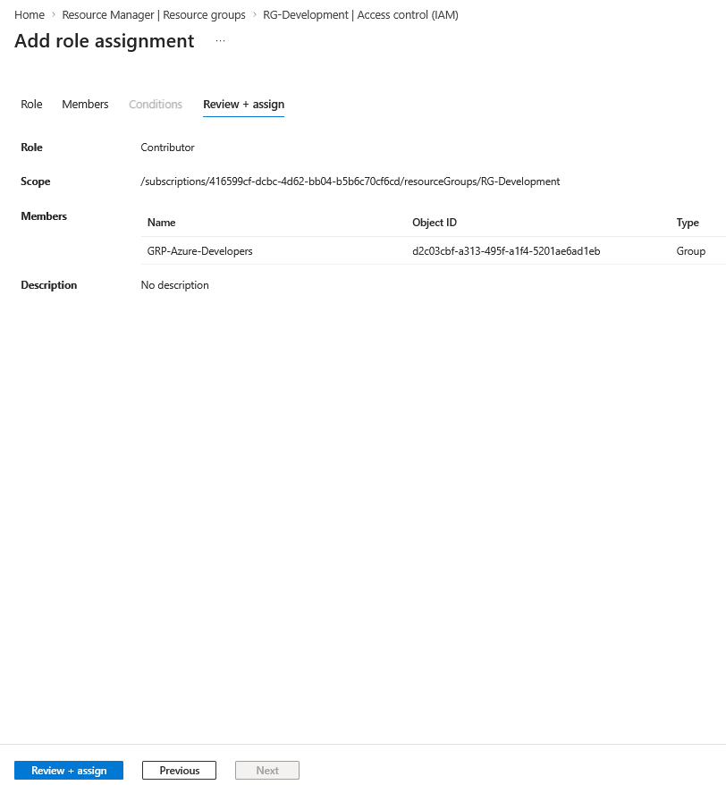

Chris was added to the Development group and his effective access was reviewed to confirm that his Contributor permission came through `GRP-Azure-Developers`.

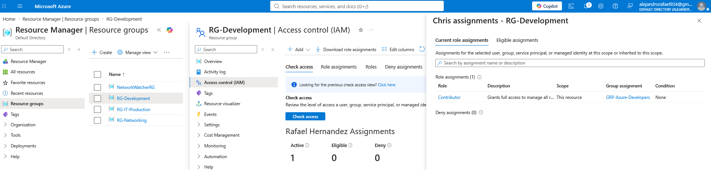

This model allowed Development access to be controlled through group membership rather than repeated individual Azure RBAC assignments.

The relevant developer accounts were also used during the project to validate that the assigned group-based permissions worked as intended from the employee perspective.

### Outcome

The Development role-play demonstrated:

- Microsoft Entra security groups
- group-based Azure RBAC
- scalable access management
- effective-access validation
- simplified onboarding and access removal
- least-privilege administration

---

## 4. Self-Service Password Reset Role-Play

A password-recovery scenario was introduced so that employees could recover access without requiring an administrator to manually reset every forgotten password.

Self-Service Password Reset was enabled for a selected Microsoft Entra group rather than being enabled for the entire tenant.

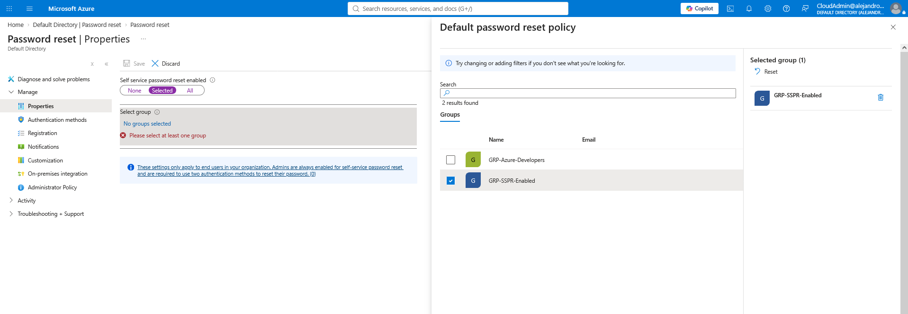

Approved authentication methods were configured for the recovery process.

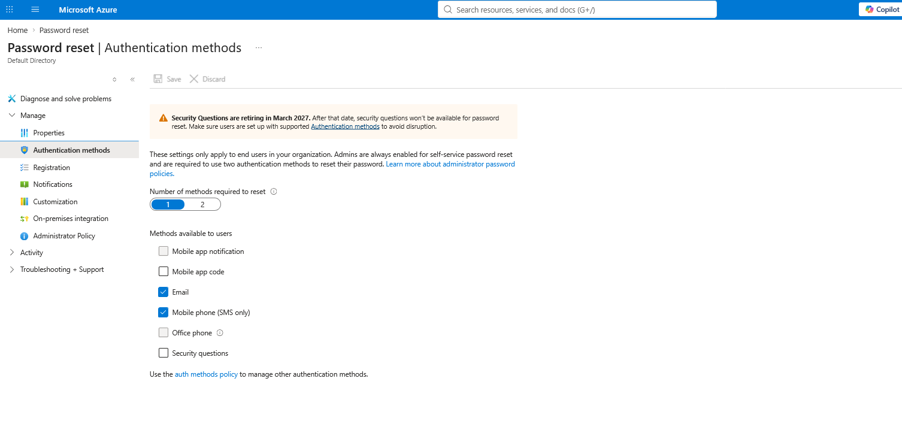

The password-reset workflow was then tested from the user perspective.

The identity-verification process was completed and Microsoft confirmed that the password reset succeeded.


### Outcome

The SSPR role-play demonstrated:

- scoped SSPR deployment
- user authentication-method configuration
- self-service password recovery
- successful end-user validation
- reduced administrator dependency for routine password resets

  ---

## 5. Employee Department Transfer — Chris

Chris originally worked in the Development department and received Contributor access to `RG-Development` through membership in `GRP-Azure-Developers`.

A simulated employee-change request then transferred Chris from Development to Networking.

As part of the transfer, his Development access was removed so that he would not retain permissions that were no longer required for his job.

Chris was then granted Network Contributor access to `RG-Networking`.

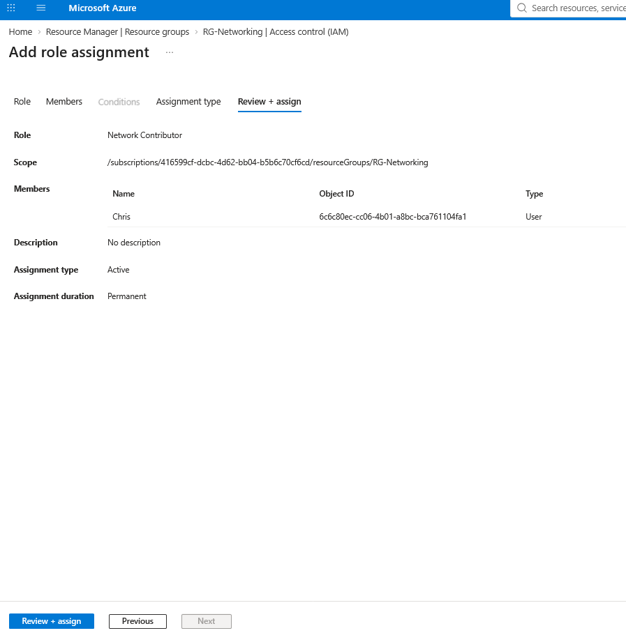

The new permissions were validated to confirm that his access now matched his Networking responsibilities.

### Outcome

The department-transfer role-play demonstrated:

- employee lifecycle access changes
- removal of outdated departmental permissions
- assignment of new role-based access
- prevention of unnecessary access accumulation
- least-privilege access after a job-role change

---

## 6. Excessive Privilege Incident — Emily

A security incident was intentionally introduced to demonstrate the risk of assigning permissions at the wrong Azure scope.

Emily normally required only Network Contributor access within `RG-Networking`.

She was instead granted Owner at the Azure subscription scope.

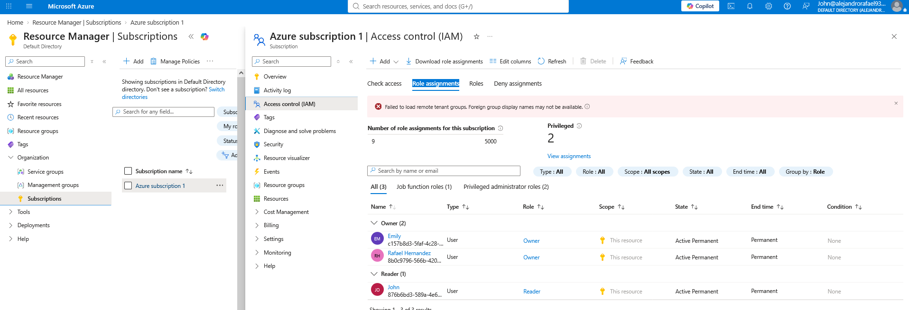

Because Azure RBAC permissions inherit downward, the subscription-level Owner assignment gave Emily authority far beyond the Networking department.

The subscription Activity Log was reviewed to investigate how the elevated role had been granted.


While operating with excessive permissions, Emily performed administrative activity outside her normal departmental responsibilities.

David noticed unexpected activity at the subscription level and raised the issue for investigation.

The Azure Activity Log showed activity involving the unauthorized `rg-eastus` resource group and identified Emily as the initiator.

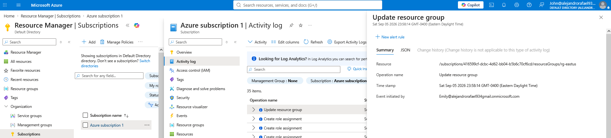

Additional administrative activity demonstrated the wider blast radius created by the subscription-level Owner assignment.

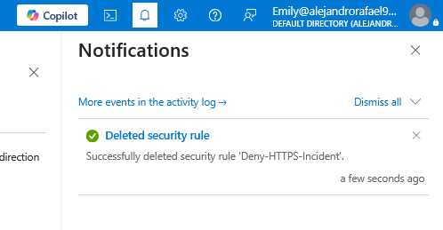

After the incident was confirmed, Emily's excessive subscription-level Owner role was removed.


### Outcome

The excessive-privilege role-play demonstrated:

- RBAC scope inheritance
- excessive privilege risk
- unauthorized activity outside a normal departmental scope
- employee detection and escalation
- Azure Activity Log investigation
- administrative attribution
- privilege remediation
- restoration of least privilege

---

## 7. Hidden Access Troubleshooting — David

A troubleshooting scenario was intentionally created to demonstrate how Azure effective access can come from more than one permission path.

David already received Contributor access to `RG-Development` through membership in `GRP-Azure-Developers`.

A second direct Contributor role assignment was intentionally added to David.

This created two independent access paths:

```text
David
│
├── Contributor — Direct assignment
│
└── Contributor — GRP-Azure-Developers
```

Azure IAM showed both assignments.

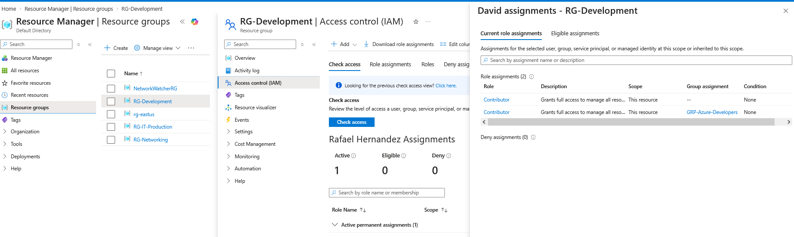

The simulated support issue stated that David's direct access had been removed.

The direct Contributor assignment was selected for removal.

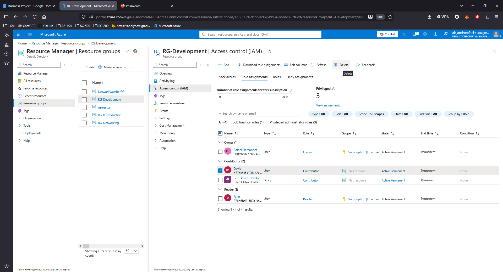

After the direct assignment was removed, David still retained Contributor access.

Investigation of his effective access showed that the remaining permission was coming through membership in `GRP-Azure-Developers`.

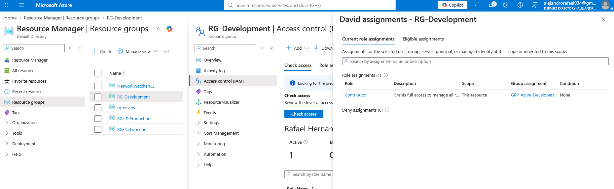

### Outcome

The hidden-access troubleshooting role-play demonstrated:

- direct RBAC assignments
- group-based RBAC assignments
- effective-access investigation
- hidden permission paths
- why removing one role assignment may not remove all access
- the importance of checking group membership and inherited permissions

---

## 8. Employee Offboarding and Return — David

David was then used for a complete employee offboarding and return-to-work scenario.

When David left the organization, his access was removed and his Microsoft Entra account was secured.

The account was disabled and active sign-in sessions were revoked.


His account was then deleted from Microsoft Entra ID.

Because recently deleted users remain recoverable temporarily, David appeared under Deleted users during the soft-delete retention period.

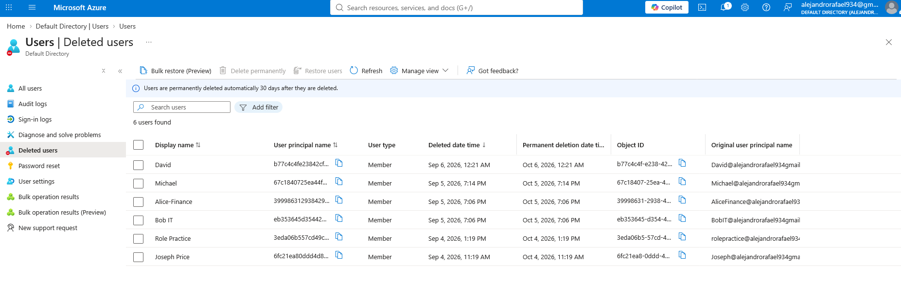

Shortly afterward, the business scenario changed:

David regretted leaving and returned to the company.

Because his original Microsoft Entra identity was still recoverable, the existing account was restored instead of creating an entirely new identity.

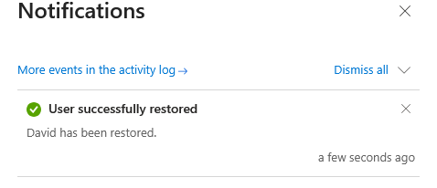

His Development access was then validated again through `GRP-Azure-Developers`.

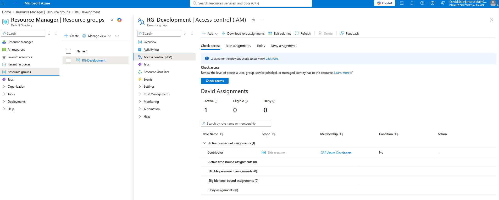

### Outcome

The employee lifecycle role-play demonstrated:

- employee offboarding
- access removal
- account disabling
- active-session revocation
- Microsoft Entra user deletion
- soft-delete recovery
- employee return / rehire
- restoration of appropriate group-based access

---

## 9. Final Audit and Governance Review

After the departmental role-plays, access changes, troubleshooting cases, and security incidents were completed, a final governance review was performed.

The Azure subscription was reviewed to verify that unnecessary privileged assignments had been removed.

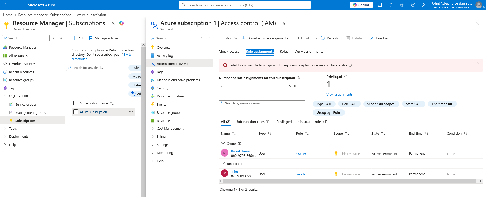

The Networking resource group was reviewed to confirm the intended departmental roles and inherited subscription access.


The Development resource group was reviewed to verify the intended group-based Contributor access model.

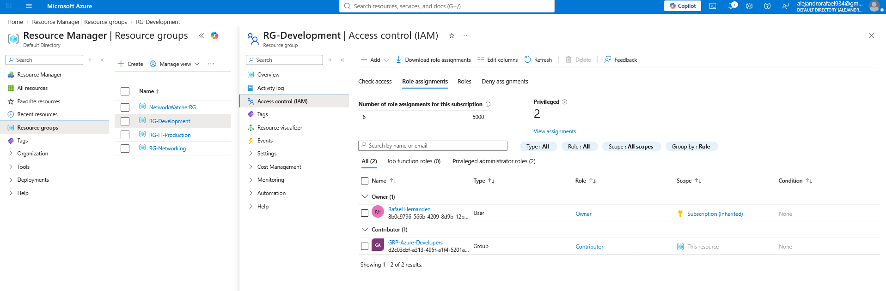

### Outcome

The final audit confirmed that the environment had returned to the intended least-privilege access model after all simulated operational events.

---

## Operational Workflow Demonstrated

Throughout the project, administrative work followed a realistic operational pattern:

```text
Business Request / Ticket
        ↓
Identify User or Department
        ↓
Determine Required Azure Scope
        ↓
Select Least-Privilege Role
        ↓
Assign or Delegate Access
        ↓
Validate Using Relevant Account
        ↓
Troubleshoot Effective Access
        ↓
Review Activity Logs When Needed
        ↓
Remediate Excessive Permissions
        ↓
Audit Final Environment
```

## Project Summary

This project simulated the day-to-day identity, access, and governance responsibilities of an Azure Administrator operating within an established small-business Azure environment.

Through departmental role-plays, simulated access requests, employee lifecycle events, troubleshooting scenarios, and security incidents, the project demonstrated how Azure RBAC and Microsoft Entra ID are used to manage access in realistic operational situations.

The project covered the full access-management lifecycle, including delegated administration, group-based access, password recovery, department transfers, excessive privilege remediation, hidden-access troubleshooting, offboarding, account restoration, and final governance review.

---

## Key Takeaways

This project reinforced that Azure access can come from multiple paths, including direct role assignments, group membership, inherited permissions, and the scope where RBAC is applied. It also demonstrated the importance of applying least privilege, validating effective access, using group-based access where appropriate, limiting delegated administrative authority, reviewing Azure Activity Logs during investigations, removing outdated or excessive permissions, and keeping employee access aligned with current business responsibilities throughout the identity lifecycle.
