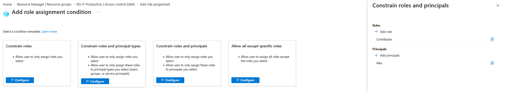
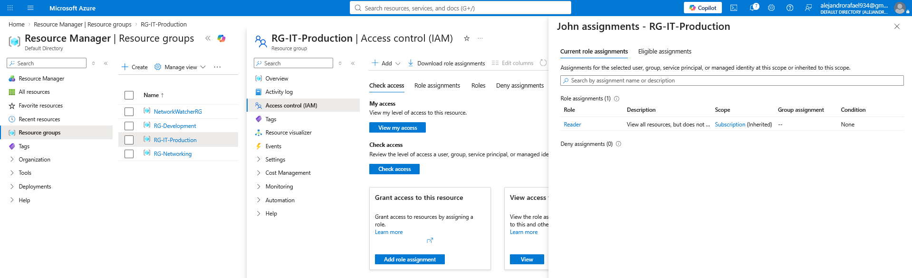
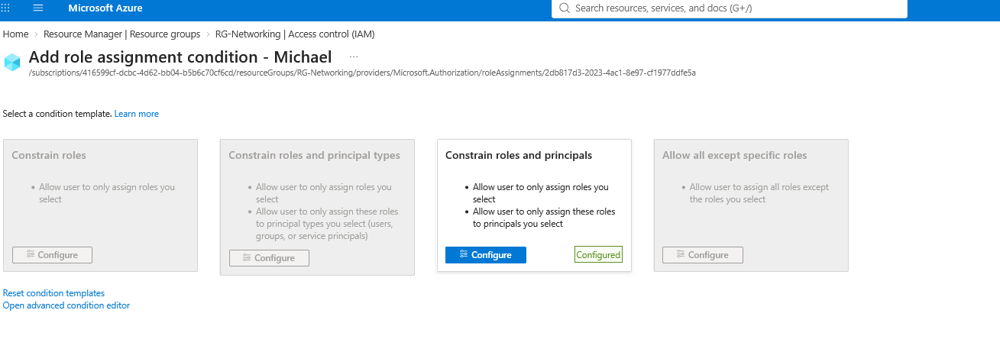
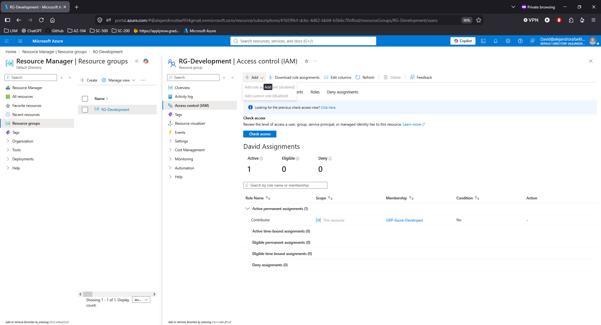
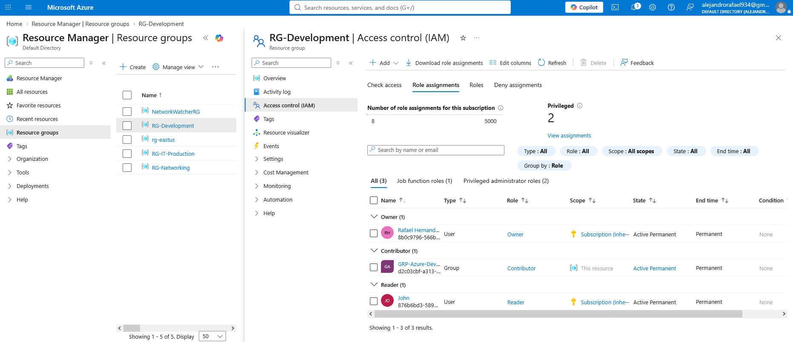
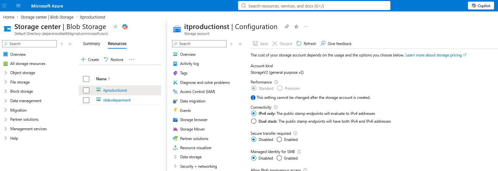
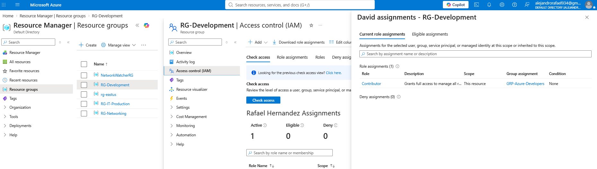
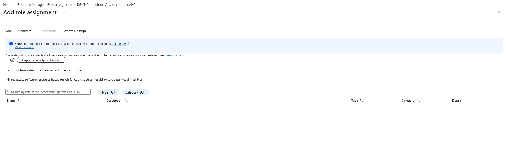
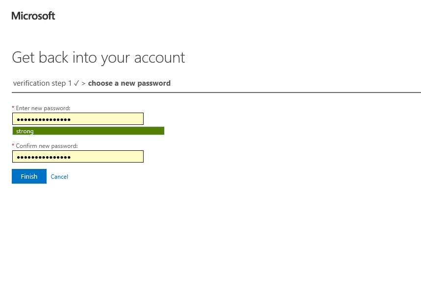
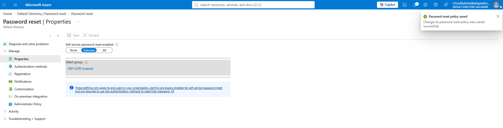

#  Enterprise RBAC & Identity Lifecycle Project | Microsoft Azure

## Project Overview

This project role-plays an existing small-business Azure environment in which the company, employees, Microsoft Entra identities, Azure subscription structure, resource groups, and supporting test resources are treated as already established.

To make the simulation possible, the required users, security groups, resource groups, and Azure resources were preconfigured as lab prerequisites. These setup activities are not the primary focus of the project.

The project instead focuses on the day-to-day responsibilities of an Azure Administrator operating within an active business environment. The goal was to simulate realistic identity, access, and governance operations rather than simply demonstrate how to create Azure resources.

Throughout the project, I responded to business requests, access changes, security incidents, and employee lifecycle events while applying least-privilege principles and validating the resulting permissions directly in Azure.

## Project Highlights

- Implemented scoped Azure RBAC across subscription and resource-group levels using Owner, Contributor, Network Contributor, and Reader roles.
- Configured delegated administration with Azure RBAC conditions to restrict which roles managers could assign and to whom.
- Used Microsoft Entra security groups for scalable group-based access and validated effective permissions through inheritance and membership.
- Configured and tested Self-Service Password Reset (SSPR) using registered authentication methods.
- Simulated employee onboarding, department transfer, offboarding, soft-delete recovery, and rehire scenarios.
- Investigated excessive privileges, hidden access paths, and administrative changes using IAM views and Azure Activity Log.

## Business Scenario

The organization is a small business already operating in Microsoft Azure. Its Microsoft Entra tenant, employee identities, Azure subscription, departmental resource groups, and supporting test resources are treated as part of an existing environment.

The company operates multiple departments, including IT Production, Networking, and Development. Managers are responsible for their departments, employees require different levels of Azure access, and an auditor independently reviews permissions and administrative activity.

As the Azure Administrator, I am responsible for maintaining secure access across the environment while responding to day-to-day operational events such as access requests, delegated administration, employee onboarding, department transfers, password recovery, excessive privilege incidents, offboarding, account restoration, and access reviews.

The objective is to support normal business operations while maintaining least privilege, separation of duties, controlled delegation, and auditable access management.

## Environment / Roles

| Identity | Business Role | Azure / Entra Responsibility |
|---|---|---|
| Rafael | Azure Administrator / Director | Subscription Owner and final authority for access and governance |
| Cloud Admin | Entra Administrator | Microsoft Entra identity and authentication administration |
| Sarah | IT Manager | Manages access to the IT Production environment |
| Alex | IT Employee | Contributor access to IT Production resources |
| Michael | Networking Manager | Manages access to the Networking environment |
| Emily | Network Technician | Network Contributor within the Networking resource group |
| Chris | Employee / Department Transfer | Initially onboarded to Development and later transferred to Networking |
| David | Developer | Receives Development access through Microsoft Entra security-group membership |
| John | Auditor | Subscription Reader responsible for reviewing access and administrative activity |

## Implementation / Role-Play Scenarios

### 1. Delegated RBAC Administration

Department managers were granted scoped Owner access with RBAC conditions that limited which roles they could assign and to which employees.

Sarah was given Owner access to `RG-IT-Production`, but her role-assignment capability was constrained so she could delegate only the Contributor role to Alex.

The final assignment confirmed that Sarah's administrative authority was scoped to the IT Production resource group.

Sarah could then assign Contributor access to Alex without receiving unrestricted role-assignment authority across the subscription.

The same delegation model was implemented for the Networking department. Michael received scoped Owner access to `RG-Networking`, with his delegation restricted to the Network Contributor role and approved employees.

Michael was then able to assign Network Contributor to Emily within the approved scope.

This demonstrated controlled administrative delegation while preserving least privilege.

---

### 2. Group-Based Development Access

Development access was managed through the `GRP-Azure-Developers` Microsoft Entra security group instead of assigning Contributor directly to every developer.

The security group was assigned Contributor at the `RG-Development` scope.

Developers could then be managed through group membership.

Chris was added to the Development security group as part of the employee onboarding scenario.

Azure IAM showed the Development resource group's final role assignments, including the security group as Contributor.

Effective access was then validated for Chris. Azure confirmed that his Contributor permission originated from `GRP-Azure-Developers`, rather than from a direct role assignment.

---

### 3. Self-Service Password Reset

Self-Service Password Reset was enabled for a selected Microsoft Entra security group rather than for the entire organization.

The password-reset policy was configured with approved authentication methods.

A phone authentication method was registered for the test user so SMS could be used during password recovery.

A forgotten-password scenario was then simulated. The user was required to verify their identity using the registered mobile phone.

After verification, the user was allowed to choose a new password.

Microsoft confirmed that the password reset completed successfully.

The user was then able to return to the Azure environment using the recovered account.

---

### 4. Employee Onboarding and Department Transfer

Chris was initially onboarded into Development and received Contributor access through membership in `GRP-Azure-Developers`.

Later, the business transferred Chris from Development to Networking.

As part of the transfer, his Development access was removed before new Networking permissions were granted.

Michael's delegated authority was updated to permit him to onboard Chris into the Networking environment.

Chris then received Active Permanent Network Contributor access to `RG-Networking`.

This demonstrated how access can follow an employee's changing business responsibilities without retaining unnecessary permissions from the previous department.
---

### 5. Excessive Privilege Incident

An intentional security incident was introduced by granting Emily Owner at the subscription scope.

Emily normally required only Network Contributor within `RG-Networking`, making the subscription-level Owner assignment an excessive privilege.

The broader permission demonstrated the potential blast radius of an incorrectly scoped privileged role.

Azure Activity Log was then used to investigate the administrative change and identify the role-assignment operation.

After the excessive privilege was identified, the subscription-level Owner assignment was removed.

Emily retained only the access required for her Networking responsibilities, restoring the environment to least privilege.

---

### 6. Hidden Access Troubleshooting

David was intentionally given both direct Contributor access and group-based Contributor access to `RG-Development`.

The direct role assignment was removed, but David still retained access.

Azure IAM **Check access** was used to investigate the remaining effective permission.

The investigation showed that David's remaining Contributor permission originated from `GRP-Azure-Developers`.

This demonstrated why removing a direct role assignment does not necessarily remove a user's effective Azure access when another access path still exists.

---

### 7. Offboarding and Account Recovery

David was later used for a complete employee offboarding scenario.

His Azure access and group memberships were removed, the Microsoft Entra account was disabled, and existing sign-in sessions were revoked.

David was then deleted from Microsoft Entra ID.

Because Microsoft Entra retains deleted users temporarily, the identity appeared under **Deleted users** during the soft-delete retention period.

A simulated rehire scenario was then introduced.

Instead of creating a new identity, David's existing Microsoft Entra account was restored.

This demonstrated both the offboarding lifecycle and recovery of a recently deleted employee identity.

---

### 8. Final Audit and Governance Review

After the operational scenarios were completed, John performed a final access review as the organization's auditor.

At the subscription scope, the final environment showed Rafael as Owner and John as Reader, with the temporary excessive privilege removed.

The Networking environment was then reviewed to verify departmental roles, inherited subscription permissions, and manager delegation.

Finally, the Development environment was reviewed to confirm that Contributor access continued to be managed through `GRP-Azure-Developers` while subscription-level permissions were inherited correctly.

The final audit confirmed that the environment returned to its intended least-privilege access model after all onboarding, transfer, troubleshooting, incident-response, offboarding, and recovery scenarios were completed.

## Project Summary

This project simulated the day-to-day identity and access responsibilities of an Azure Administrator working within an existing small-business Azure environment.

The project focused on secure access management, delegated administration, identity lifecycle operations, troubleshooting, auditing, and least-privilege governance across Microsoft Azure and Microsoft Entra ID.

## Key Takeaways

This project reinforced that Azure access can come from multiple paths, including direct role assignments, group membership, and inherited permissions.

It also demonstrated the importance of limiting privileged access, validating effective permissions, using controlled delegation, and maintaining a secure identity lifecycle from onboarding through offboarding and recovery.
