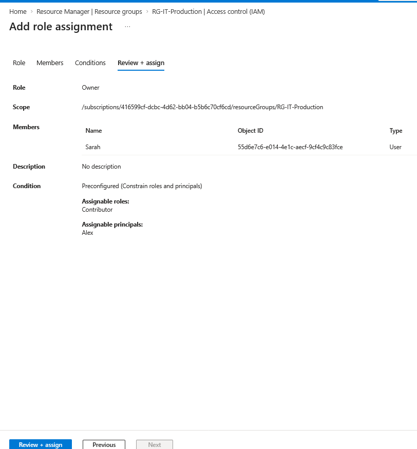
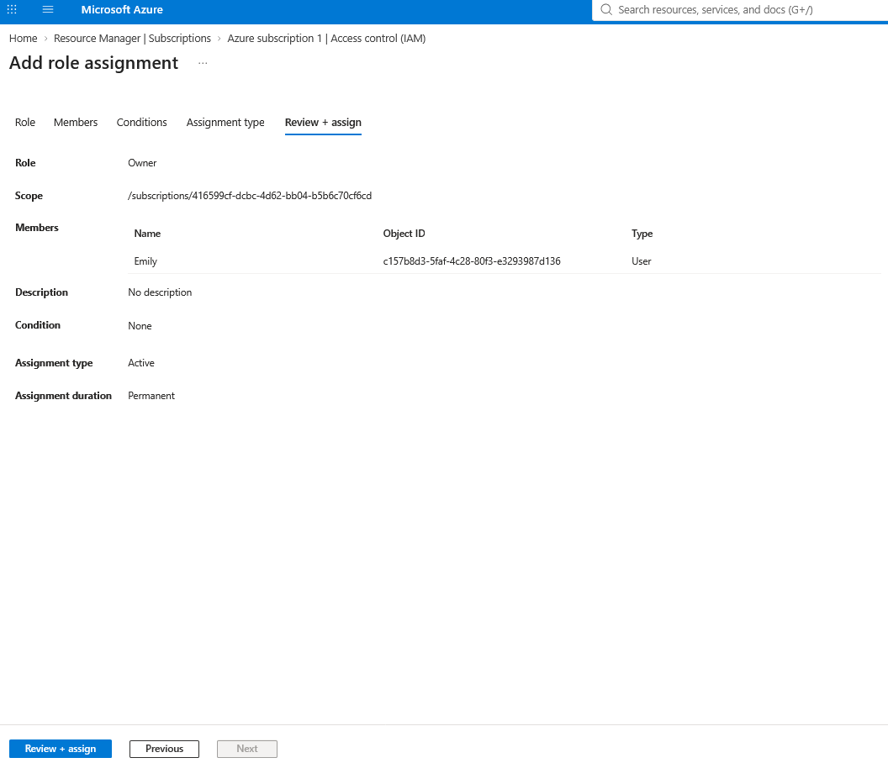
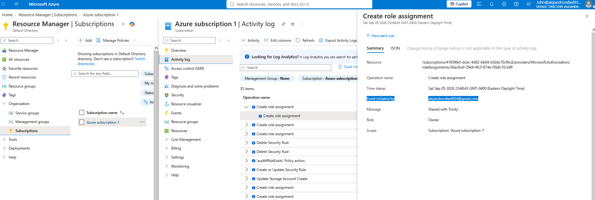
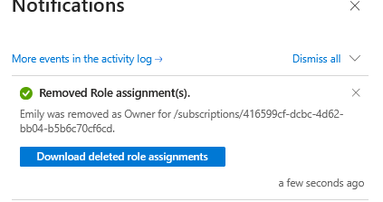
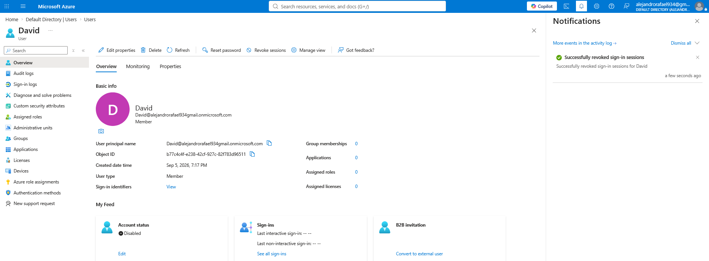
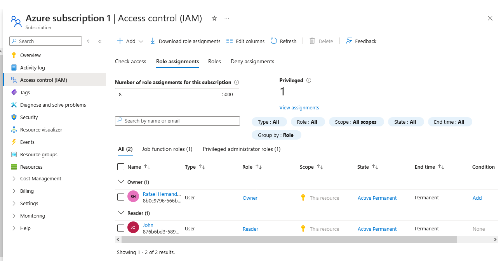
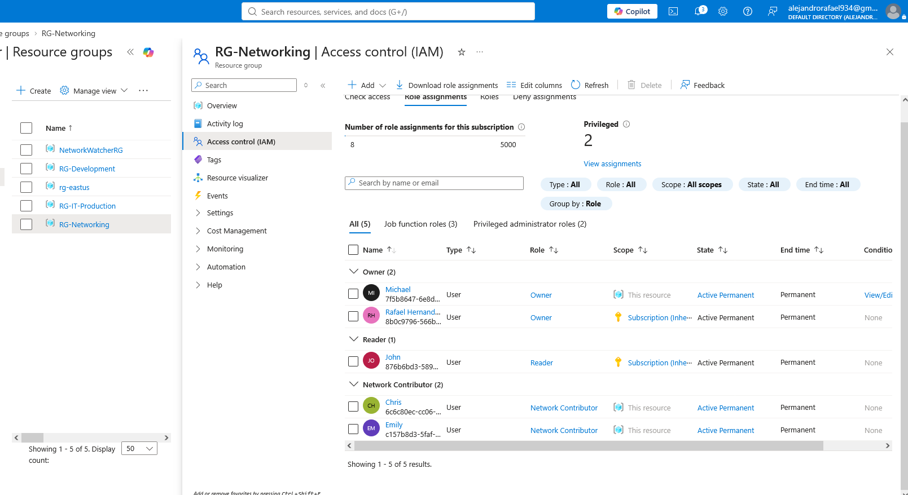

#  Enterprise RBAC & Identity Lifecycle Project | Microsoft Azure

## Project Overview

This project role-plays an existing small-business Azure environment in which the company, employees, Microsoft Entra identities, Azure subscription structure, resource groups, and supporting test resources are treated as already established.

To make the simulation possible, the required users, security groups, resource groups, and Azure resources were preconfigured as lab prerequisites. These setup activities are not the primary focus of the project.

The project instead focuses on the day-to-day responsibilities of an Azure Administrator operating within an active business environment. The goal was to simulate realistic identity, access, and governance operations rather than simply demonstrate how to create Azure resources.

Throughout the project, I responded to business requests, access changes, security incidents, and employee lifecycle events while applying least-privilege principles and validating the resulting permissions directly in Azure.

## Project Highlights

- Implemented scoped Azure RBAC across subscription and resource-group levels using Owner, Contributor, Network Contributor, and Reader roles.
- Configured delegated administration with Azure RBAC conditions to restrict which roles managers could assign and to whom.
- Used Microsoft Entra security groups for scalable group-based access and validated effective permissions through inheritance and membership.
- Configured and tested Self-Service Password Reset (SSPR) using registered authentication methods.
- Simulated employee onboarding, department transfer, offboarding, soft-delete recovery, and rehire scenarios.
- Investigated excessive privileges, hidden access paths, and administrative changes using IAM views and Azure Activity Log.

## Business Scenario

The organization is a small business already operating in Microsoft Azure. Its Microsoft Entra tenant, employee identities, Azure subscription, departmental resource groups, and supporting test resources are treated as part of an existing environment.

The company operates multiple departments, including IT Production, Networking, and Development. Managers are responsible for their departments, employees require different levels of Azure access, and an auditor independently reviews permissions and administrative activity.

As the Azure Administrator, I am responsible for maintaining secure access across the environment while responding to day-to-day operational events such as access requests, delegated administration, employee onboarding, department transfers, password recovery, excessive privilege incidents, offboarding, account restoration, and access reviews.

The objective is to support normal business operations while maintaining least privilege, separation of duties, controlled delegation, and auditable access management.

## Environment / Roles

| Identity | Business Role | Azure / Entra Responsibility |
|---|---|---|
| Rafael | Azure Administrator / Director | Subscription Owner and final authority for access and governance |
| Cloud Admin | Entra Administrator | Microsoft Entra identity and authentication administration |
| Sarah | IT Manager | Manages access to the IT Production environment |
| Alex | IT Employee | Contributor access to IT Production resources |
| Michael | Networking Manager | Manages access to the Networking environment |
| Emily | Network Technician | Network Contributor within the Networking resource group |
| Chris | Employee / Department Transfer | Initially onboarded to Development and later transferred to Networking |
| David | Developer | Receives Development access through Microsoft Entra security-group membership |
| John | Auditor | Subscription Reader responsible for reviewing access and administrative activity |

## Implementation / Role-Play Scenarios

### 1. Delegated RBAC Administration

Department managers were granted scoped Owner access with RBAC conditions that limited which roles they could assign and to which employees.

Sarah was given Owner access to `RG-IT-Production`, with delegation restricted so she could assign only the Contributor role to Alex.

The same controlled delegation model was implemented for Networking. Michael received Owner access to `RG-Networking`, with his role-assignment authority restricted to approved Network Contributor assignments.

This demonstrated delegated administration without granting unrestricted role-assignment authority.

---

### 2. Group-Based Development Access

Development access was managed through the `GRP-Azure-Developers` Microsoft Entra security group instead of assigning Contributor directly to each developer.

The group received Contributor access to `RG-Development`.

Effective access was then validated for Chris. Azure confirmed that his Contributor permission came through `GRP-Azure-Developers`.

This demonstrated scalable access management through group membership.

---

### 3. Self-Service Password Reset

Self-Service Password Reset was enabled for a selected Microsoft Entra security group rather than for the entire organization.

The password-reset policy was configured with approved authentication methods.

A forgotten-password scenario was then simulated, and Microsoft confirmed that the password reset completed successfully.

This validated the complete SSPR workflow from configuration to successful recovery.

---

### 4. Employee Onboarding and Department Transfer

Chris was initially onboarded into Development and received access through group membership.

Later, the business transferred Chris from Development to Networking.

His Development access was removed, and he was granted Network Contributor access to `RG-Networking`.

This demonstrated how access can be updated when an employee changes departments without retaining unnecessary permissions from the previous role.

---

### 5. Excessive Privilege Incident

An intentional security incident was introduced by granting Emily Owner at the subscription scope.

Emily normally required only Network Contributor access within `RG-Networking`, making the subscription-level Owner assignment excessive.

Azure Activity Log was used to investigate and trace the privileged role assignment.

After the issue was identified, the excessive Owner assignment was removed and least privilege was restored.

---

### 6. Hidden Access Troubleshooting

David was intentionally given both direct Contributor access and group-based Contributor access to `RG-Development`.

After the direct role assignment was removed, David still retained access.

Azure IAM Check access revealed that the remaining permission came through `GRP-Azure-Developers`.

This demonstrated why removing a direct assignment does not always remove effective access.

---

### 7. Offboarding and Account Recovery

David was used for a complete employee offboarding scenario.

His access and group memberships were removed, the Microsoft Entra account was disabled, and active sign-in sessions were revoked.

The account was then deleted and appeared under Microsoft Entra Deleted users during the soft-delete retention period.

A simulated rehire scenario followed, and David's account was restored instead of creating a new identity.

This demonstrated both offboarding and recovery of a recently deleted employee identity.

---

### 8. Final Audit and Governance Review

John performed a final access review of the subscription and departmental resource groups.

At the subscription scope, the final environment showed Rafael as Owner and John as Reader, with the temporary excessive privilege removed.

The Networking environment was reviewed to verify scoped departmental permissions and inherited subscription access.

Finally, the Development environment was reviewed to confirm group-based Contributor access and inherited subscription permissions.

The final audit confirmed that the environment returned to its intended least-privilege access model.

## Project Summary

This project simulated the day-to-day identity and access responsibilities of an Azure Administrator working within an existing small-business Azure environment.

The project focused on secure access management, delegated administration, identity lifecycle operations, troubleshooting, auditing, and least-privilege governance across Microsoft Azure and Microsoft Entra ID.

## Key Takeaways

This project reinforced that Azure access can come from multiple paths, including direct role assignments, group membership, and inherited permissions.

It also demonstrated the importance of limiting privileged access, validating effective permissions, using controlled delegation, and maintaining a secure identity lifecycle from onboarding through offboarding and recovery.
