# Azure Secure Storage Administration — V1

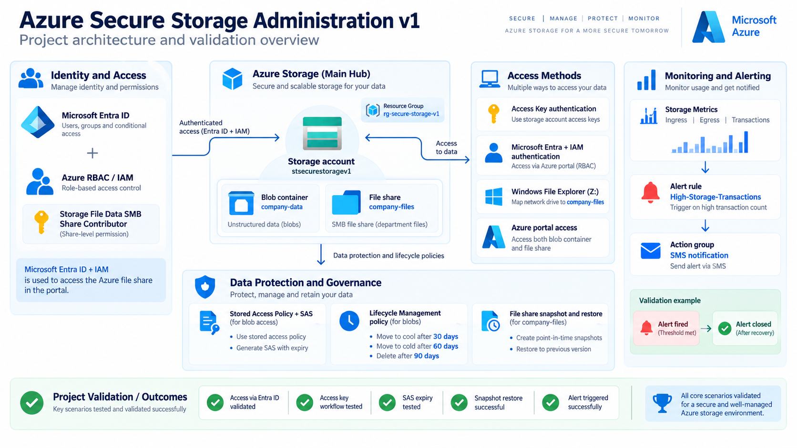

## Project Overview

The environment was configured with Microsoft Entra ID and Azure RBAC for identity-based access, storage account access keys for administrative testing, network restrictions, data protection features, lifecycle management, SAS-based delegated access, file-share snapshots, monitoring, and alerting.

The project also validates real operational scenarios including mapped Azure Files access from a local Windows computer, blob version recovery, SAS expiration, file restoration from snapshots, storage transaction monitoring, and an Azure Monitor alert that successfully triggered and sent an SMS notification.

## Business Problem

Organizations need secure, reliable, and cost-effective storage for both unstructured data and shared files. Poorly configured storage can expose sensitive data, make recovery difficult, increase costs, and leave administrators without visibility into activity.

This project addresses those risks by:

- securing access with Microsoft Entra ID, Azure RBAC, access keys, and SAS
- protecting and recovering data with versioning, soft delete, and file-share snapshots
- reducing cost and improving visibility through lifecycle management, metrics, and alerting

## Project Objectives

- Build a secure Azure Storage environment for blob and file-based workloads.
- Implement identity-based and key-based access methods.
- Protect data using versioning, soft delete, and file-share snapshots.
- Automate storage tiering and cleanup with lifecycle management.
- Validate delegated access using SAS and stored access policies.
- Monitor storage activity and configure an alert that notifies administrators when transaction activity exceeds a defined threshold.

## Project Highlights

- Secured Azure Storage access using Microsoft Entra ID, Azure RBAC, storage account keys, and time-limited SAS access.
- Configured Blob versioning and soft delete, then validated recovery after overwriting and deleting data.
- Mounted Azure Files to a local Windows computer as a `Z:` drive and verified bidirectional file access.
- Created and tested Azure Files snapshots by deleting a live file and restoring it successfully.
- Implemented lifecycle management to move blobs from Hot → Cool → Cold and delete inactive data after 90 days.
- Monitored Ingress, Egress, and Transactions with Azure Monitor and successfully triggered a transaction-based SMS alert.

## Azure Resources and Services Used

- Azure Storage Account
- Azure Blob Storage and Azure Files
- Microsoft Entra ID and Azure RBAC
- Storage Account Access Keys and SAS
- Blob Versioning, Soft Delete, and File Share Snapshots
- Lifecycle Management
- Azure Monitor Metrics, Alerts, and Action Groups
- Storage Account Network Restrictions

## Implementation

### 1. Create the Secure Storage Environment

The project began by creating the Azure Storage foundation inside the `rg-secure-storage-v1` resource group. The goal was to keep all storage-related resources organized under one dedicated administrative scope before configuring data services, permissions, recovery, and monitoring.

A general-purpose storage account named `stsecurestoragev1` was then configured in **East US** using **Standard performance** and **Zone-Redundant Storage (ZRS)**. The deployment also included secure-transfer requirements and network restrictions so the storage environment would not simply be left open with unrestricted access.

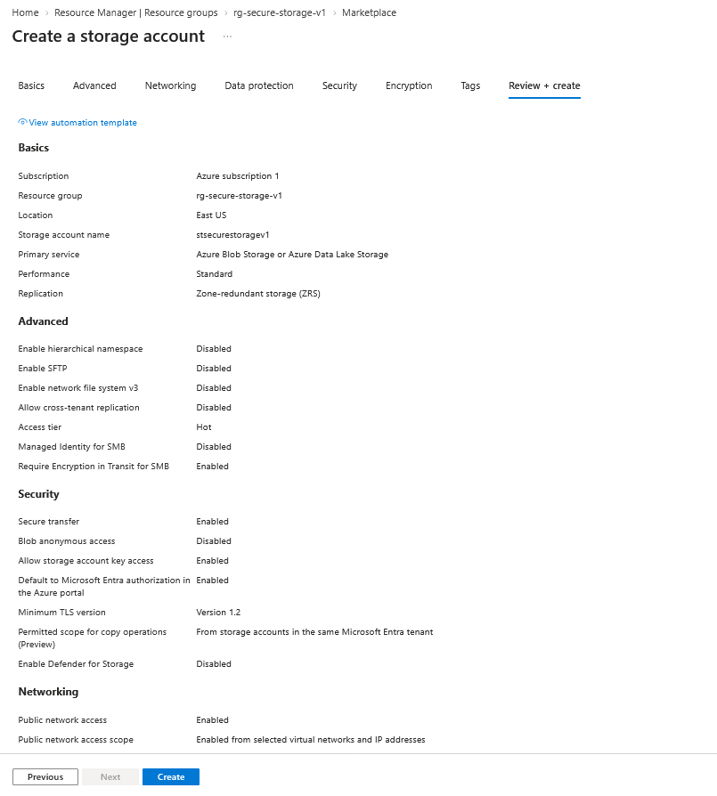

The configuration review confirms the storage account settings before deployment, including the resource group, region, redundancy option, security settings, and restricted public network access.

This storage account became the central platform used throughout the project for both **Blob Storage** and **Azure Files**.

From this foundation, the next step was to create and configure the Blob Storage environment.

### 2. Configure Blob Storage

A Blob Storage container named `company-data` was created inside `stsecurestoragev1` to store unstructured company data.

The container was kept private so anonymous public access was not allowed. Access to the data was instead controlled through Azure authentication and authorization mechanisms.

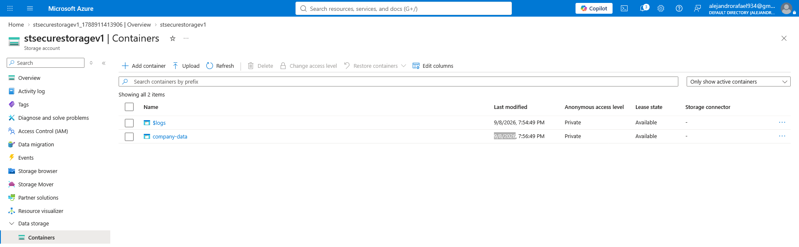

After creating the container, access was tested using Microsoft Entra ID. The initial access attempt was denied because the required data-plane permissions had not yet been assigned.

To resolve this, the **Storage Blob Data Contributor** role was assigned at the container scope, giving the required read, write, and delete permissions for blob data.

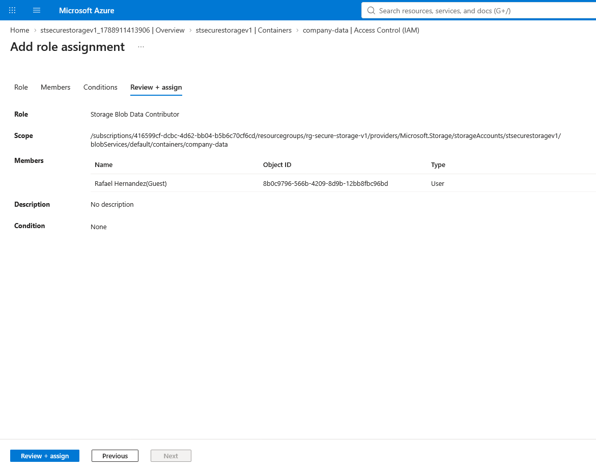

This demonstrated the difference between having management access to the Azure resource and having permission to work with the actual data stored inside the container.

Once the role assignment was applied, the container was ready for blob uploads, versioning, soft delete, and recovery testing.

### 3. Configure Microsoft Entra ID and Azure RBAC

After creating the Blob container, Microsoft Entra ID and Azure RBAC were used to control access to the stored data.

The initial access test showed that having administrative control over the storage resource did not automatically grant permission to read or modify the blob data itself. This highlighted the separation between Azure resource management permissions and storage data permissions.

The **Storage Blob Data Contributor** role was assigned directly at the `company-data` container scope to provide the required blob data access while keeping the assignment limited to the resource that needed it.

Once the role assignment propagated, access to the container succeeded using the Microsoft Entra user account.

This validated identity-based access to Blob Storage and demonstrated how Azure RBAC can be used to apply least-privilege permissions at a specific storage scope.

### 4. Configure Blob Versioning and Soft Delete Recovery

Blob versioning and soft delete were enabled to protect data from accidental overwrites and deletions.

To validate versioning, `company-policy.txt` was uploaded and then replaced with a newer copy using the same filename. Azure automatically preserved the earlier copy as a previous version instead of permanently overwriting it.

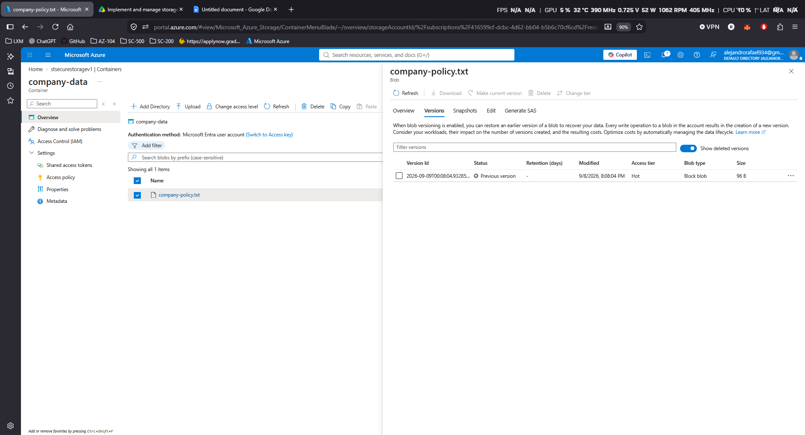

The file was then intentionally deleted to test recovery. Because soft delete was enabled, the blob remained recoverable instead of being permanently removed.

The deleted blob was successfully undeleted and a previous version was promoted back to the current version.

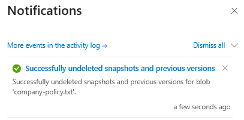

This test validated two separate data-protection controls:

- **Blob Versioning** protected the file from unwanted changes and overwrites.
- **Soft Delete** protected the file from accidental deletion.

Together, these features provided a practical recovery path for common storage incidents.

### 5. Configure Azure Files and Map the Z: Drive

An Azure File Share named `company-files` was created to demonstrate traditional shared-file storage alongside Blob Storage.

The share was configured for SMB access and then connected to a local Windows workstation using the Azure Files connection script. The share was successfully mounted in File Explorer as the `Z:` network drive.

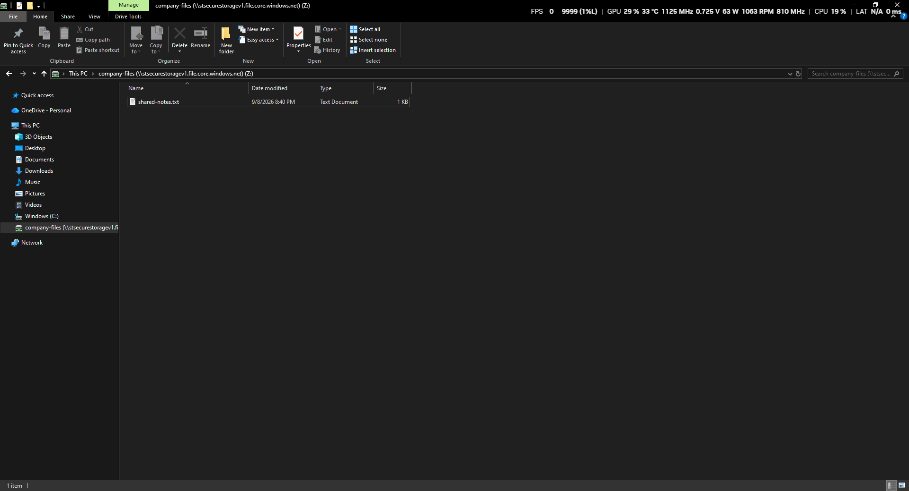

This allowed files stored in Azure Files to be accessed from Windows like a normal network share.

The mounted drive was then tested in both directions by creating and opening files from the local computer and confirming that the same files were visible in the Azure portal.

This validated the end-to-end path:

**Windows workstation → SMB → Azure Files → `company-files`**

The test demonstrated how Azure Files can provide cloud-hosted shared storage while still supporting familiar Windows file-share workflows.

### 6. Validate Access Key and Microsoft Entra Authentication

Azure Files access was tested using two different authentication methods to compare key-based access with identity-based access.

The first method used the **storage account access key**, which successfully allowed the `company-files` share to be browsed and accessed from the Azure portal and mounted Windows drive.

The second method used **Microsoft Entra ID + Azure RBAC**. The **Storage File Data SMB Share Contributor** role was assigned to provide file-share data access at the `company-files` scope.

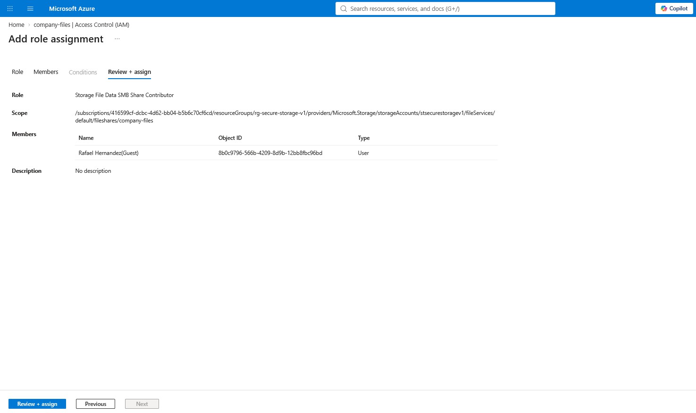

After the required permissions were assigned, Azure Files access was successfully validated using the Microsoft Entra user account.

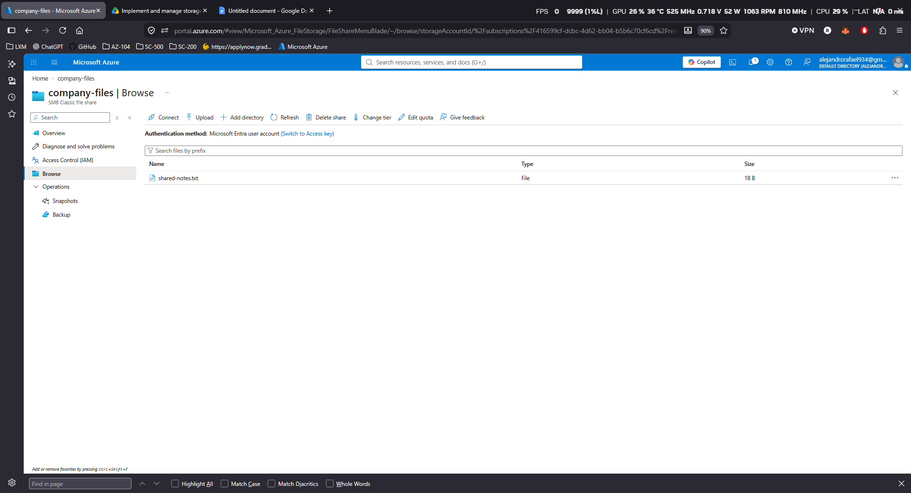

This demonstrated two different Azure Files access models:

- **Access Key authentication** — key-based access using the storage account credentials.
- **Microsoft Entra + IAM authentication** — identity-based access controlled through Azure RBAC.

Testing both methods provided a clearer understanding of how Azure Storage separates shared-key authentication from identity-based authorization.

### 7. Configure Lifecycle Management

A lifecycle management policy was created for the `company-data` Blob container to automate storage tiering and reduce long-term storage costs.

The rule was scoped specifically to the `company-data/` prefix so it would affect only the project container rather than every blob in the storage account.

The policy was configured to:

- move blobs to the **Cool** tier after 30 days without modification
- move blobs to the **Cold** tier after 60 days without modification
- delete blobs after 90 days without modification

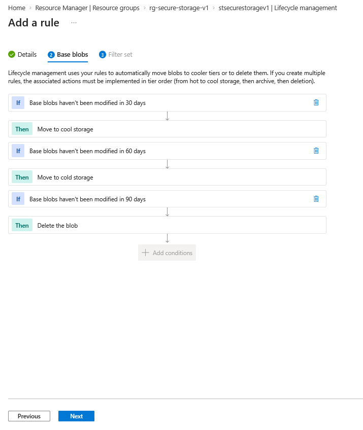

This created an automated data-management process where frequently used data remains in the Hot tier while older, inactive data is gradually moved to lower-cost storage tiers and eventually removed.

The lifecycle rule demonstrated how Azure Storage can automatically enforce retention and cost-optimization policies without requiring manual administration.
### 8. Configure Stored Access Policy and SAS Expiration

A Stored Access Policy named `read-policy` was created on the `company-data` container to provide controlled, time-limited access to blob data.

The policy was configured with **Read** permission and a short expiration window so the access behavior could be tested during the lab.

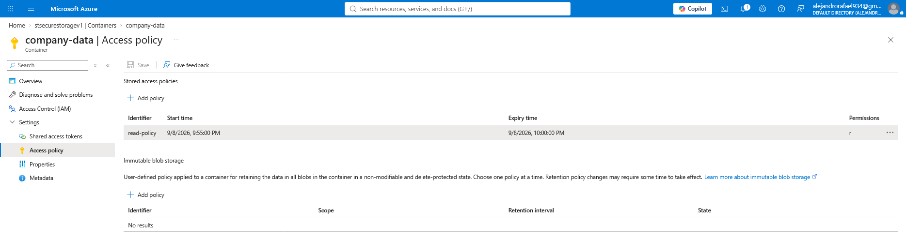

A Shared Access Signature (SAS) was then generated and linked to the stored access policy. The SAS URL successfully opened `company-policy.txt` before the policy expired.

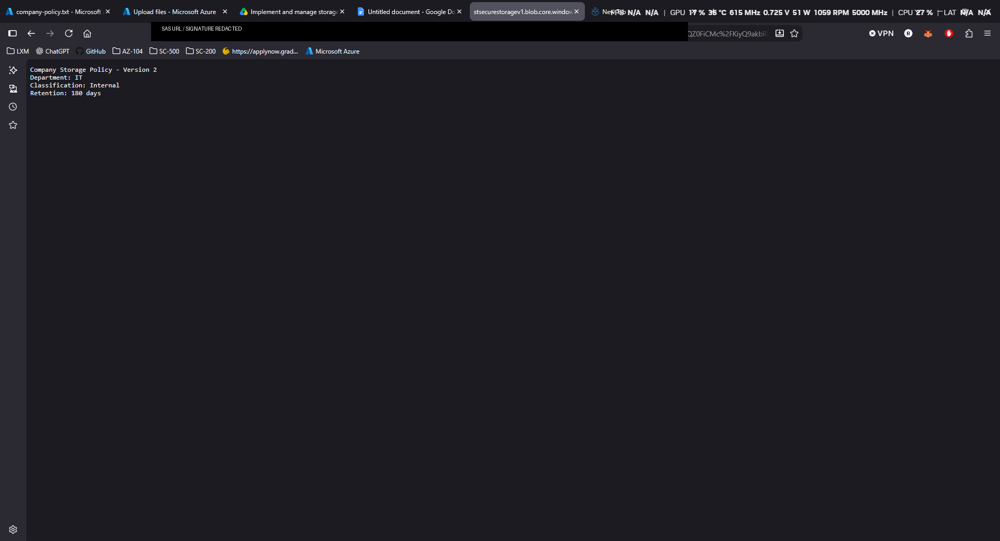

After the expiration time passed, the same SAS URL was tested again and Azure returned an authentication failure because the signature was no longer valid.

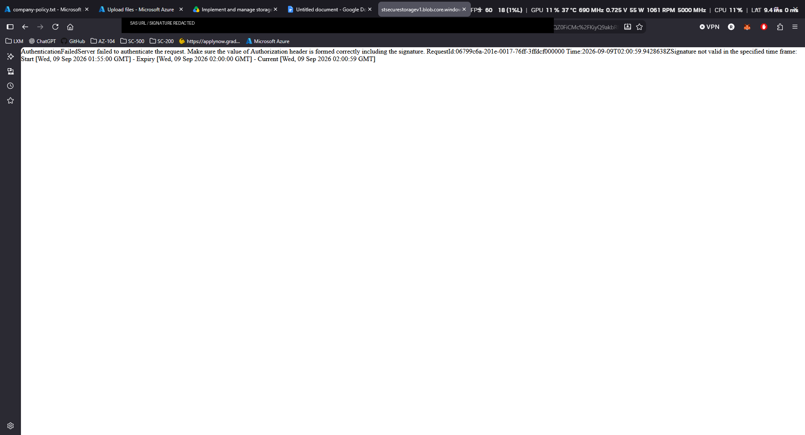

This validated temporary delegated access to Blob Storage and demonstrated how a Stored Access Policy can centrally control the permissions and lifetime of a SAS token.

The test confirmed:

- SAS access worked before expiration
- the same SAS became invalid after expiration
- HTTPS-only access was enforced
- the storage account firewall remained an additional network security layer

### 9. Configure Azure Files Snapshot and Restore

An Azure Files snapshot was created for the `company-files` share to capture a point-in-time copy before making changes to the live file share.

To test recovery, `shared-notes.txt` was intentionally deleted from the active share. The deletion was confirmed both in the Azure portal and from the mapped `Z:` drive on the local Windows workstation.

The previously created snapshot was then opened and used to restore the deleted file back into the live share.

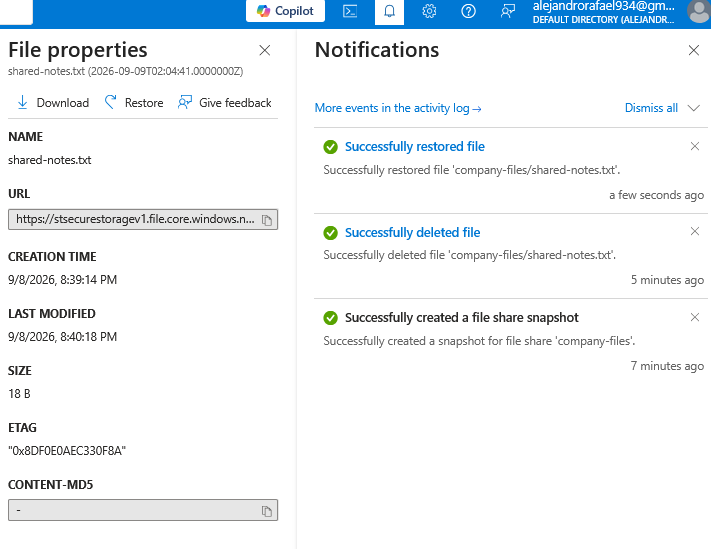

The restored file was successfully returned to `company-files`, confirming that the snapshot preserved the earlier state of the share even after the live file had been deleted.

This validated a practical file-recovery workflow:

**Create snapshot → delete live file → restore from snapshot → verify recovery**

The test demonstrated how Azure Files snapshots can protect shared data from accidental deletion or unwanted changes without requiring a full backup restore.

### 10. Configure Azure Monitor Metrics and Alerts

Azure Monitor was used to observe storage activity and validate that the environment was actively processing requests.

The storage account metrics were configured to monitor **Ingress**, **Egress**, and **Transactions**, providing visibility into data movement and the number of storage operations generated during the lab.

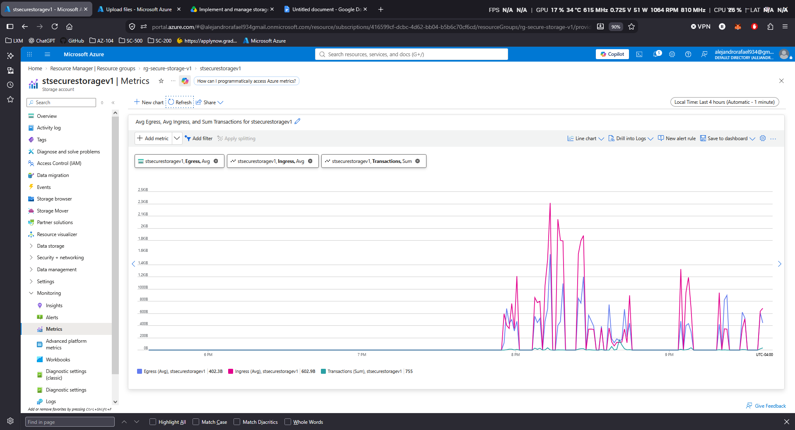

A metric alert named `High-Storage-Transactions` was then created to trigger when the storage account processed more than **10 transactions within a 5-minute window**.

The alert was configured to evaluate every minute and was connected to an Action Group that sent an SMS notification when the threshold was exceeded.

After generating additional storage activity through the Azure portal and the mapped `Z:` drive, the alert successfully entered the **Fired** state.

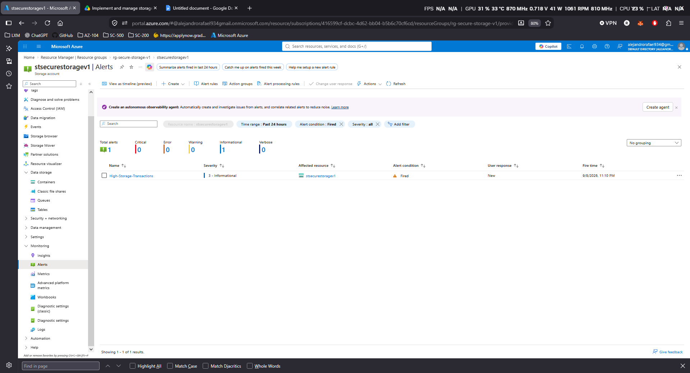

The SMS notification was also received, confirming that the full monitoring and notification workflow was functioning correctly.

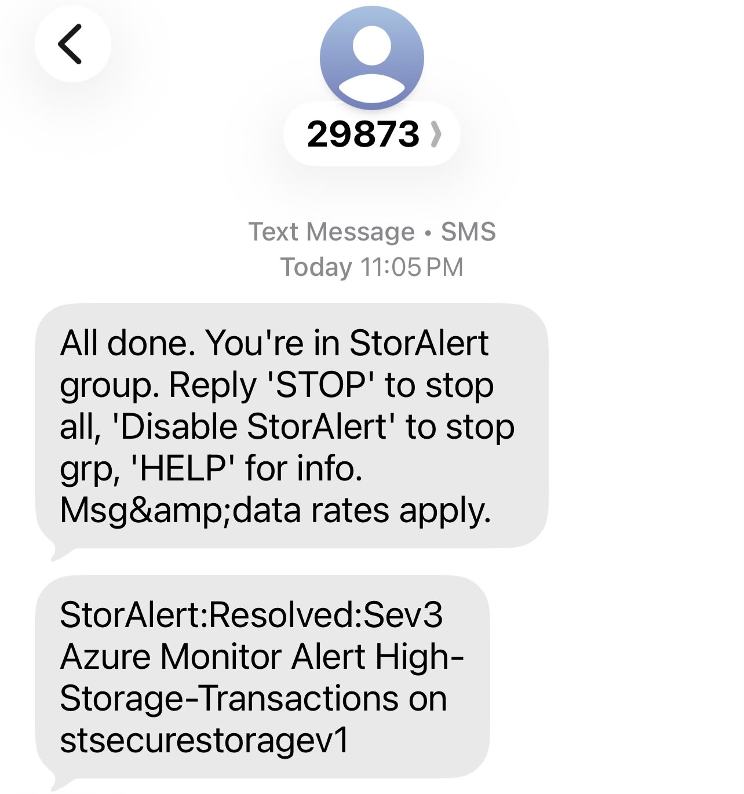

This validated the complete monitoring flow:

**Storage activity → Azure Monitor metric → threshold exceeded → alert fired → Action Group → SMS notification**

The alert was then reviewed and closed, demonstrating both detection and administrator response to storage activity.

## Project Results

The project successfully delivered a secure Azure Storage environment with Blob Storage, Azure Files, identity-based access, recovery controls, lifecycle management, SAS-based access, and Azure Monitor alerting.

The configuration was validated through real tests including blob recovery, mapped `Z:` drive access, SAS expiration, snapshot restore, and a successfully triggered SMS alert.

## Key Takeaways

- Azure Storage separates resource management permissions from data access permissions.
- Versioning, soft delete, and snapshots provide different recovery options.
- Microsoft Entra ID and Azure RBAC provide stronger identity-based access control.
- Lifecycle policies and monitoring help control cost and improve visibility.
- Testing the configuration is just as important as deploying it.

**Next:** V2 — Azure Storage Troubleshooting & Recovery
