# Azure Storage Private Networking Architecture — V3

## Project Overview

This project demonstrates how to secure Azure Storage by combining private networking, DNS integration, network access restrictions, and connectivity validation.

The environment was designed to allow authorized Azure resources to access Blob Storage through a Private Endpoint while restricting public access. A separate Service Endpoint path was also configured to compare both connectivity models and demonstrate how subnet-based access control differs from Private Link.

The project also includes an intentional DNS failure scenario where the Private DNS A record was removed, causing name resolution and connectivity to fail. The issue was then diagnosed, remediated, and validated by restoring the correct private DNS record.

## Business Problem

An organization stores sensitive files in Azure Storage and needs to reduce exposure to the public internet while still allowing approved Azure resources to access the data.

The environment must support secure private connectivity, restrict unauthorized public access, and provide a controlled alternative using Service Endpoints for subnet-based access.

The organization also needs administrators to be able to identify and resolve DNS-related connectivity failures affecting Private Endpoint access.

## Project Objectives

- Implement private connectivity to Azure Blob Storage using a Private Endpoint.
- Configure Private DNS so the storage account resolves to its private IP from inside the virtual network.
- Restrict public access to the storage account and validate that unauthorized external access is blocked.
- Configure and test a Service Endpoint to compare subnet-based access with Private Link.
- Validate connectivity using PowerShell from dedicated test virtual machines.
- Simulate a Private DNS failure, troubleshoot the issue, restore the DNS record, and confirm connectivity is recovered.

## Project Highlights

- Built a segmented Azure virtual network with dedicated subnets for client access, Private Endpoint connectivity, and Service Endpoint testing.
- Secured Azure Blob Storage with a Private Endpoint and validated private connectivity through the private IP `10.30.2.4`.
- Configured Azure Private DNS using `privatelink.blob.core.windows.net` and verified name resolution from inside the VNet.
- Restricted public network access and confirmed unauthorized access from an external client was blocked.
- Configured a Microsoft.Storage Service Endpoint and validated access from an approved subnet while external public access remained denied.
- Compared Private Endpoint and Service Endpoint connectivity behavior using real PowerShell and SAS-based tests.
- Simulated a DNS outage by deleting the storage A record, reproduced the connectivity failure, restored the record, and validated recovery.
- Performed end-to-end troubleshooting using `nslookup`, `Test-NetConnection`, and `curl`.

## Azure Resources and Services Used

- Azure Storage Account
- Azure Virtual Network and Subnets
- Azure Private Endpoint
- Azure Private DNS Zone
- Azure Service Endpoint
- Azure Virtual Machines
- Storage Network Access Rules
- Shared Access Signature (SAS)
- PowerShell connectivity testing

## Implementation and Validation

### Step 1 — Review the Existing Project Environment

The project started by reviewing the existing V2 storage recovery environment and confirming the resources that would be reused for the private networking implementation.

The existing environment already contained the Azure Storage account, Recovery Services vault, and Log Analytics workspace. Instead of rebuilding the environment, the networking architecture was added on top of the existing storage configuration.

This established the baseline before any private networking changes were introduced.

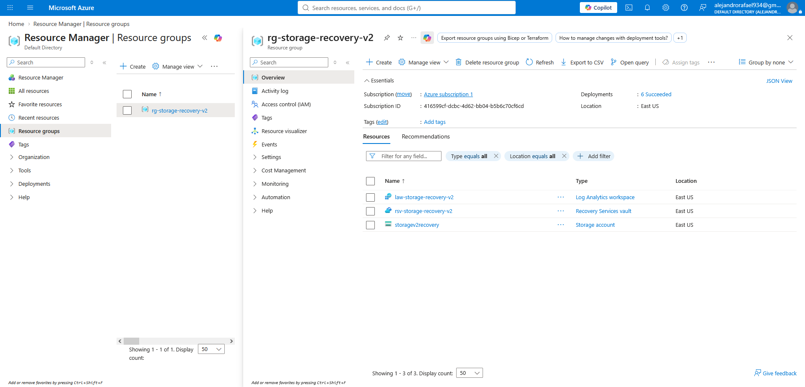

### Step 2 — Configure the Private Endpoint

A Private Endpoint was created for the Blob service of the `storagev2recovery` storage account and placed inside the dedicated `snet-private-endpoint` subnet.

Azure created a network interface for the Private Endpoint and assigned it the private IP address `10.30.2.4`.

This private IP acts as the private entry point to the Blob service from inside the virtual network. The storage account itself does not move into the VNet; instead, Azure Private Link exposes the storage service through this private endpoint.

The Private Endpoint connection was successfully approved and associated with the storage account.

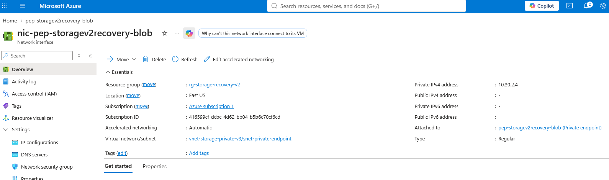

### Step 3 — Configure Private DNS

A Private DNS zone named `privatelink.blob.core.windows.net` was created and linked to `vnet-storage-private-v3`.

An A record was created for `storagev2recovery`, mapping the storage account to the Private Endpoint IP address `10.30.2.4`.

This DNS configuration allows clients inside the virtual network to use the normal Azure Storage hostname while automatically resolving it to the private IP address.

The expected name resolution path became:

`storagev2recovery.blob.core.windows.net`
→ `storagev2recovery.privatelink.blob.core.windows.net`
→ `10.30.2.4`

This allows applications to continue using the standard storage hostname without manually connecting to the private IP address.

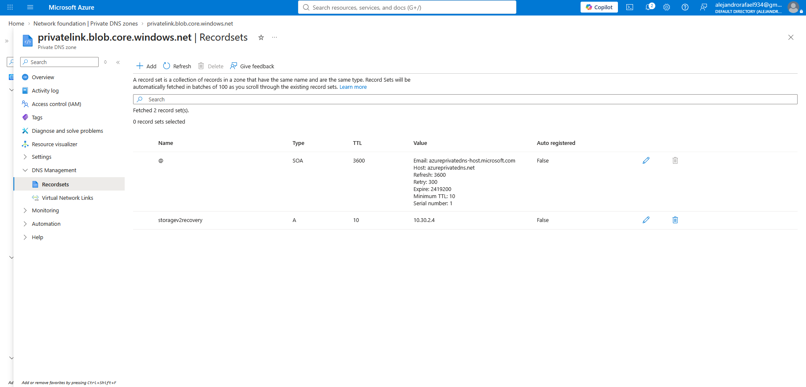

### Step 4 — Validate Private Endpoint Connectivity

A dedicated validation VM was deployed in `snet-client` to test end-to-end private connectivity to the storage account.

PowerShell was used to verify both DNS resolution and HTTPS connectivity.

The client VM used the private IP address `10.30.1.4`, while the storage Blob service resolved to the Private Endpoint IP `10.30.2.4`.

The following connectivity test was performed:

`Test-NetConnection storagev2recovery.blob.core.windows.net -Port 443`

The result returned:

- Remote address: `10.30.2.4`
- Remote port: `443`
- Source address: `10.30.1.4`
- `TcpTestSucceeded: True`

This confirmed that the client VM was successfully reaching Azure Blob Storage through the Private Endpoint instead of the public storage endpoint.

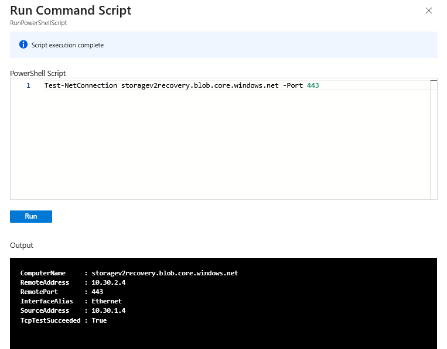

### Step 5 — Restrict Public Network Access

After validating the Private Endpoint path, public network access to the storage account was restricted.

The goal was to ensure that clients outside the approved Azure network could no longer access the storage account through its public endpoint.

The storage account networking configuration was changed so that unrestricted public access was no longer allowed.

This created two separate access behaviors:

- Approved Azure resources could continue using the Private Endpoint.
- External clients using the public endpoint were blocked.

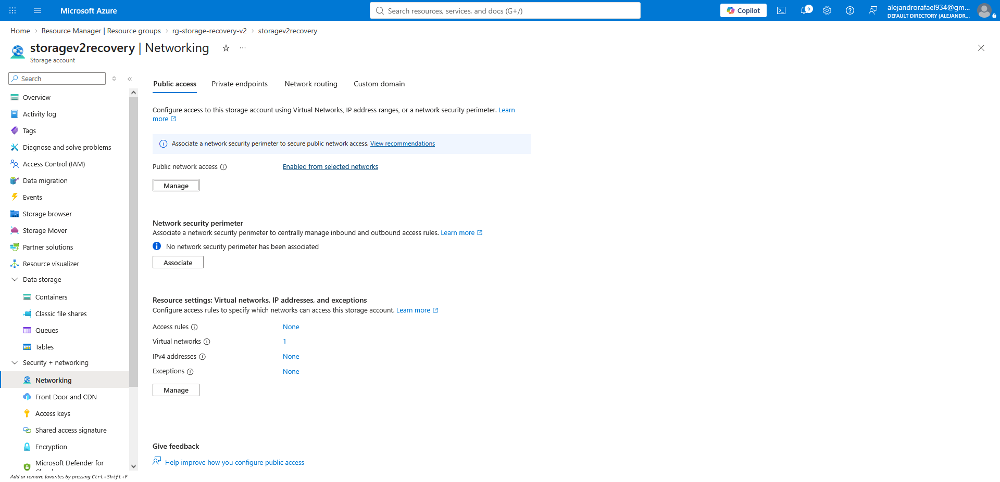

### Step 6 — Validate Public Access Is Blocked

The storage account was then tested from an external client outside the Azure virtual network.

The external client attempted to access Blob Storage through the public endpoint and received an authorization/network access failure.

This confirmed that the storage account was no longer accessible from an unapproved public network while the Private Endpoint path remained functional.

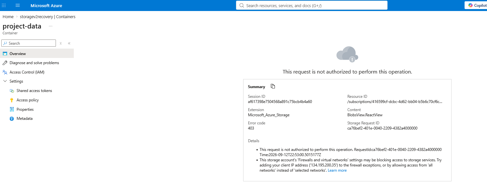

### Step 7 — Configure and Allow a Service Endpoint Subnet

A separate subnet, `snet-service-endpoint`, was configured with the `Microsoft.Storage` Service Endpoint.

The storage account was then configured to allow access from this selected subnet.

Unlike a Private Endpoint, a Service Endpoint does not assign the storage account a private IP address inside the VNet. The storage service continues to use its public endpoint, but Azure recognizes the traffic as originating from an approved subnet.

This allowed the project to compare two different Azure Storage networking models:

- **Private Endpoint** — access through a private IP inside the VNet.
- **Service Endpoint** — access through the public storage endpoint, restricted to an approved subnet.

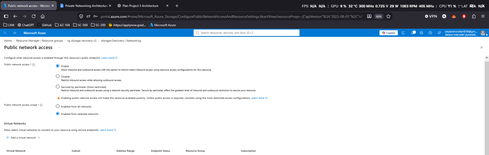

### Step 8 — Validate Service Endpoint Access

A second validation VM was deployed inside `snet-service-endpoint`.

The storage account remained restricted to selected networks, and the Service Endpoint subnet was the approved network.

A read-only SAS URL was used to test access to an existing blob from the Service Endpoint VM.

The blob was successfully downloaded from the VM, confirming that Azure Storage accepted the request because it originated from the approved Service Endpoint subnet.

The same blob request was also tested from an external local computer and was denied, proving that access was restricted by the storage network rules.

This demonstrated that the Service Endpoint allowed trusted subnet traffic while continuing to block unapproved public clients.

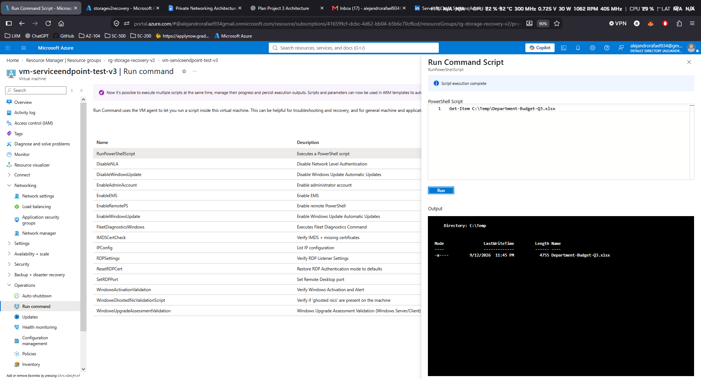

### Step 9 — Simulate a Private DNS Failure

To introduce a realistic troubleshooting scenario, the `storagev2recovery` A record was intentionally deleted from the Private DNS zone `privatelink.blob.core.windows.net`.

Removing this record broke the DNS mapping between the storage account hostname and the Private Endpoint IP address `10.30.2.4`.

The Private Endpoint itself remained deployed and healthy, but clients could no longer discover its private IP through DNS.

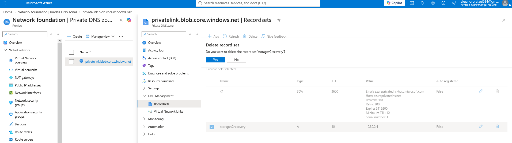

### Step 10 — Diagnose the DNS Resolution Failure

The client VM in `snet-client` was used to test name resolution after the A record was removed.

An `nslookup` query for:

`storagev2recovery.blob.core.windows.net`

failed to return the expected private IP address.

This confirmed that the failure was caused by DNS resolution rather than by the Private Endpoint resource itself.

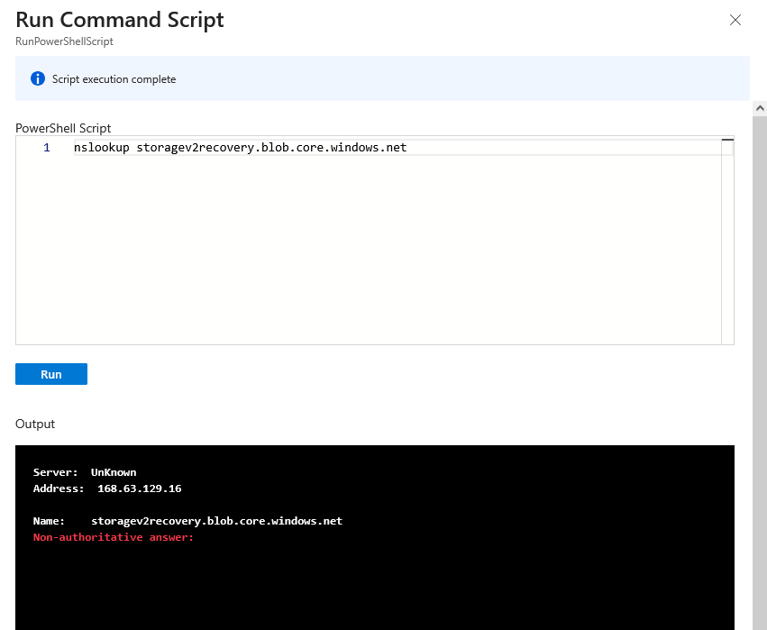

### Step 11 — Confirm Private Connectivity Is Broken

A second connectivity test was performed using:

`Test-NetConnection storagev2recovery.blob.core.windows.net -Port 443`

Because the hostname could no longer be resolved, the client VM could not determine a remote address for the storage account.

The test failed before a connection to the Private Endpoint could be established.

This demonstrated how a missing Private DNS record can break Private Endpoint connectivity even when the endpoint itself is still correctly deployed.

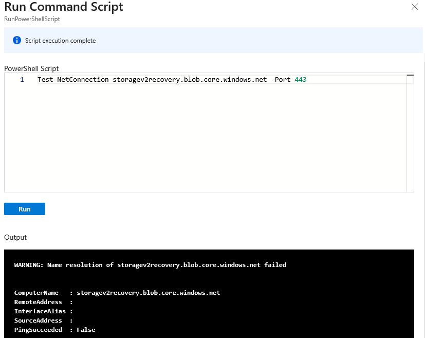

### Step 12 — Restore DNS and Validate Recovery

The deleted A record was recreated in the Private DNS zone:

`storagev2recovery` → `10.30.2.4`

After restoring the record, the connectivity test was repeated from the client VM.

The storage hostname once again resolved to the Private Endpoint IP, and TCP connectivity over port 443 succeeded.

The final result confirmed:

- Remote address: `10.30.2.4`
- Remote port: `443`
- Source address: `10.30.1.4`
- `TcpTestSucceeded: True`

This completed the troubleshooting cycle by reproducing the failure, identifying the DNS issue, restoring the correct configuration, and validating that private connectivity had been fully recovered.

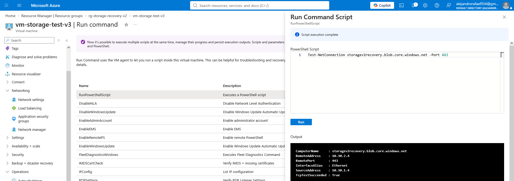

## Key Takeaways

- Private Endpoints provide Azure Storage with a private IP presence inside a virtual network, allowing clients to access the service without relying on the public endpoint.
- Private DNS is critical to Private Endpoint connectivity because clients must resolve the storage hostname to the correct private IP address.
- Service Endpoints work differently from Private Endpoints: the storage service continues to use its public endpoint, but access can be restricted to approved Azure subnets.
- Storage network rules can block external public clients while still allowing approved Azure resources to access the same storage account.
- A healthy Private Endpoint can still become unusable if DNS configuration is incorrect or missing.
- `nslookup`, `Test-NetConnection`, and `curl` are useful tools for validating DNS resolution, HTTPS connectivity, and storage access behavior.
- Testing from multiple network locations is important because the same storage account can behave differently depending on whether traffic comes from a Private Endpoint path, an approved Service Endpoint subnet, or an external public client.
- Intentionally breaking the Private DNS record demonstrated a complete troubleshooting workflow: reproduce the issue, isolate the root cause, restore the configuration, and validate recovery.
