# Azure Storage Troubleshooting & Recovery

## Project Overview

This project demonstrates the administration, troubleshooting, backup, recovery, access control, and monitoring of Azure Storage using Azure Files, Recovery Services vaults, Microsoft Entra ID, Azure RBAC, Log Analytics, and KQL.

The environment was intentionally used to simulate realistic storage incidents, including accidental file deletion, file modification, backup interruption, and data-access failures. Each issue was investigated, remediated, and validated to demonstrate practical Azure Administrator skills.

## Business Scenario

A company stores shared departmental files in Azure Files and requires reliable protection against accidental deletion, unwanted file changes, backup interruptions, and unauthorized or misconfigured access.

The cloud administrator is responsible for protecting the file share, maintaining recovery points, restoring affected files, troubleshooting user access, validating backup health, and monitoring backup-related activity through centralized logging.

## Project Highlights
Configured Azure Files backup using a Recovery Services vault and backup policy.
Created and validated recovery points for the company-files share.
Recovered an accidentally deleted business file from backup.
Restored a modified Excel file using an earlier recovery point and Overwrite Existing.
Troubleshot Microsoft Entra ID and Azure RBAC data-plane access for Azure Files.
Simulated disabled backup protection, retained existing recovery data, resumed protection, and validated a successful backup.
Configured Recovery Services vault diagnostic settings to send backup telemetry to Log Analytics.
Used KQL to investigate protected-instance status and recovery-point activity.

## Azure Resources and Services Used

- Azure Storage Account
- Azure Files
- Recovery Services Vault
- Azure Backup
- Microsoft Entra ID
- Azure RBAC
- Azure Monitor Diagnostic Settings
- Log Analytics Workspace
- Kusto Query Language (KQL)

---

### 1. Storage Environment Deployment

The project began by creating a dedicated Azure environment for storage troubleshooting and recovery testing.

A new resource group named `rg-storage-recovery-v2` was created in **East US** to organize all resources used in this project. Keeping the project resources together made the environment easier to manage, monitor, and clean up after testing.

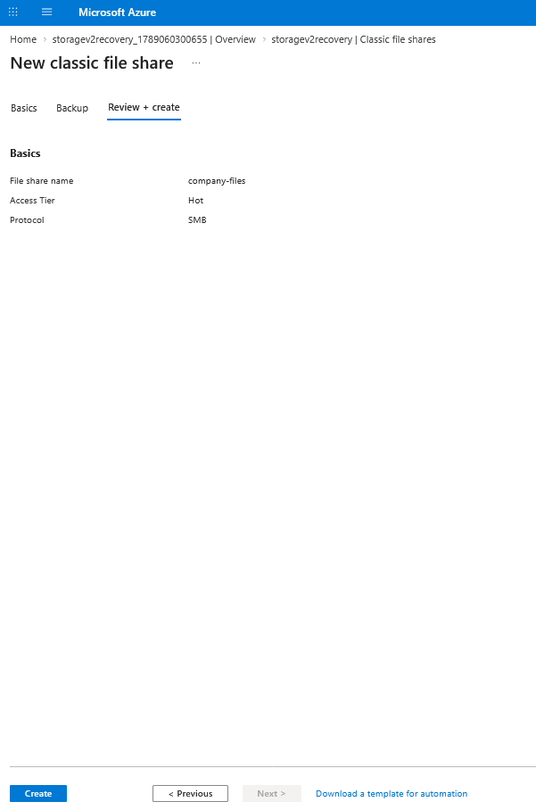

The resource group became the administrative container for the storage account, Recovery Services vault, and later the Log Analytics workspace used throughout the project.

Next, a general-purpose v2 storage account named `storagev2recovery` was deployed. The account used **Standard performance** and **Locally Redundant Storage (LRS)**, which was sufficient for this lab while keeping the environment simple and cost-conscious.

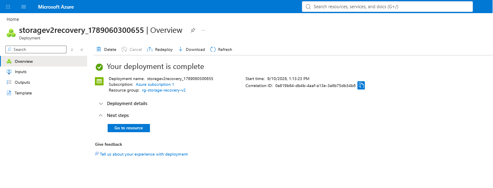

The storage account served as the main data platform for the project and became the source location for the Azure File Share that would later be protected by Azure Backup.

Inside the storage account, an Azure File Share named `company-files` was created to simulate a shared company repository used by multiple departments.

Several business-related test files were uploaded to establish a healthy baseline before any failures were introduced:

- `company-policy.txt`
- `Department-Budget-Q3.xlsx`
- `HR-Policies.docx`

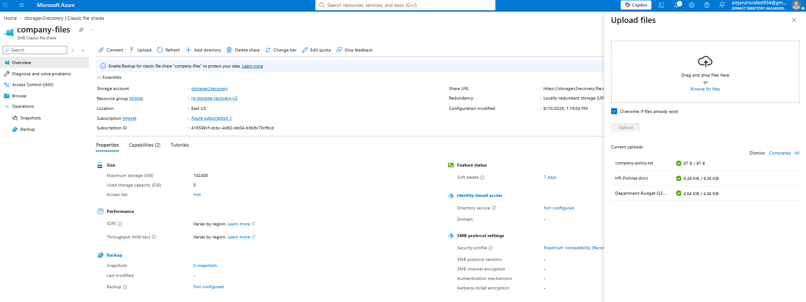

These files were intentionally used later in the project to simulate realistic incidents such as accidental deletion, file modification, and access-control failures.

By building the storage environment first, the project created a controlled baseline where problems could be introduced intentionally, investigated, remediated, and validated without affecting production resources.

### 2. Recovery Services Vault and Backup Configuration

With the storage environment in place, the next objective was to protect the `company-files` Azure File Share against accidental deletion, unwanted changes, and other recovery scenarios.

A Recovery Services vault named `rsv-storage-recovery-v2` was created in the same resource group as the storage account. The vault acts as the central management point for Azure Backup and stores the recovery configuration and recovery points associated with protected workloads.

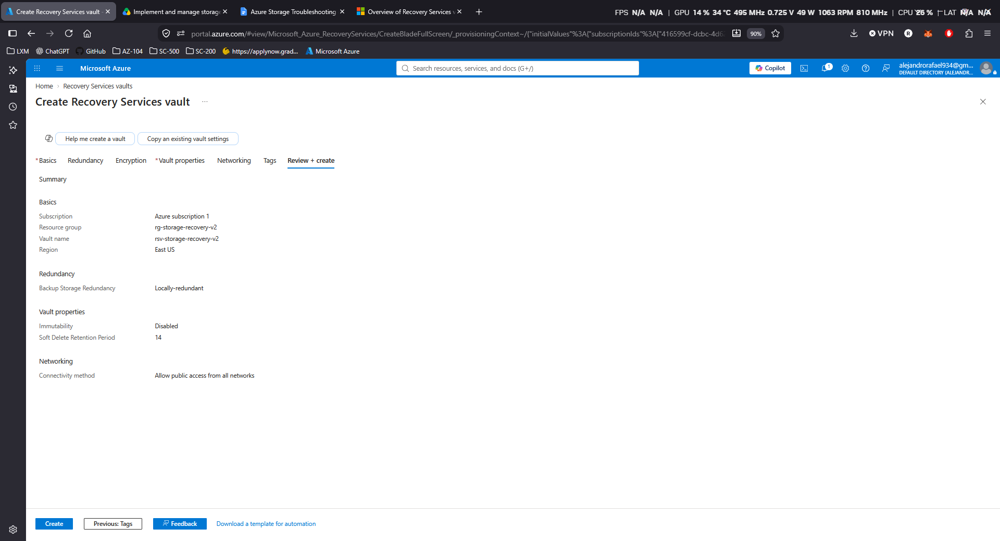

The vault was configured with **Locally Redundant Storage (LRS)** for backup storage. This was appropriate for the project because the lab focused on backup administration and recovery workflows rather than cross-region disaster recovery.

The `storagev2recovery` storage account was then selected as the source of the Azure File Share to protect, and `company-files` was added as the backup item.

A backup policy was configured to control how often backups would be created and how long recovery points would be retained.

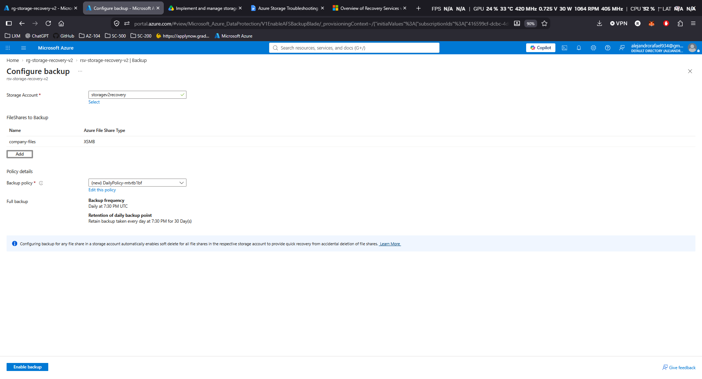

The policy provided the scheduled protection layer for the file share, allowing Azure Backup to create recovery points automatically and maintain a usable recovery history.

Once backup protection was enabled, Azure registered the file share with the Recovery Services vault and began protecting `company-files`.

This completed the initial backup configuration and established the recovery foundation needed for the deletion, modification, and backup-interruption scenarios performed later in the project.

### 3. Recovery Point Creation

After backup protection was configured, an on-demand backup was triggered for the `company-files` Azure File Share.

The purpose of this step was to create an immediate recovery point before introducing any intentional failures. This gave the project a known healthy backup state that could later be used to recover deleted or modified files.

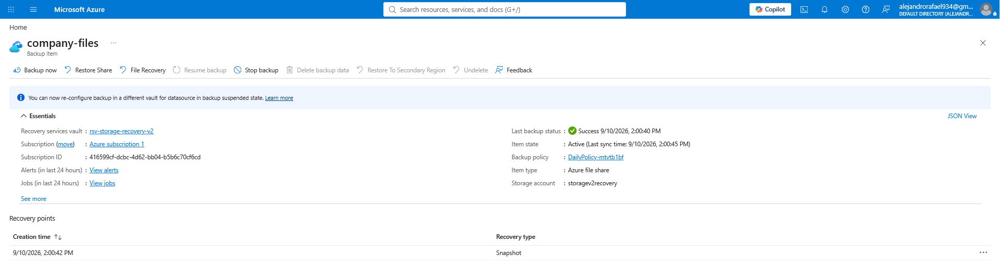

The backup completed successfully, and a new recovery point became available for `company-files`.

This recovery point represented a protected snapshot of the file share at that moment in time and became the baseline used throughout the recovery scenarios that followed.

Creating the recovery point before introducing failures ensured that later incidents could be tested safely and that a valid restore source was already available when recovery was required.

### 4. Incident 1 — Accidental File Deletion

The first recovery scenario simulated a common storage incident: an important business file being deleted by mistake.

The file `Department-Budget-Q3.xlsx` was intentionally removed from the `company-files` Azure File Share to represent accidental user deletion.

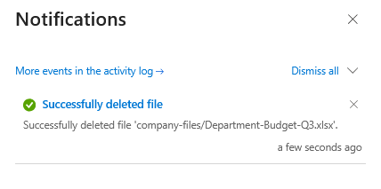

After the deletion was confirmed, the Recovery Services vault was used to begin a file-level recovery operation.

Rather than restoring the entire file share, the recovery process targeted only the deleted Excel file. This demonstrated a more precise recovery method and avoided unnecessary changes to the remaining files.

A previously created recovery point was selected as the source for the restore.

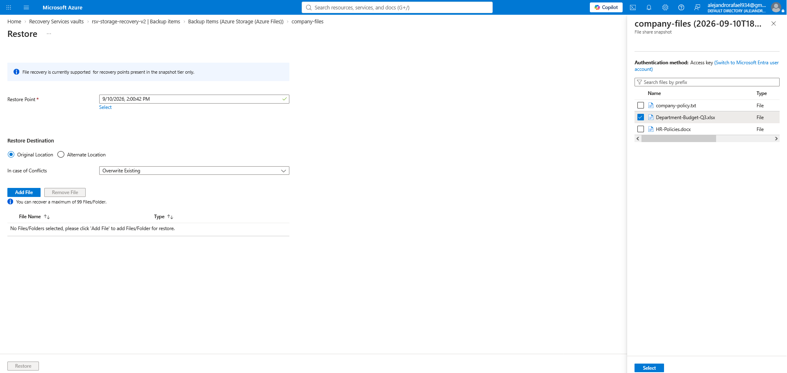

The recovery operation restored `Department-Budget-Q3.xlsx` back to its original location in `company-files`.

After the restore completed, the file share was checked again to confirm that the deleted file had returned successfully.

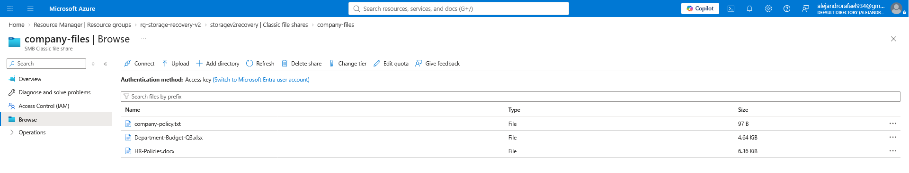

This incident demonstrated how Azure Backup recovery points can be used to recover accidentally deleted files without restoring the entire Azure File Share.

The final validation confirmed that the deleted business file was restored and available again to users.

### 5. Incident 2 — Accidental File Modification

The second recovery scenario simulated a different type of storage incident: a file remained available, but its contents were accidentally changed.

The file `Department-Budget-Q3.xlsx` was intentionally modified to represent a user saving incorrect financial data over the existing healthy version.

Several values inside the workbook were changed so the difference between the healthy and damaged versions would be easy to identify during validation.

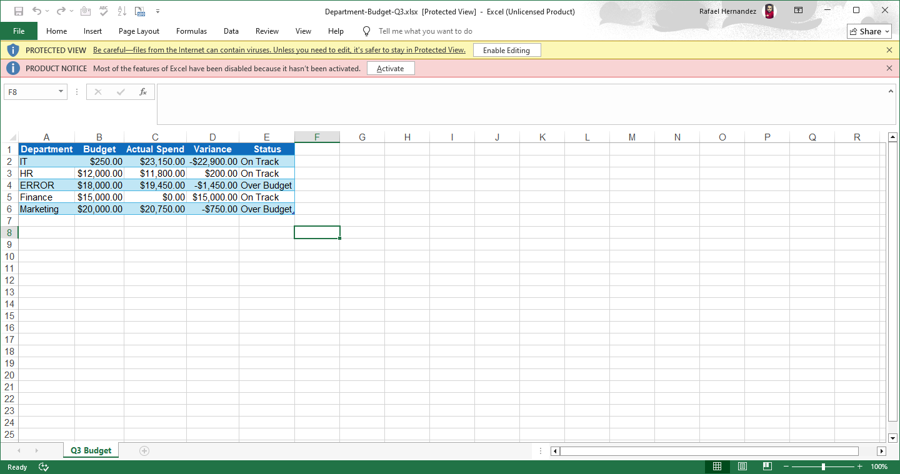

Because the file still existed, the recovery approach was different from the previous deletion scenario.

Instead of restoring a missing file, the objective was to recover the earlier healthy version from the existing recovery point and replace the damaged live copy.

The Recovery Services vault was used again to perform file-level recovery. The previous recovery point was selected, and the file was restored to its **original location** using **Overwrite Existing**.

This allowed Azure Backup to replace the modified version of `Department-Budget-Q3.xlsx` with the known-good copy stored in the recovery point.

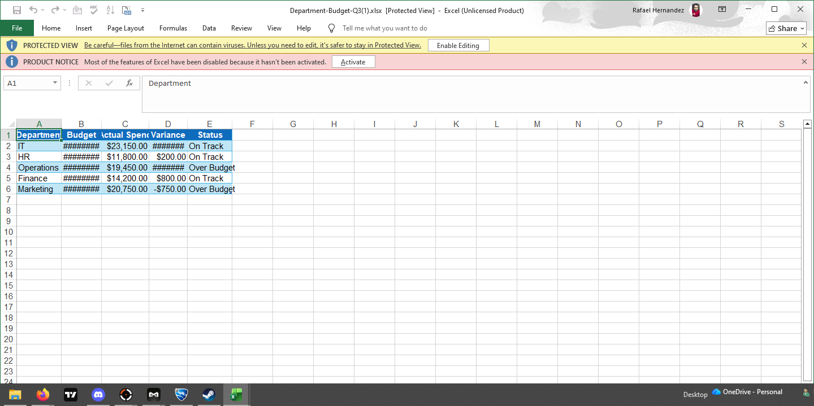

After the restore completed, the workbook was opened and reviewed to confirm that the original values had returned.

The validation confirmed that the accidental changes were removed and that the healthy version of the file had been successfully restored.

This scenario demonstrated that Azure Backup can be used not only for deleted files, but also for recovering earlier versions of files that have been modified, corrupted, or overwritten.

### 7. Backup Protection Troubleshooting

The next scenario focused on backup protection state rather than file recovery.

To simulate an operational issue, backup protection for `company-files` was intentionally stopped using the **Retain backup data** option.

This created a realistic condition where scheduled protection was disabled, but the existing recovery points were preserved.

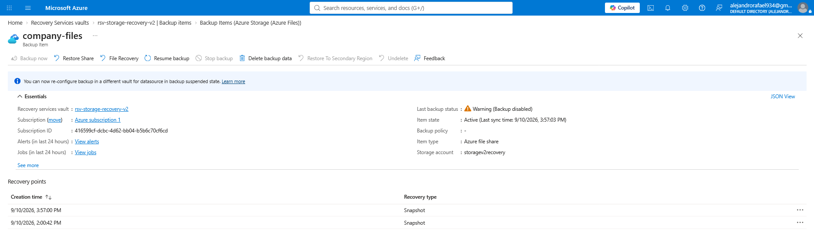

The backup item entered a warning state showing that protection was no longer active.

At the same time, the previously created recovery point was still available. This confirmed that stopping protection with retained data does not immediately remove the recovery history.

The issue was then remediated by using **Resume backup** and reattaching the backup policy to `company-files`.

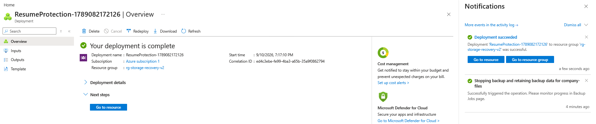

After protection was resumed, a new manual backup was triggered to verify that the backup configuration was operational again.

The backup completed successfully, and a new recovery point was created.

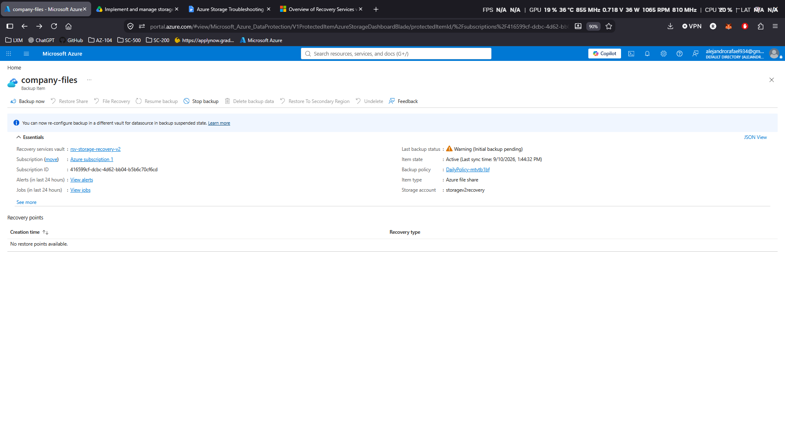

This troubleshooting scenario demonstrated how an Azure Administrator can identify a disabled backup state, preserve existing recovery data, restore protection, and validate that scheduled backup operations are working again.

The final result confirmed that `company-files` returned to a healthy protected state with a successful new recovery point.

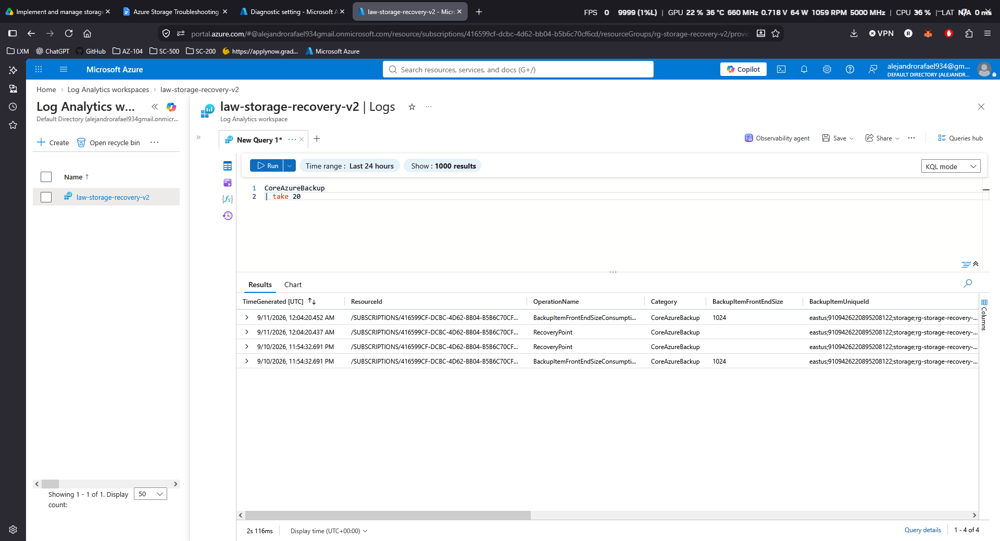

## Project Takeaway

This project went beyond basic Azure Storage configuration by introducing realistic failure scenarios and validating the recovery process from beginning to end.

The environment demonstrated how Azure Files, Recovery Services vaults, Azure Backup, Microsoft Entra ID, Azure RBAC, Log Analytics, and KQL can work together to protect business data and support day-to-day cloud administration.

The project included recovery from accidental file deletion, restoration of a modified file using a previous recovery point, troubleshooting of data-plane access issues, recovery from interrupted backup protection, and validation of backup telemetry through centralized monitoring.

Overall, the project demonstrated practical Azure Administrator skills across storage management, backup and recovery, access control, troubleshooting, and operational monitoring.
