# Azure Virtual Machine Administration, Troubleshooting & High Availability Project

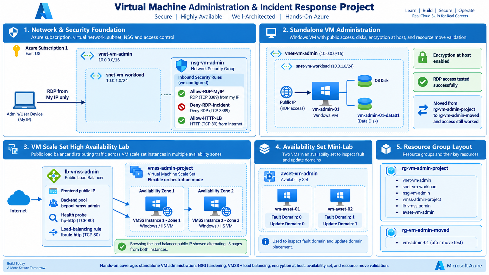

## Project Overview

This project demonstrates hands-on administration and troubleshooting of Azure virtual machines in a realistic cloud environment. The work included VM deployment, disk management, performance testing, VM resizing, Encryption at Host, NSG troubleshooting, high-availability design, load balancing, failover testing, Availability Sets, VM Scale Sets, and resource movement between resource groups.

Several incidents were intentionally introduced to practice identifying problems, applying remediation, and validating that services continued working after the changes.

## Project Highlights

- Deployed and administered a Windows Server virtual machine in Azure
- Attached, initialized, formatted, and managed a dedicated data disk
- Simulated disk capacity pressure and expanded the disk from 32 GiB to 64 GiB
- Generated sustained CPU load and monitored Percentage CPU in Azure Monitor
- Resized the VM from 2 vCPUs / 4 GiB RAM to 4 vCPUs / 8 GiB RAM
- Enabled and validated Encryption at Host
- Configured NSG rules to restrict RDP access to the administrator's public IP
- Simulated an RDP outage with a higher-priority deny rule and restored access
- Deployed a VM Scale Set with instances across Availability Zones
- Configured a Standard Public Load Balancer, backend pool, TCP health probe, and HTTP rule
- Installed IIS on VMSS instances and validated traffic failover between zones
- Created an Availability Set with 2 fault domains and 2 update domains
- Deployed two VMs into the Availability Set and verified their placement
- Moved `vm-admin-01` to a different resource group and validated RDP access after the move

## Business Scenario

A company is running a Windows workload in Azure and needs to improve its reliability, security, performance, and operational resilience. The environment initially depends heavily on a standalone virtual machine, creating risks related to performance bottlenecks, storage limitations, access misconfiguration, and single-instance availability.

The Azure administrator is responsible for troubleshooting these issues, improving the VM configuration, strengthening network access, and introducing a more resilient architecture using VM Scale Sets, Availability Zones, Availability Sets, and Load Balancer health probes.

The final environment demonstrates how an administrator can investigate incidents, implement corrective actions, validate recovery, and improve the overall availability and manageability of Azure compute resources.

## Business Requirements

The company requires a secure and resilient Azure virtual machine environment that supports reliable administrative access, scalable compute capacity, additional storage, and high availability. The solution must allow administrators to monitor and resolve performance, disk, and connectivity issues, protect VM data with Encryption at Host, distribute traffic across healthy backend instances, and maintain service availability during VM or zone failures. The environment must also support common lifecycle operations such as resizing, disk expansion, availability configuration, and moving resources between resource groups.

## Azure Resources and Services Used

- Azure Virtual Machines, Virtual Machine Scale Sets, Availability Sets, and Availability Zones
- Azure Virtual Network, Subnet, Network Interfaces, Public IP Addresses, and Network Security Groups
- Azure Managed Disks, OS/Data Disks, disk resizing, and Encryption at Host
- Azure Load Balancer, Backend Pools, Health Probes, and Load-Balancing Rules
- Azure Monitor Metrics for CPU performance validation
- Azure Resource Groups and resource movement between groups
- Azure Cloud Shell, Azure CLI, PowerShell, and IIS for deployment, testing, and validation

  ## Implementation

  ### 1. Virtual Machine Deployment and Network Configuration

  The project began by deploying `vm-admin-01`, a Windows Server virtual machine inside `rg-vm-admin-project`. The VM was connected to `vnet-vm-admin` through the `snet-vm-workload` subnet and protected by `nsg-vm-admin`.

The network configuration was designed to allow controlled administrative access while keeping the VM isolated inside the Azure virtual network. A public IP address was used for RDP access, and inbound NSG rules were configured so remote administration could later be tested and intentionally disrupted during the incident-response portion of the project.

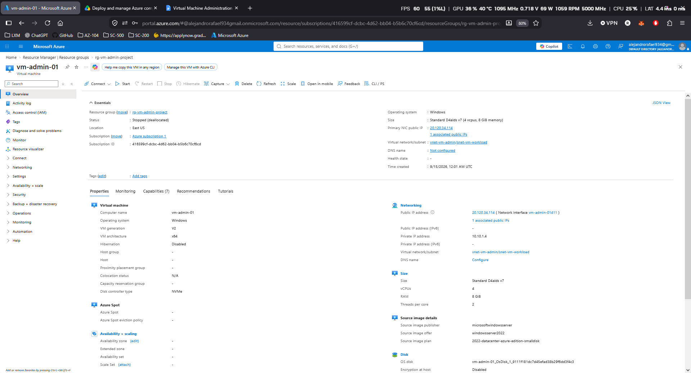

The VM overview confirmed the operating system, VM size, public IP address, private IP address, and the connection to `vnet-vm-admin/snet-vm-workload`. This provided the baseline environment used throughout the rest of the project.

### 2. Data Disk Configuration and Capacity Expansion

A dedicated managed data disk was attached to `vm-admin-01` to provide additional storage for application and company data. After the disk was attached in Azure, it was initialized and formatted inside Windows Server so it could be used as a separate data volume.

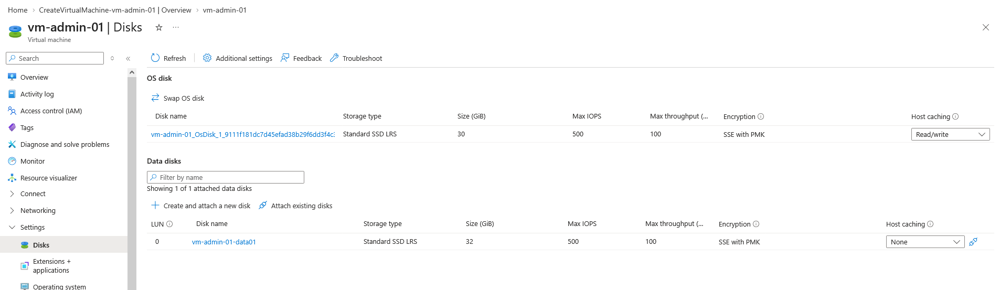

The new disk was configured as the `E:` drive and used to store test files. This separated application data from the operating system disk and provided a realistic environment for practicing disk administration.

To simulate a storage-capacity incident, large test files were created until the data disk was nearly full. This demonstrated how limited free space can affect a production workload and created a realistic scenario that required administrator intervention.

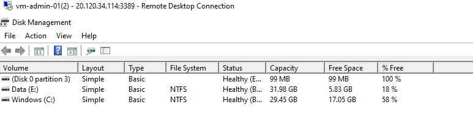

The managed disk was then expanded in Azure from **32 GiB to 64 GiB**. After increasing the disk size in Azure, the additional unallocated space was extended inside Windows using Disk Management so the operating system could use the full capacity.

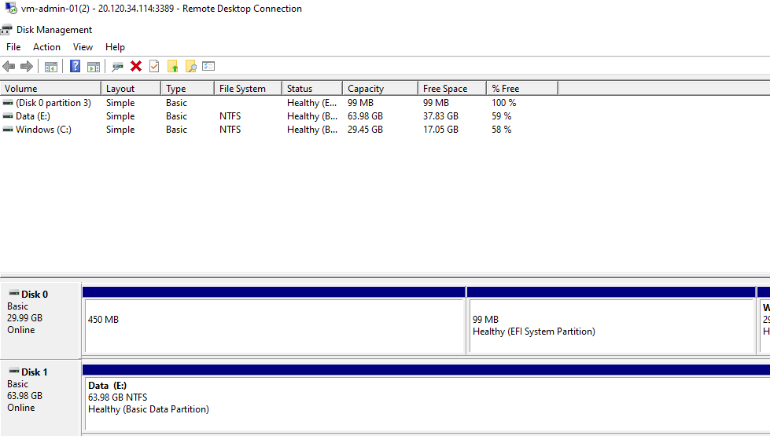

The final validation confirmed that the `E:` volume had successfully increased to approximately **64 GiB**, resolving the capacity issue without replacing the virtual machine or removing the existing data.

### 3. High CPU Incident and VM Resizing

To simulate a performance incident, sustained CPU load was generated inside `vm-admin-01` using PowerShell. Windows Task Manager showed CPU utilization reaching approximately **100%**, confirming that the VM was under heavy processor pressure.

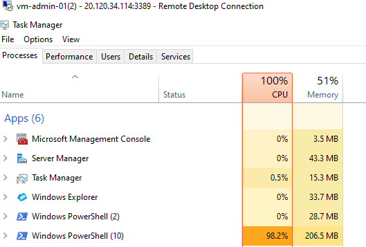

Azure Monitor metrics were then used to confirm the CPU spike from the Azure side. This provided a second source of evidence and demonstrated how an administrator can correlate guest operating system performance with Azure platform monitoring.

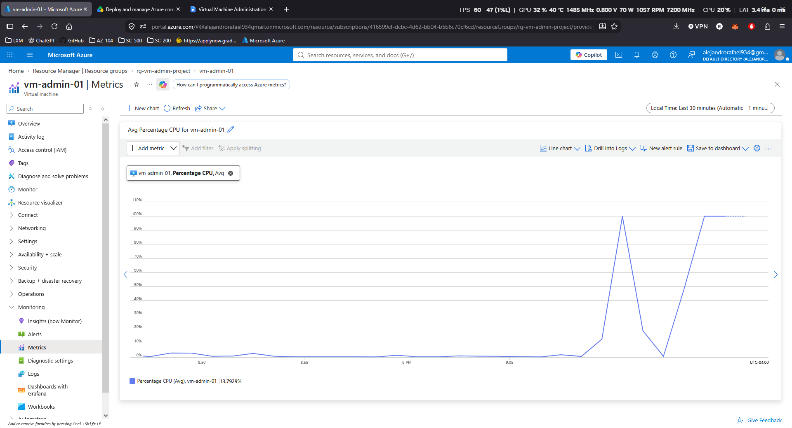

Because the VM was consistently reaching high CPU utilization, the VM size was increased to provide more compute capacity. `vm-admin-01` was resized from a smaller configuration to **Standard D4alds v7 with 4 vCPUs and 8 GiB of RAM**.

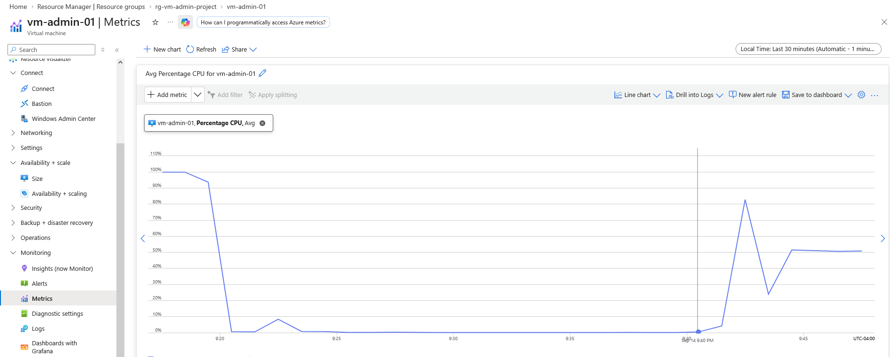

After the resize, the VM was started again and CPU utilization was reviewed to confirm the new compute capacity. The performance pressure was reduced, demonstrating how VM resizing can be used to respond to sustained resource demand without rebuilding the server.

### 4. RDP Access Incident and NSG Rule Troubleshooting

To simulate a remote-access incident, an inbound NSG rule was intentionally created to deny RDP traffic on TCP port **3389** with a higher priority than the existing allow rule.

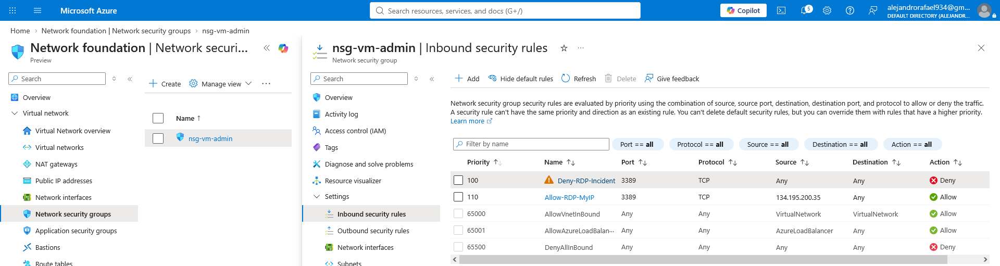

Because Azure evaluates lower priority numbers first, the deny rule was processed before the allow rule. As a result, new RDP connections to `vm-admin-01` were blocked even though the VM itself remained healthy and running.

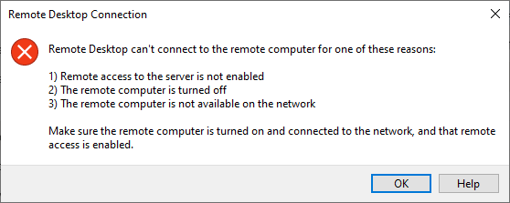

The issue was investigated by reviewing the NSG rule order and identifying the priority conflict. The allow rule for the administrator's public IP was then moved ahead of the deny rule so authorized RDP traffic could be accepted first.

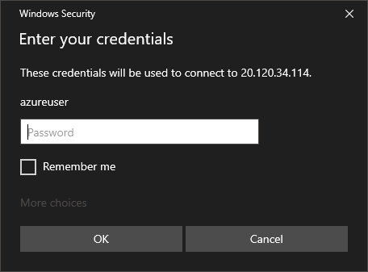

A new RDP connection was tested successfully after the rule correction, confirming that the problem was caused by NSG rule precedence rather than the virtual machine or Windows operating system.

This incident demonstrated how Azure NSG priorities directly affect connectivity and how administrators can troubleshoot remote-access failures by reviewing security rules before making changes to the VM itself.

### 5. Encryption at Host

To strengthen data protection for `vm-admin-01`, **Encryption at Host** was enabled on the virtual machine.

Before the change, the VM configuration showed **Encryption at host: Disabled**, providing a clear baseline before the security improvement was applied.

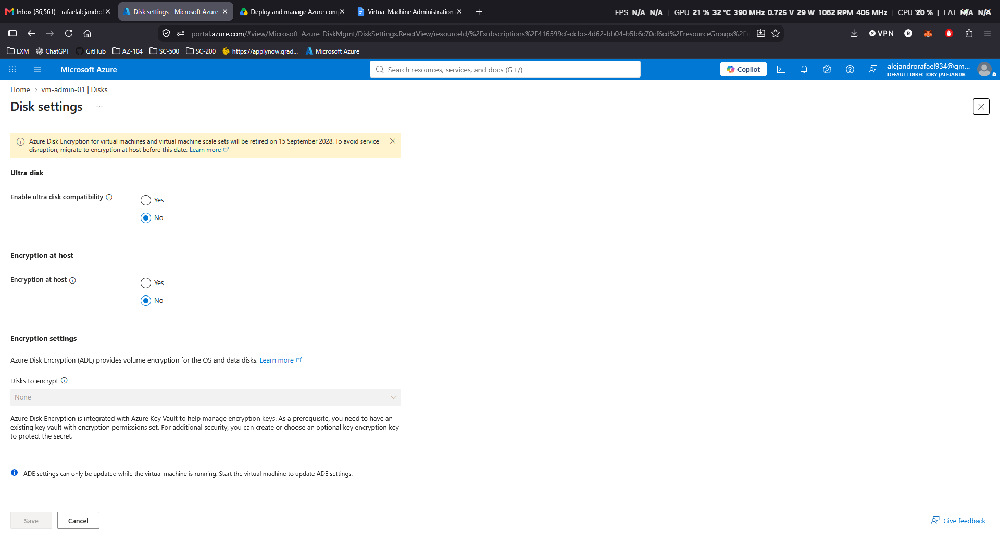

The required `Microsoft.Compute/EncryptionAtHost` feature was registered at the subscription level using Azure Cloud Shell. The VM was then kept in a **Stopped (deallocated)** state while Encryption at Host was enabled.

After the configuration change was saved, the VM properties confirmed that **Encryption at host was successfully enabled**.

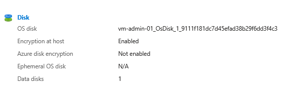

Encryption at Host extends protection to disk-related data handled by the Azure compute host, including the temporary disk and host cache, before data is written to Azure managed disks.

This configuration added another layer of protection to the virtual machine while keeping the existing OS disk and managed data disk configuration intact.

### 6. Virtual Machine Scale Set and Availability Zones

To address the single-point-of-failure risk of relying on only one virtual machine, a **Virtual Machine Scale Set (VMSS)** was deployed as a more resilient compute design.

The scale set was configured with multiple instances and distributed across separate Azure Availability Zones. This allowed the workload to continue running even if one VM instance or one availability zone became unavailable.

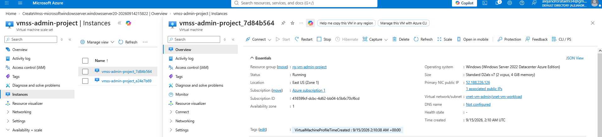

The first VMSS instance was deployed in **Availability Zone 1**.

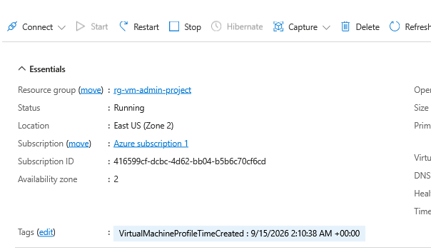

The second instance was deployed in **Availability Zone 2**, providing physical separation between the two backend virtual machines within the East US region.

This design improved resiliency by ensuring that the workload was no longer dependent on a single VM or a single datacenter location.

The VM Scale Set also provided a centralized way to manage multiple similar virtual machines and created the foundation for the Load Balancer and failover testing performed in the next stage of the project.

### 7. Load Balancer Configuration and Failover Validation

To provide a single entry point for the VM Scale Set and improve application availability, a **Standard Public Azure Load Balancer** was configured in front of the VMSS instances.

The Load Balancer included a frontend public IP, a backend pool containing the VMSS instances, a health probe, and a load-balancing rule for HTTP traffic.

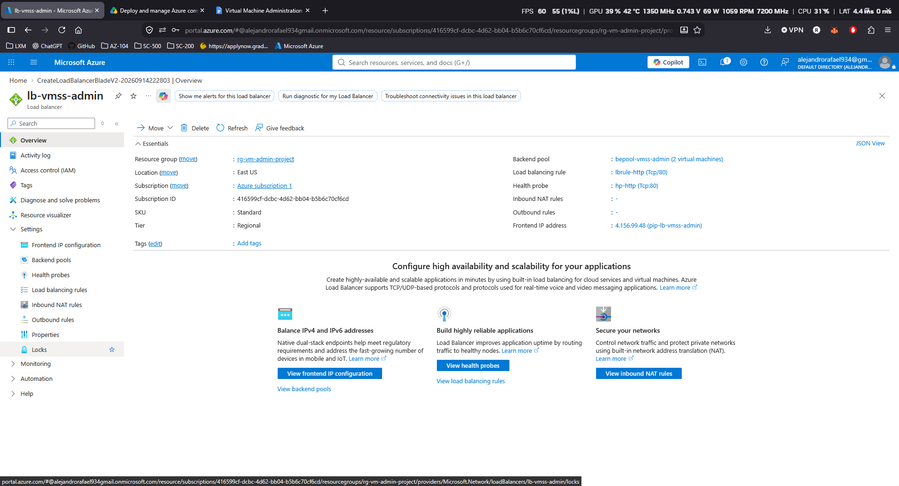

The health probe was configured to monitor the backend instances so Azure could determine which servers were healthy enough to receive traffic.

IIS was then installed on both VMSS instances. Each server displayed a different webpage so it would be easy to identify which instance was currently responding to the request.

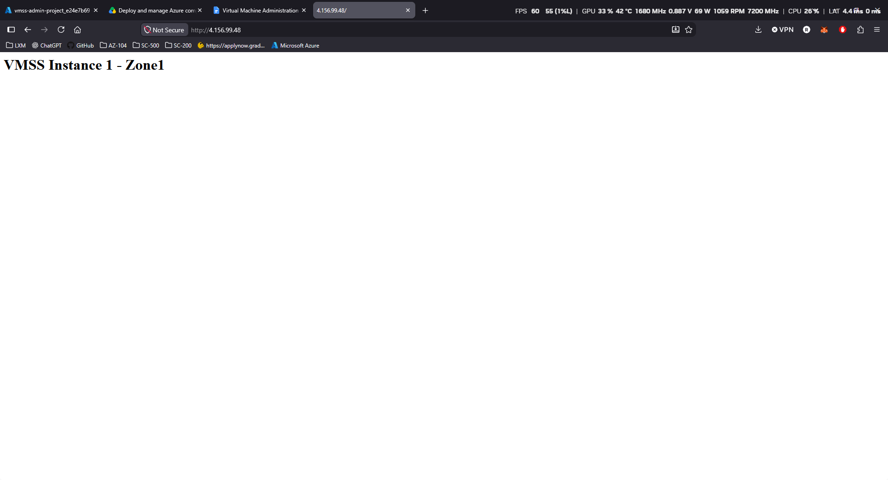

Initial testing showed traffic being successfully served by the VMSS instance in **Availability Zone 1**.

To simulate a failure, the Zone 1 instance was stopped. After the Load Balancer health probe detected that the instance was no longer healthy, traffic was automatically redirected to the remaining healthy VMSS instance in **Availability Zone 2**.

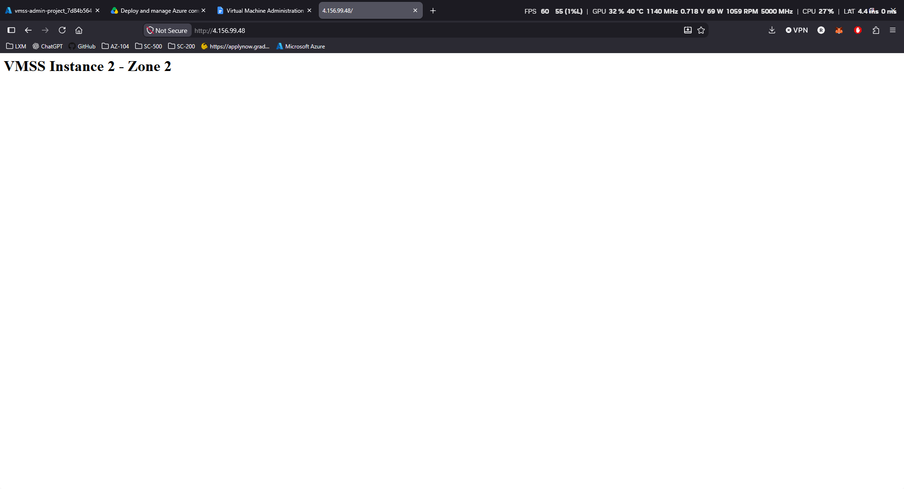

The successful response from the Zone 2 instance confirmed that the Load Balancer could detect backend failure and continue directing traffic to a healthy server.

This test demonstrated real application-level failover rather than simply proving that multiple virtual machines existed across different zones.

### 8. Availability Set Deployment and Fault Domain Validation

To compare another Azure high-availability option, an **Availability Set** was created for a separate pair of virtual machines.

The Availability Set was configured with **2 Fault Domains** and **2 Update Domains**. This design helps distribute virtual machines across separate underlying hardware groups and maintenance groups within the same Azure datacenter.

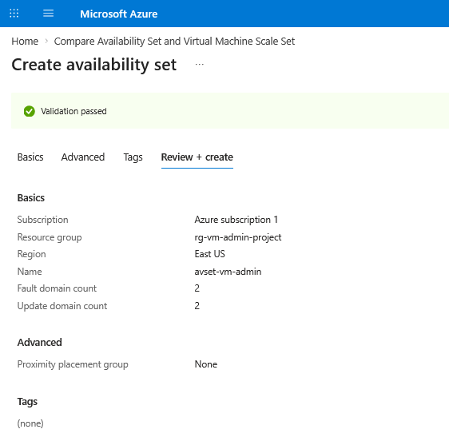

Two Windows Server virtual machines, `vm-avset-01` and `vm-avset-02`, were then deployed into the Availability Set.

After deployment, Azure showed the two VMs placed across different Fault Domains and Update Domains.

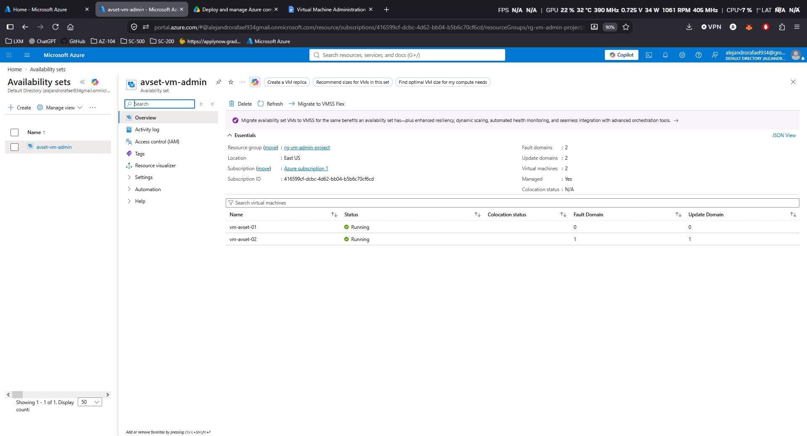

The final placement confirmed that:

- `vm-avset-01` was assigned to one Fault Domain and Update Domain
- `vm-avset-02` was assigned to a different Fault Domain and Update Domain

This configuration reduces the risk of both virtual machines being affected by the same physical hardware failure or planned maintenance event.

The Availability Set was used as a separate high-availability demonstration from the VM Scale Set architecture, allowing the project to show the difference between individually managed VMs using Fault/Update Domains and VMSS instances distributed across Availability Zones.

### 9. Virtual Machine Resource Group Move and Post-Move Validation

As part of the VM lifecycle administration tasks, `vm-admin-01` was moved from its original resource group, `rg-vm-admin-project`, to a new resource group named `rg-vm-admin-moved`.

The move operation was first validated in Azure before it was applied. Only the virtual machine resource was selected for the move, while related resources such as the NIC, disks, and public IP remained in their existing resource group.

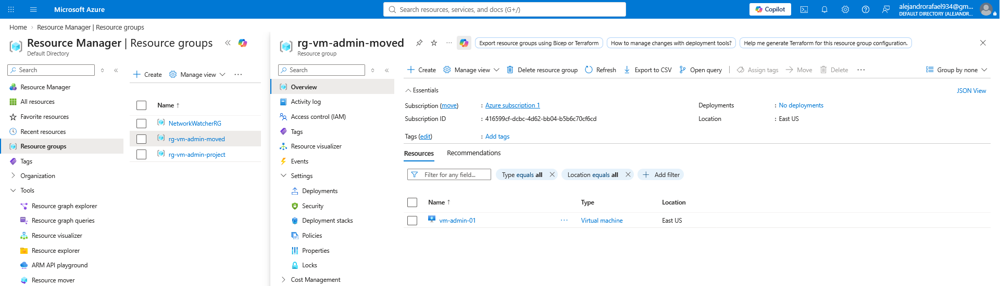

After the move completed, the Azure portal confirmed that `vm-admin-01` was now located inside `rg-vm-admin-moved`.

Because moving a resource changes its Azure resource ID, the next step was to verify that the VM still operated normally after the move.

The virtual machine was started and a new RDP connection was tested successfully.

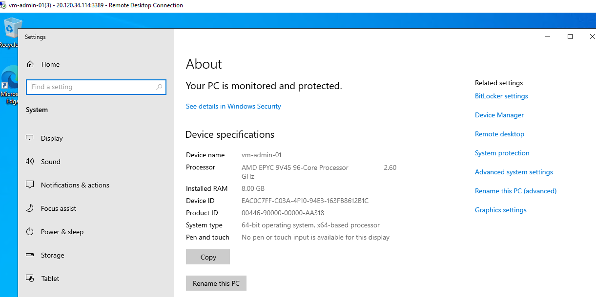

The successful RDP connection confirmed that the VM remained accessible and functional after being moved to the new resource group.

This demonstrated an important Azure administration task: reorganizing resources without rebuilding the virtual machine or disrupting its existing configuration.

## Project Outcome

The project successfully demonstrated the administration, troubleshooting, security, and high-availability capabilities required to manage Azure virtual machines in a realistic environment.

The final solution included a secured standalone Windows Server VM, managed disk expansion, CPU performance troubleshooting and resizing, NSG-based RDP troubleshooting, Encryption at Host, VM Scale Sets across Availability Zones, Azure Load Balancer failover, Availability Set fault/update domain validation, and virtual machine movement between resource groups.

The environment showed how common Azure compute incidents can be identified, remediated, and validated while also improving the resilience and manageability of the workload.

## Key Takeaways

- Azure VM issues should be investigated at both the guest operating system and Azure platform levels.
- VM resizing can provide additional compute capacity when sustained CPU demand exceeds the current VM size.
- Managed disks can be expanded without rebuilding the virtual machine, but the operating system volume must also be extended.
- NSG rule priority directly affects connectivity and is an important part of RDP troubleshooting.
- Encryption at Host adds an additional protection layer for VM disk-related data handled by the Azure compute host.
- VM Scale Sets combined with Availability Zones and Azure Load Balancer provide a resilient architecture for multi-instance workloads.
- Availability Sets provide fault-domain and update-domain separation for individually managed virtual machines.
- Azure resources can be reorganized between resource groups while preserving the VM configuration and connectivity when dependencies remain valid.

