# Azure Secure Network Infrastructure Project

## Project Overview

This project demonstrates the design, implementation, security, and troubleshooting of a multi-tier Azure network environment.

The environment was built to simulate a small enterprise-style application architecture with separate web and backend network tiers. The design focused on controlling communication between those tiers, protecting backend resources from direct internet exposure, securing Azure Storage connectivity, implementing private DNS resolution, distributing web traffic through Azure Load Balancer, and validating failures with Azure Network Watcher.

Rather than configuring isolated Azure services individually, the project brings multiple networking components together into one connected environment and demonstrates how they interact during normal operation and troubleshooting.

## Business Scenario

A company is hosting a web-based application in Azure and needs a network design that separates public-facing web servers from backend systems while still allowing the application tiers to communicate securely.

The environment must:

- Allow users to access the web application through a single public endpoint.
- Distribute incoming traffic across multiple web servers for availability.
- Keep backend systems isolated from direct internet exposure.
- Allow only the required communication between the web and backend tiers.
- Provide secure access to Azure Storage.
- Support private access to Azure PaaS services using Private Endpoint and Private DNS.
- Provide administrators with tools to diagnose routing, security, DNS, and service availability problems.

This project implements a segmented Azure network architecture that addresses those requirements while also providing practical troubleshooting scenarios.

## Project Highlights

- Designed separate web and backend Azure virtual networks to provide network segmentation.
- Connected application tiers privately using Azure VNet peering.
- Secured traffic using Network Security Groups and Application Security Groups.
- Implemented User Defined Route testing to demonstrate how routing can override Azure system routes.
- Configured Azure Storage access using both Service Endpoint and Private Endpoint architectures.
- Implemented Azure Private DNS so Storage traffic resolved to the private endpoint IP.
- Deployed a Standard Azure Load Balancer across two IIS web servers.
- Validated backend health and automatic failover by intentionally stopping IIS on one web server.
- Used Azure Network Watcher to isolate routing, NSG, and destination-port failures.

## Architecture

The environment uses two separate Azure virtual networks to isolate the public-facing web tier from the backend tier.

### Web Tier

- **vnet-web — 10.10.0.0/16**
  - WebSubnet — 10.10.1.0/24
  - WebVM01
  - WebVM02
  - NSG-Web
  - ASG-Web
  - Route table used for UDR testing
  - Azure Load Balancer frontend and backend pool

The web tier hosts the IIS servers that receive application traffic. Both web VMs are placed behind Azure Load Balancer so users connect through a single public endpoint instead of connecting directly to individual VMs.

### Backend Tier

- **vnet-backend — 10.20.0.0/16**
  - BackendSubnet — 10.20.1.0/24
  - BackendVM01
  - NSG-Backend
  - PrivateEndpointSubnet — 10.20.2.0/24
  - Azure Storage Private Endpoint

The backend tier is separated from the web tier and is not intended to receive direct internet traffic. Communication from the web tier is controlled by NSG rules and private network connectivity.

### Private Connectivity

The two VNets are connected through Azure VNet peering. This allows `WebVM01` and `WebVM02` to communicate privately with `BackendVM01` without requiring public IP connectivity between the application tiers.

Azure Storage is also accessed through a Private Endpoint placed in the backend VNet. Private DNS allows resources in the connected VNets to resolve the Storage Account hostname to the private endpoint IP address.

### Network Architecture Evidence

**Web VNet and Subnet Design**

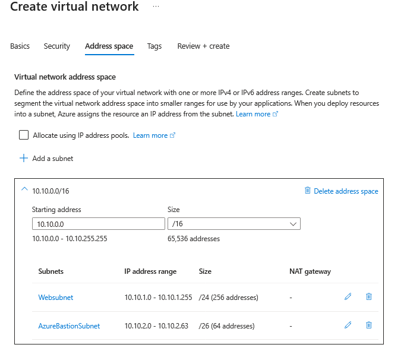

**Backend VNet and Private Endpoint Subnet**

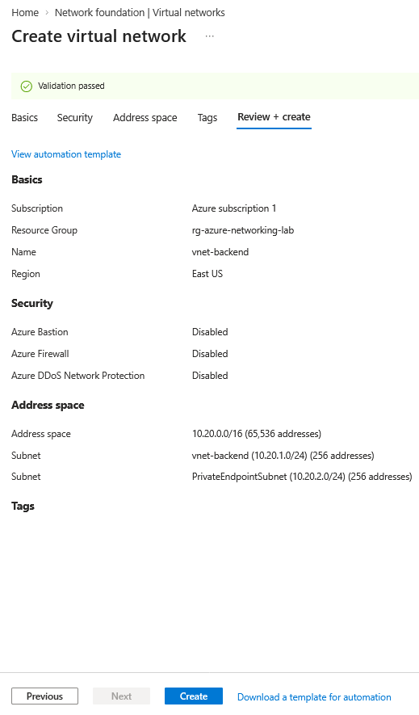

**VNet Peering Configuration**

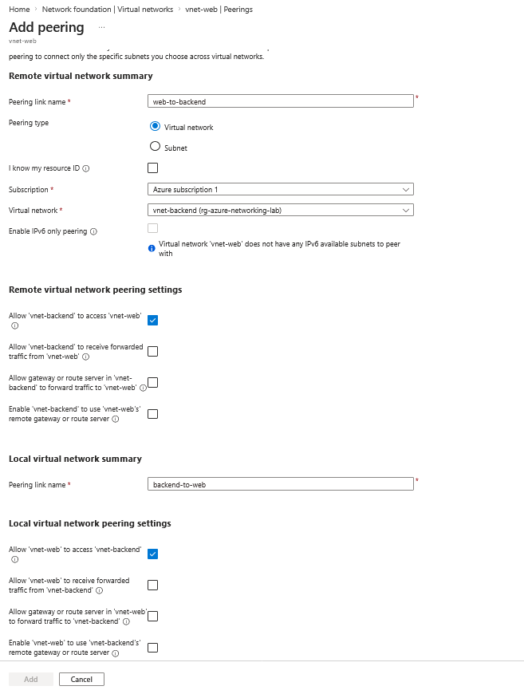

### Network Security Evidence

**Backend NSG Rule Using ASG-Web**

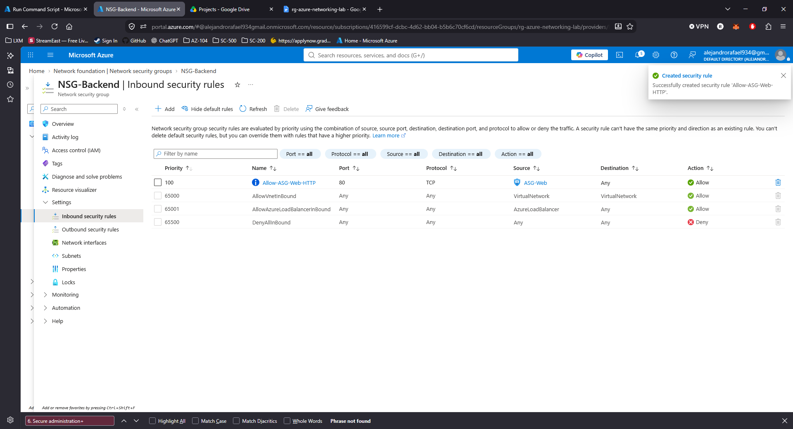

The backend NSG was configured to allow only the required application traffic from the web tier using the `ASG-Web` Application Security Group.

Using an ASG allows security rules to reference a logical group of application resources rather than depending only on individual IP addresses. This makes the security configuration easier to manage as application resources change.

### Private Endpoint Evidence

**Storage Private Endpoint with Private IP**

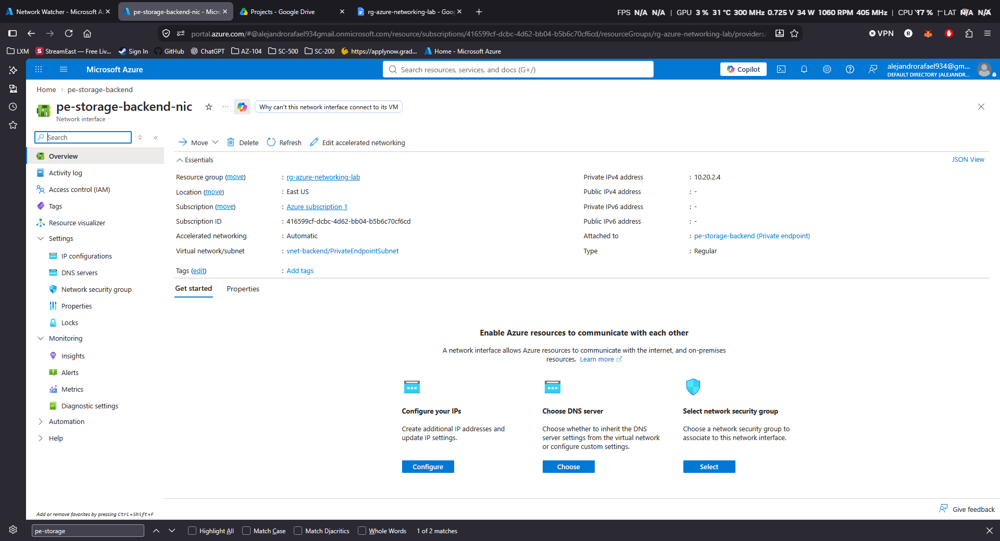

The Azure Storage Account was connected to the backend network through a Private Endpoint. This created a network interface with a private IP inside `PrivateEndpointSubnet`, allowing workloads in the environment to reach the Storage service through private connectivity.

Private DNS was then used so the normal Storage hostname could resolve to the private endpoint IP rather than requiring applications to use a different hostname.

## Azure Resources and Services Used

- Azure Virtual Networks, Subnets, and VNet Peering
- Network Security Groups (NSGs) and Application Security Groups (ASGs)
- Route Tables and User Defined Routes (UDRs)
- Azure Virtual Machines and Azure Load Balancer
- Health Probes and Load Balancing Rules
- Azure Storage Account with Service Endpoints and Private Endpoints
- Azure Private DNS Zones
- Azure Network Watcher with Connection Troubleshoot, NSG Diagnostics, and Next Hop

## Implementation Steps

1. **Created the web and backend network tiers**  
   Built separate Azure virtual networks and dedicated subnets so the public-facing web servers and backend resources were logically separated.

2. **Connected the VNets using VNet peering**  
   Configured bidirectional VNet peering so the web tier could communicate privately with the backend tier across Azure's network.

3. **Applied network security controls**  
   Configured NSGs for the web and backend networks and used `ASG-Web` to group web-tier resources for application-based security rules.

4. **Configured and tested custom routing**  
   Associated a route table with the web subnet and used a temporary UDR to demonstrate how custom routes can override Azure's default routing behavior.

5. **Secured Azure Storage connectivity**  
   Configured a Service Endpoint and later implemented a Private Endpoint to compare different methods of securing access to Azure Storage.

6. **Configured private DNS resolution**  
   Created and linked a Private DNS zone so Storage hostname resolution returned the private endpoint IP from the connected VNets.

7. **Deployed Azure Load Balancer**  
   Added `WebVM01` and `WebVM02` to a backend pool, configured an HTTP health probe, and created a load-balancing rule for TCP port 80.

8. **Validated and troubleshot the environment**  
   Used Azure Network Watcher, Load Balancer health information, DNS testing, and service checks to diagnose intentionally introduced failures.

## Validation and Troubleshooting Results

This environment was validated by testing connectivity, routing, security controls, private DNS resolution, application availability, and load balancer failover.

Several failure scenarios were intentionally introduced so that the root cause could be identified using Azure diagnostic tools rather than simply observing whether a connection worked or failed.

### VNet Peering Validation

Connectivity between `WebVM01` and `BackendVM01` was tested using Azure Network Watcher.

The connection succeeded through `VirtualNetworkPeering`, confirming that:

- the two VNets were successfully peered,
- the network route between the tiers was available,
- and private communication could occur without exposing the backend VM directly to the internet.

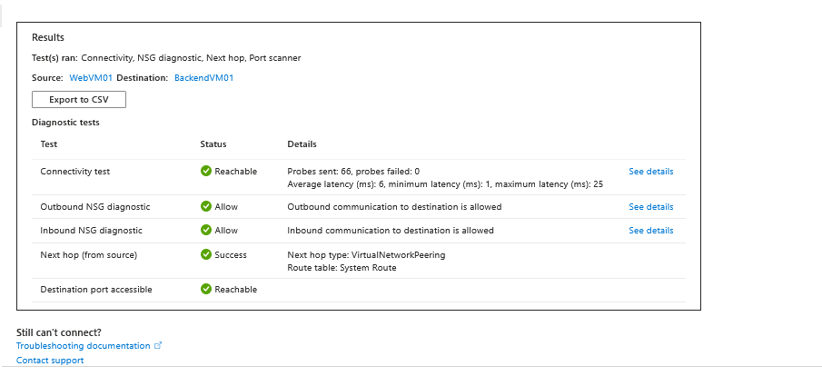

### UDR Routing Troubleshooting

A temporary User Defined Route was created for the backend network with a next hop of `None`.

This intentionally created a blackhole route. Traffic leaving the web subnet for the backend network matched the UDR and was dropped instead of using the normal VNet peering route.

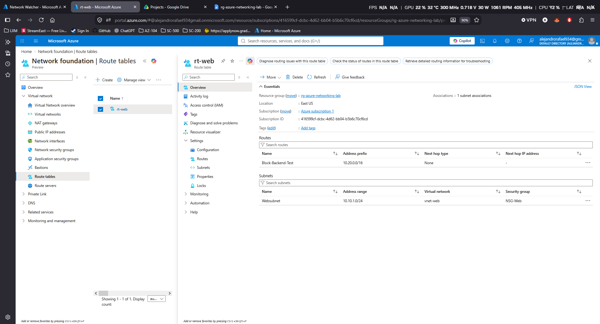

Azure Network Watcher showed that the NSG diagnostics were still allowing the traffic while the connection remained unreachable.

This was important because it demonstrated that an allowed NSG rule does not guarantee connectivity. Routing must also provide a valid path to the destination.

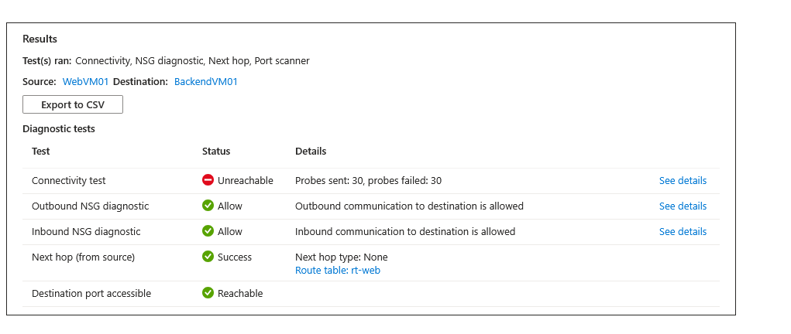

After the temporary route was removed, traffic again used the Azure system route through VNet peering.

### Private DNS Validation

The Private DNS zone was linked to both the web and backend VNets.

This allowed resources in either network to use the private DNS zone when resolving the Azure Storage hostname.

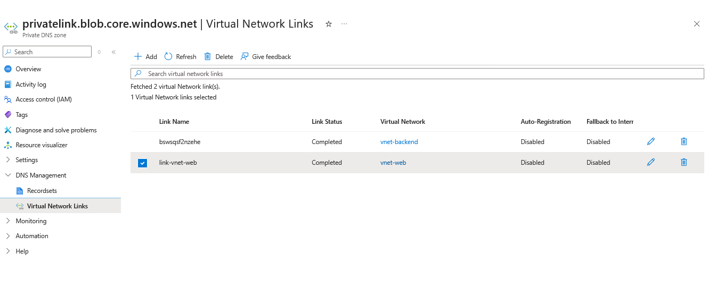

Using `nslookup`, the Storage Account hostname resolved to the private endpoint IP:

`10.20.2.4`

This confirmed that DNS resolution was directing workloads to the Storage Private Endpoint rather than only returning the public Storage endpoint.

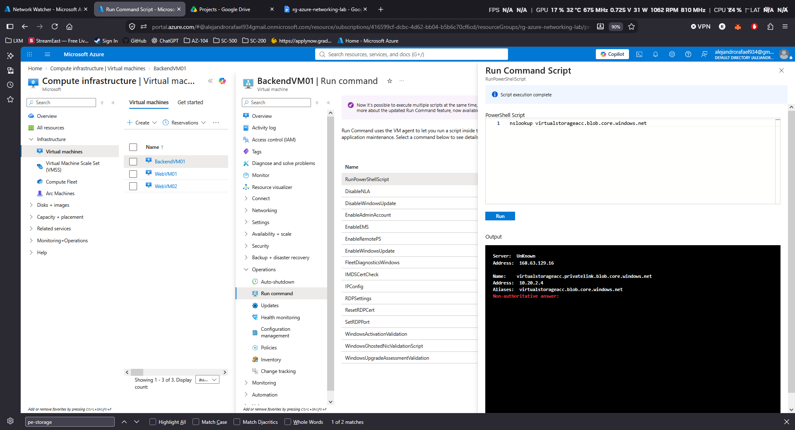

### Load Balancer Validation and Failover

The Azure Load Balancer health probe initially reported both `WebVM01` and `WebVM02` as healthy.

This confirmed that both backend servers were responding on TCP port 80 and were eligible to receive incoming traffic.

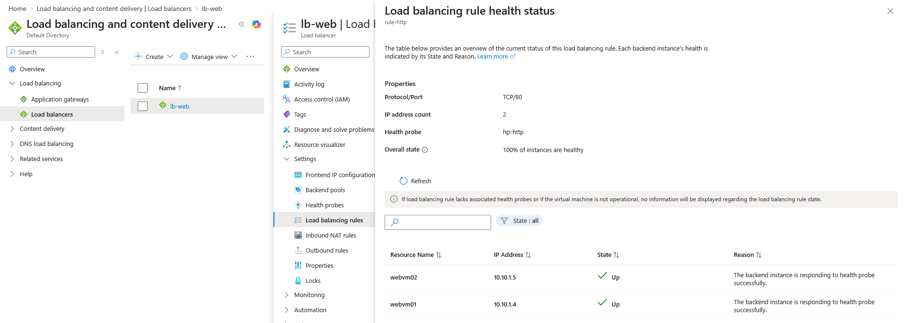

IIS was then intentionally stopped on `WebVM01`.

The health probe detected that the server was no longer responding and marked `WebVM01` as unhealthy while `WebVM02` remained healthy.

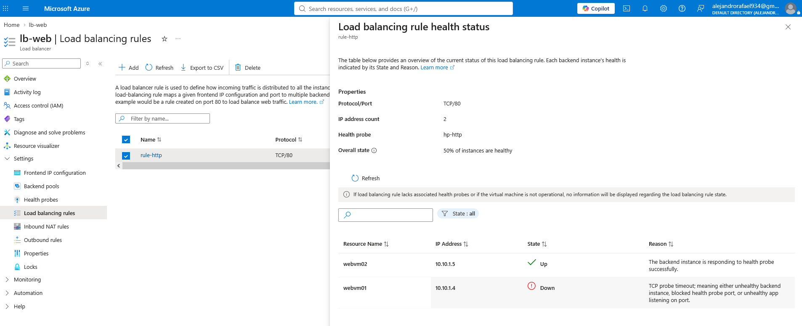

The web application remained accessible through the same Load Balancer public IP, but traffic was now served by `WebVM02`.

This demonstrated that Azure Load Balancer could remove an unhealthy backend instance from rotation and continue serving traffic through the remaining healthy server.

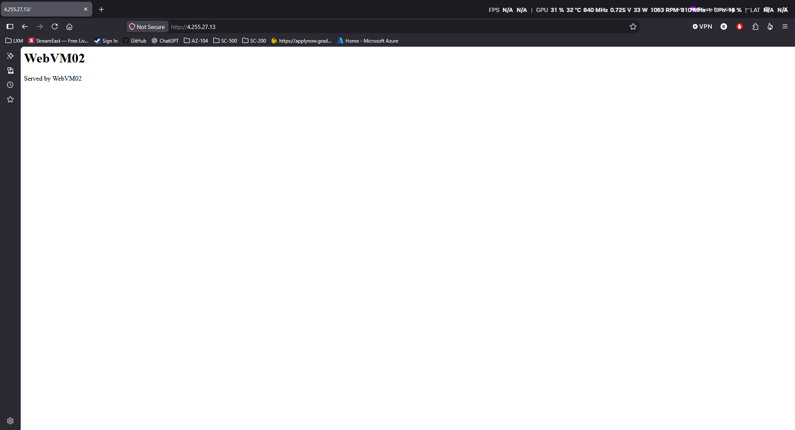

After IIS was restarted on `WebVM01`, the health probe detected the recovery and returned the VM to the healthy backend pool.

### NSG Troubleshooting

A temporary deny rule was added to `NSG-Backend` to block traffic from `ASG-Web` to TCP port `8080`.

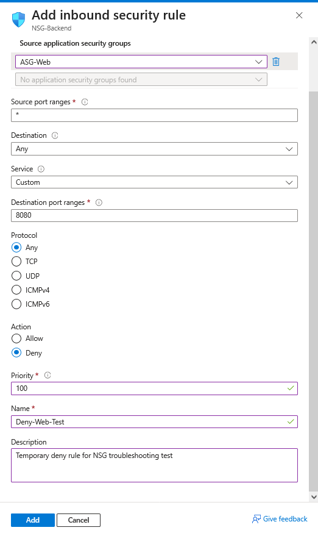

Azure Network Watcher showed:

- outbound NSG communication was allowed,
- VNet peering and routing were working,
- but inbound communication was denied by `NSG-Backend`.

This isolated the NSG as the source of the connection failure.

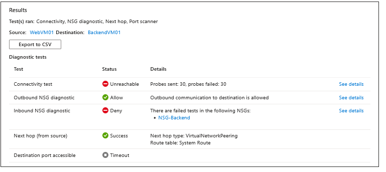

After the temporary deny rule was removed, both inbound and outbound NSG diagnostics returned to an allowed state.

A separate test also demonstrated that connectivity can still fail even when routing and NSGs are correct if the destination application is not listening on the expected port. This helped distinguish network-layer failures from application/service-layer failures.

## Project Outcome

The completed environment provided a segmented Azure network with separate web and backend tiers, controlled private connectivity, secure access to Azure Storage, private DNS resolution, and load-balanced web services.

The project demonstrated both implementation and operational troubleshooting. Instead of validating only successful configurations, failures were intentionally introduced at multiple layers to determine whether the root cause was related to routing, NSGs, DNS, application ports, or backend health.

The final environment successfully demonstrated:

- Private communication between segmented VNets
- Controlled application-tier traffic
- Private connectivity to Azure Storage
- Private DNS resolution
- Load-balanced HTTP traffic across multiple web servers
- Automatic removal and recovery of unhealthy backend servers
- Network troubleshooting with Azure Network Watcher
