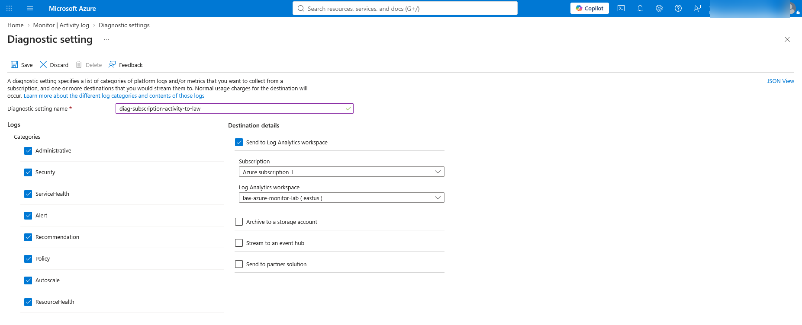
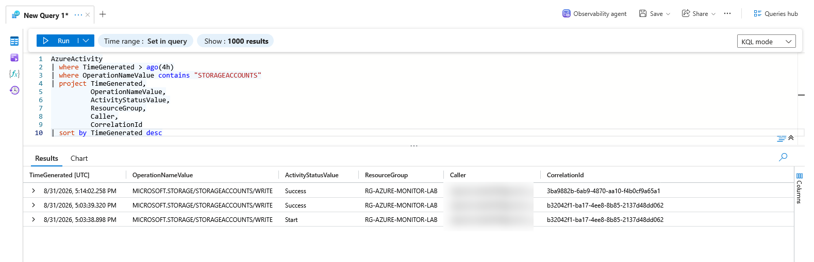
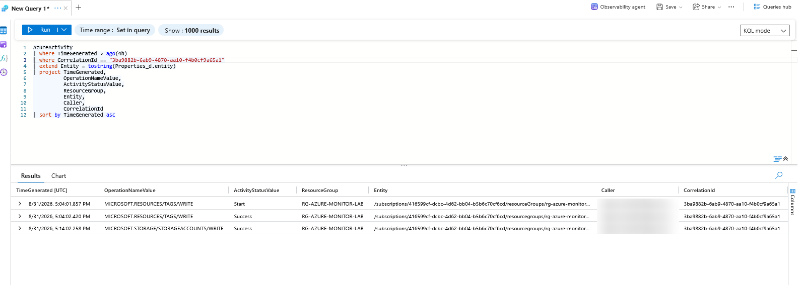
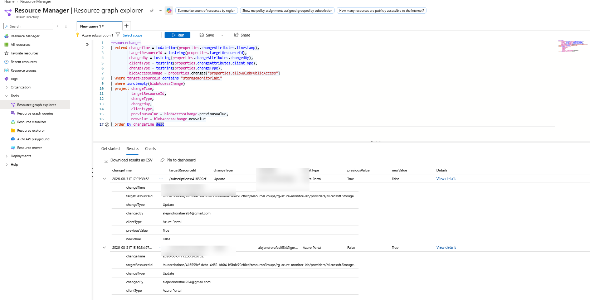
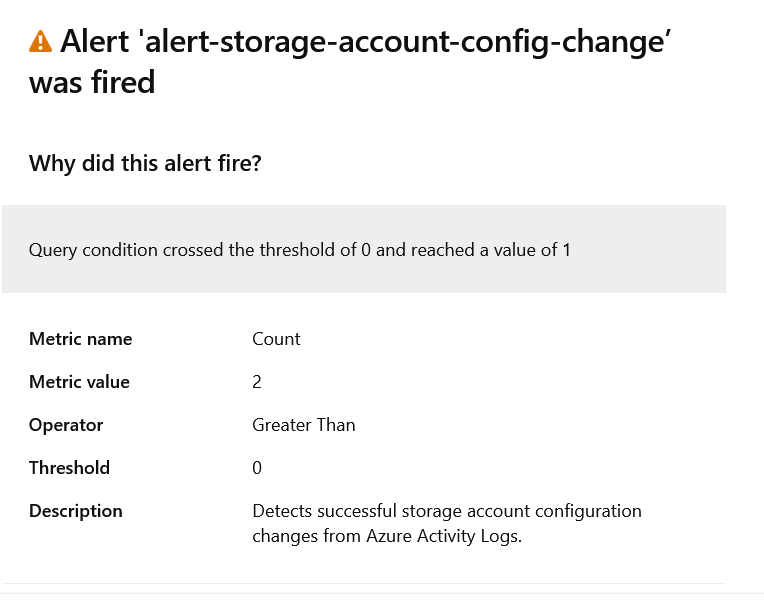
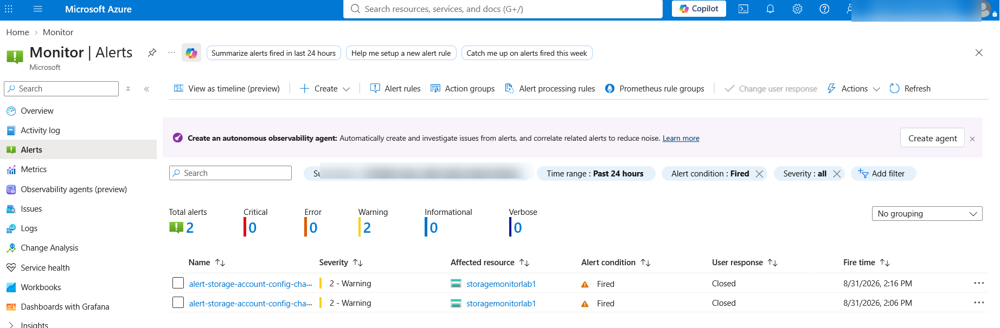
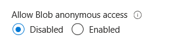

# Azure Log Collection & KQL Analysis Lab

## Overview

This project demonstrates the implementation of an Azure monitoring and incident investigation workflow using Azure Monitor, Log Analytics, Kusto Query Language (KQL), Azure Resource Graph, and Azure Monitor Alerts.

Azure Activity Logs were centralized in a Log Analytics workspace and analyzed with KQL to identify administrative changes made to Azure resources. The investigation focused on a storage account security configuration change involving anonymous blob access.

The solution was extended with automated alerting and email notifications to detect future storage account configuration changes. The workflow concluded with remediation of the risky configuration and closure of the generated alert.

## Business Scenario

An organization requires centralized visibility into Azure administrative activity and the ability to investigate potentially risky configuration changes.

A storage account was modified to allow anonymous blob access. The objective was to determine:

- What configuration changed
- Which Azure resource was affected
- Who performed the change
- When the change occurred
- Whether the operation succeeded
- The previous and new configuration values

After identifying the change, an Azure Monitor alert rule and Action Group were configured to proactively detect and notify administrators of future storage account configuration changes.

## Project Highlights

- Centralized Azure Activity Logs in Log Analytics
- Investigated storage account changes with KQL
- Used `CorrelationId` to trace related events
- Identified the exact `allowBlobPublicAccess` change with Azure Resource Graph
- Created an Azure Monitor alert with email notification
- Remediated the risky configuration and closed the alert
- Troubleshot initial log ingestion issues

## Architecture

```text
Azure Activity Log
        ↓
Diagnostic Setting
        ↓
Log Analytics Workspace
        ↓
AzureActivity Table
        ↓
KQL Investigation
        ↓
Azure Resource Graph Change Analysis
        ↓
Azure Monitor Alert Rule
        ↓
Action Group
        ↓
Email Notification
        ↓
Administrator Remediation
```
## Azure Resources Used

| Resource / Service | Purpose |
|---|---|
| Resource Group | Organized the project resources |
| Log Analytics Workspace | Centralized and queried log data |
| Azure Activity Log | Captured subscription-level administrative events |
| Diagnostic Setting | Routed Activity Logs to Log Analytics |
| Storage Account | Generated configuration-change events |
| KQL | Investigated and filtered Activity Log data |
| Azure Resource Graph | Identified the exact configuration property change |
| Azure Monitor Alert Rule | Detected storage account configuration changes |
| Action Group | Sent email notifications when alerts fired |

## Implementation

### 1. Centralized Azure Activity Logs

To create a central location for monitoring and investigation, a dedicated Log Analytics Workspace was configured for the project.

At the subscription level, a Diagnostic Setting was created to export Azure Activity Log categories into the workspace. This allowed administrative events—such as resource updates, configuration changes, policy activity, and security-related operations—to be stored in Log Analytics and queried with KQL.

This established the logging pipeline used throughout the project:

`Azure Activity Log → Diagnostic Setting → Log Analytics Workspace → AzureActivity`

The configuration ensured that subscription-level administrative activity could be centrally investigated instead of relying only on the Azure Portal Activity Log view.



### 2. KQL Investigation of Storage Account Changes

After Activity Logs began flowing into Log Analytics, KQL was used to investigate administrative operations affecting the storage account.

The query filtered `AzureActivity` records for storage account write operations and returned key investigation fields including:

- Timestamp
- Operation name
- Activity status
- Resource group
- Caller
- Correlation ID

This made it possible to identify when the storage account was modified, who initiated the change, and whether the operation completed successfully.

```kusto
AzureActivity
| where TimeGenerated > ago(4h)
| where OperationNameValue contains "STORAGEACCOUNTS"
| project TimeGenerated,
          OperationNameValue,
          ActivityStatusValue,
          ResourceGroup,
          Caller,
          CorrelationId
| sort by TimeGenerated desc
```


### 3. Correlation Analysis

To understand which Azure Activity Log events belonged to the same administrative operation, the investigation used the `CorrelationId` field.

Filtering on a single correlation ID made it possible to reconstruct the sequence of related events and distinguish individual log entries from the broader configuration change they were part of.

The correlated results showed related operations such as:

- Tag write events
- Storage account write events
- `Start` and `Success` activity states
- The same initiating account across the operation

This helped reconstruct the event timeline instead of analyzing each Activity Log record in isolation.

```kusto
AzureActivity
| where TimeGenerated > ago(4h)
| where CorrelationId == "3ba9882b-6ab9-4870-aa10-f4b0cf9a65a1"
| extend Entity = tostring(Properties_d.entity)
| project TimeGenerated,
          OperationNameValue,
          ActivityStatusValue,
          ResourceGroup,
          Entity,
          Caller,
          CorrelationId
| sort by TimeGenerated asc
```


### 4. Exact Configuration Change Analysis

The Azure Activity Log confirmed that a storage account write operation occurred, but the Activity Log alone did not clearly identify which configuration property changed.

To determine the exact setting modification, Azure Resource Graph Change Analysis was used to inspect resource change history for the storage account.

The investigation identified the property:

`properties.allowBlobPublicAccess`

The change history showed that anonymous blob access was modified from:

- `False → True` — anonymous blob access was enabled
- `True → False` — the setting was later restored to a safer configuration

The change record also provided the administrator account, timestamp, affected resource, and the client used to perform the change.

```kusto
resourcechanges
| extend changeTime = todatetime(properties.changeAttributes.timestamp),
         targetResourceId = tostring(properties.targetResourceId),
         changedBy = tostring(properties.changeAttributes.changedBy),
         clientType = tostring(properties.changeAttributes.clientType),
         changeType = tostring(properties.changeType),
         blobAccessChange = properties.changes["properties.allowBlobPublicAccess"]
| where targetResourceId contains "storagemonitorlab1"
| where isnotempty(blobAccessChange)
| project changeTime,
          targetResourceId,
          changeType,
          changedBy,
          clientType,
          previousValue = blobAccessChange.previousValue,
          newValue = blobAccessChange.newValue
| order by changeTime desc
```


### 5. Automated Alerting and Email Notification

After validating the investigation workflow, an Azure Monitor log search alert was created to proactively detect future storage account configuration changes.

The alert queried the `AzureActivity` table for successful storage account write operations:

```kusto
AzureActivity
| where TimeGenerated > ago(15m)
| where OperationNameValue == "MICROSOFT.STORAGE/STORAGEACCOUNTS/WRITE"
| where ActivityStatusValue == "Success"
```


### 6. Remediation and Incident Closure

After the alert was triggered and the configuration change was investigated, the storage account was remediated by restoring **Allow Blob anonymous access** to `Disabled`.

The alert was then marked as **Closed** from the administrator response workflow to document that the event had been reviewed and handled.

This completed the incident lifecycle:

**Detection → Investigation → Verification → Remediation → Closure**





This demonstrated the complete operational response process, from detecting the configuration change through remediation and formal alert closure.

### 7. Troubleshooting and Lessons Learned

During implementation, the `AzureActivity` table initially returned no results even though subscription Activity Logs were visible in Azure Monitor.

The ingestion path was validated by checking:

- Subscription-level Diagnostic Settings
- `Microsoft.Insights` and `Microsoft.OperationalInsights` resource providers
- Log Analytics workspace network isolation
- Daily ingestion cap settings
- Workspace table availability
- Azure Activity Log source events

The issue was determined to be related to ingestion delay rather than a configuration failure. After propagation completed, Activity Log records began appearing in the `AzureActivity` table and could be queried successfully with KQL.

This reinforced the importance of validating each stage of the monitoring pipeline:

**Event Generation → Diagnostic Settings → Log Analytics Ingestion → KQL Validation → Alerting**

Key lessons from the project included:

- KQL analyzes data after ingestion; it does not collect the data itself
- Azure Activity Logs identify administrative operations, while Resource Graph Change Analysis can provide exact property-level changes
- `CorrelationId` is useful for linking related administrative events
- Alert rules and Action Groups enable proactive detection and notification
- Troubleshooting monitoring solutions requires validating both the log source and the ingestion pipeline

## Skills Demonstrated

- Azure Monitor & Log Analytics
- Kusto Query Language (KQL)
- Azure Activity Logs & Diagnostic Settings
- Azure Resource Graph
- Alert Rules & Action Groups
- Incident Investigation & Remediation

- ## Project Outcome

This project demonstrated an end-to-end Azure monitoring and incident response workflow.

Administrative activity was collected centrally, investigated with KQL, correlated across related events, and analyzed at the property level to identify a risky storage account configuration change. Automated alerting was then implemented to detect future changes, followed by remediation and formal alert closure.

The final workflow demonstrated:

**Detect → Investigate → Correlate → Verify → Alert → Remediate → Close**

