# Azure VM Performance Monitoring & Proactive Alerting
## Project Overview

This project demonstrates the implementation of performance monitoring and proactive alerting for a Windows Server virtual machine in Microsoft Azure.

Azure Monitor was used to analyze CPU, network, and disk performance during a realistic Windows Update maintenance workload. A centralized performance dashboard was created to correlate resource activity, and a metric-based alert rule was configured to detect sustained high CPU utilization.

The alert was integrated with an Azure Monitor Action Group to send email notifications. The alert lifecycle was successfully validated from **Fired** to **Resolved**.

## Project Highlights

- Monitored CPU, network, and disk performance using Azure Monitor
- Correlated multiple metrics during a Windows Update maintenance workload
- Built a centralized Azure VM performance dashboard
- Configured a high-CPU alert using a 70% static threshold
- Integrated an Azure Monitor Action Group with email notifications
- Successfully validated the complete alert lifecycle from **Fired** to **Resolved**

## Business Scenario

An organization is running a Windows Server virtual machine in Azure and requires visibility into its performance.

The operations team needs to:

- Monitor CPU, network, and disk utilization
- Identify abnormal or sustained resource usage
- Correlate performance changes with server workloads
- Receive proactive notifications when CPU utilization exceeds an acceptable threshold
- Confirm when the performance condition returns to normal

## Project Objectives

The objectives of this project were to:

- Deploy and monitor a Windows Server virtual machine in Azure
- Establish a baseline for normal VM performance
- Generate a realistic maintenance workload using Windows Update
- Analyze CPU, network, and disk metrics using Azure Monitor
- Correlate multiple metrics to understand workload behavior
- Build a centralized Azure monitoring dashboard
- Configure a high-CPU metric alert
- Create an Action Group for email notifications
- Validate the alert firing when the configured threshold was exceeded
- Validate automatic alert resolution when CPU utilization returned to normal

## Architecture

The solution used Azure Monitor to collect and visualize platform metrics from the virtual machine. A custom metric alert monitored CPU utilization and triggered an Action Group when the configured threshold was exceeded.

```text
Windows Server VM
      |
      v
Azure Monitor Metrics
      |
      +--> Percentage CPU
      +--> Network In Total
      +--> OS Disk Write Bytes/Sec
      |
      v
VM Performance Dashboard
      |
      v
High CPU Alert Rule
      |
      v
Action Group
      |
      v
Email Notification
```
## Azure Resources Used

- **Azure Virtual Machine** — Windows Server 2025 VM used as the monitored workload
- **Virtual Network** — Provided network connectivity for the virtual machine
- **Network Security Group** — Controlled inbound access to the VM
- **Public IP Address** — Enabled RDP connectivity for administration
- **Azure Monitor Metrics** — Collected and visualized CPU, network, and disk performance data
- **Azure Dashboard** — Centralized the monitored performance metrics into a single operational view
- **Azure Monitor Alert Rule** — Detected sustained CPU utilization above 70%
- **Azure Monitor Action Group** — Sent email notifications when the alert fired and when it automatically resolved

## Implementation

### 1. Deploy the Windows Server Virtual Machine

A Windows Server 2025 virtual machine named `vm-monitoring-lab` was deployed in the existing Azure resource group provided by the lab environment.

The VM was configured with:

- **Region:** East US
- **VM Size:** Standard B2ms
- **Operating System:** Windows Server 2025 Datacenter: Azure Edition
- **Network Access:** Public IP with RDP enabled
- **Virtual Network:** New VNet and subnet created during deployment
- **Network Security:** Network Security Group applied to the VM network interface

The virtual machine served as the monitored workload for the remainder of the project.

After deployment, connectivity was validated using Remote Desktop Protocol (RDP) to confirm that the server was accessible and ready for performance testing.

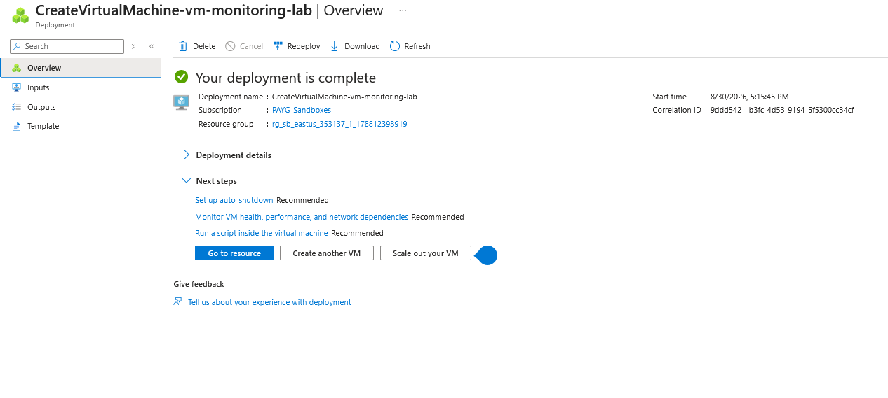

*Windows Server virtual machine deployment completed successfully in Azure.*

### 2. Establish a Performance Baseline

Before generating additional workload on the virtual machine, Azure Monitor Metrics was used to observe the VM's normal CPU behavior.

The **Percentage CPU** metric was selected using the **Virtual Machine Host** metric namespace with an **Average** aggregation. This provided a baseline for comparison before introducing a maintenance workload.

The initial monitoring period showed the VM transitioning from higher startup activity to a lower, more stable CPU utilization level. This baseline made it possible to distinguish normal resource usage from the performance changes generated later in the project.

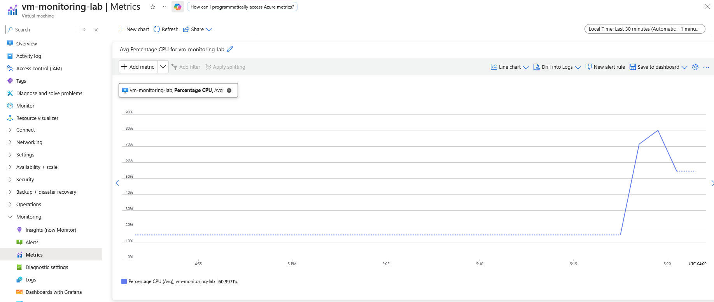

*Azure Monitor Percentage CPU metric used to establish the VM's baseline performance before workload testing.*

### 3. Generate a Realistic Maintenance Workload

To create a realistic performance event, Windows Update was used to generate normal operating-system maintenance activity on the virtual machine.

The update process downloaded and installed Microsoft security and maintenance components, creating measurable CPU, disk, and network activity.

During the workload, Task Manager showed CPU utilization rising significantly above the earlier baseline, reaching approximately **84%** at one point.

This provided a realistic event that could be analyzed in Azure Monitor instead of relying on an artificial CPU stress test.

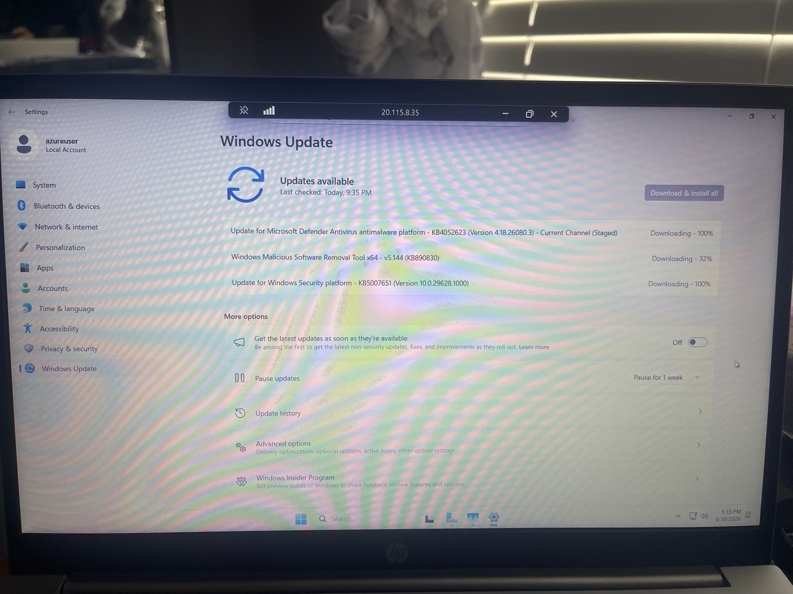

*Windows Update running on the Azure VM to generate a realistic maintenance workload.*

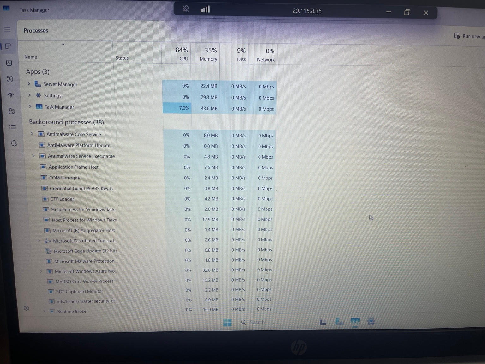

*Task Manager showing elevated CPU utilization during the maintenance workload.*

### 4. Analyze Azure Monitor Metrics

After the maintenance workload was generated, Azure Monitor Metrics was used to analyze how the virtual machine responded.

The analysis focused on three platform metrics:

- **Percentage CPU** — used to measure processor utilization during the workload
- **Network In Total** — used to identify inbound traffic generated while updates were being downloaded
- **OS Disk Write Bytes/Sec** — used to observe write activity on the operating system disk during update processing

The metrics showed clear increases in resource utilization during the maintenance window. CPU usage increased significantly, inbound network traffic spiked as update files were downloaded, and disk write activity increased as the operating system staged and installed those updates.

Reviewing these metrics together provided a clearer understanding of the workload than relying on CPU utilization alone.

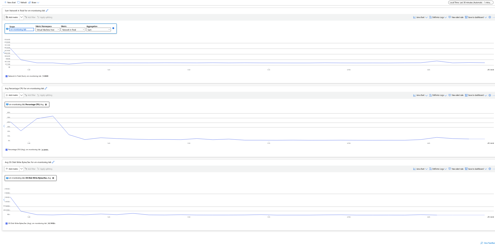

*Azure Monitor metrics used to compare CPU, inbound network traffic, and OS disk write activity during the maintenance workload.*

### 5. Correlate CPU, Network, and Disk Activity

The collected metrics were reviewed together to correlate resource utilization with the Windows Update maintenance workload.

During the update process:

- **CPU utilization increased** as Windows processed and installed updates
- **Inbound network traffic increased** while update packages were downloaded
- **OS disk write activity increased** as files were written, staged, and installed

The timing of these metric changes aligned with the maintenance activity observed inside the virtual machine.

By comparing multiple metrics across the same time period, the workload could be interpreted as expected maintenance activity rather than an unexplained performance issue.

This demonstrated the value of using multiple Azure Monitor signals together when investigating VM performance.

### 6. Build the VM Performance Monitoring Dashboard

To provide a centralized view of the virtual machine's health and performance, the key Azure Monitor metrics were pinned to a custom Azure Dashboard.

The dashboard was designed to display the most important operational metrics in one place:

- **Percentage CPU** — primary indicator of processor utilization
- **Network In Total** — shows inbound network activity
- **OS Disk Write Bytes/Sec** — shows operating system disk write throughput

A Markdown information tile was also added to document the monitored resource, the purpose of the dashboard, and the metrics being tracked.

This created a reusable operational view that could be opened quickly without having to configure each metric individually.

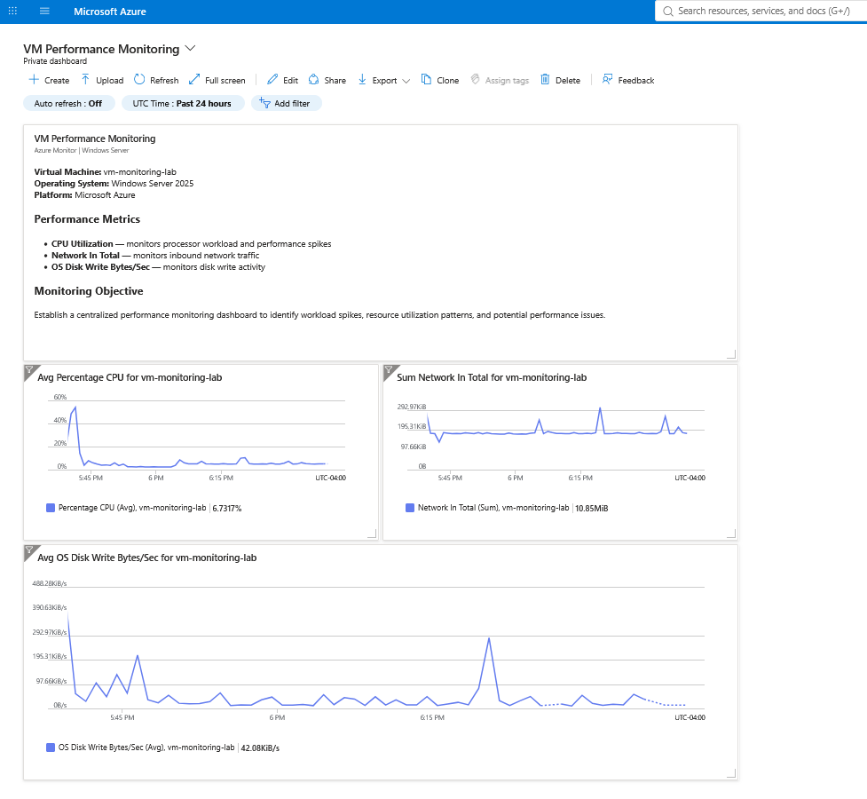

*Custom Azure Dashboard providing centralized visibility into CPU, network, and disk performance for the monitored virtual machine.*

### 7. Configure the High-CPU Alert Rule

To move from passive monitoring to proactive detection, a custom Azure Monitor metric alert was created for the virtual machine.

The alert monitored the **Percentage CPU** metric and was configured with the following condition:

- **Threshold type:** Static
- **Aggregation:** Average
- **Operator:** Greater than
- **Threshold:** 70%
- **Evaluation frequency:** Every 1 minute
- **Lookback period:** 5 minutes
- **Severity:** 2 - Warning

This configuration was designed to detect sustained high CPU utilization rather than brief spikes.

The rule was named `alert-vm-high-cpu` and enabled immediately after creation.

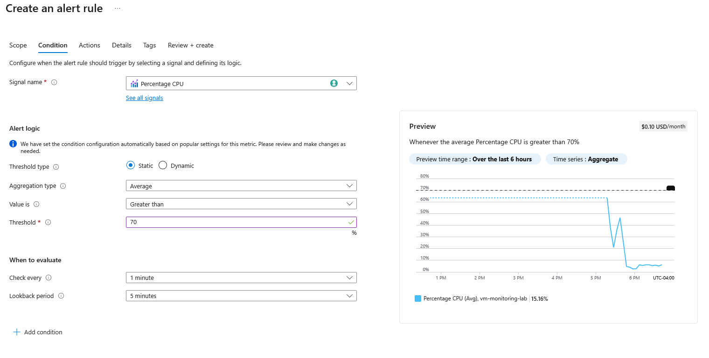

*Azure Monitor metric alert configured to trigger when average CPU utilization exceeds 70% over a 5-minute period.*

### 8. Configure the Action Group

An Azure Monitor Action Group was created to define how the monitoring system should respond when the high-CPU alert was triggered.

The Action Group was named `ag-vm-monitoring-alerts` and configured with an email notification so that the administrator would be notified when the alert condition was met.

The Action Group was then associated with the `alert-vm-high-cpu` alert rule.

This created the following notification flow:

- Azure Monitor evaluates the VM's CPU metric
- The alert fires when average CPU utilization exceeds 70%
- The associated Action Group is triggered
- An email notification is sent to the administrator

Using an Action Group separates the alert condition from the notification method, allowing the same notification configuration to be reused by additional alerts if needed.

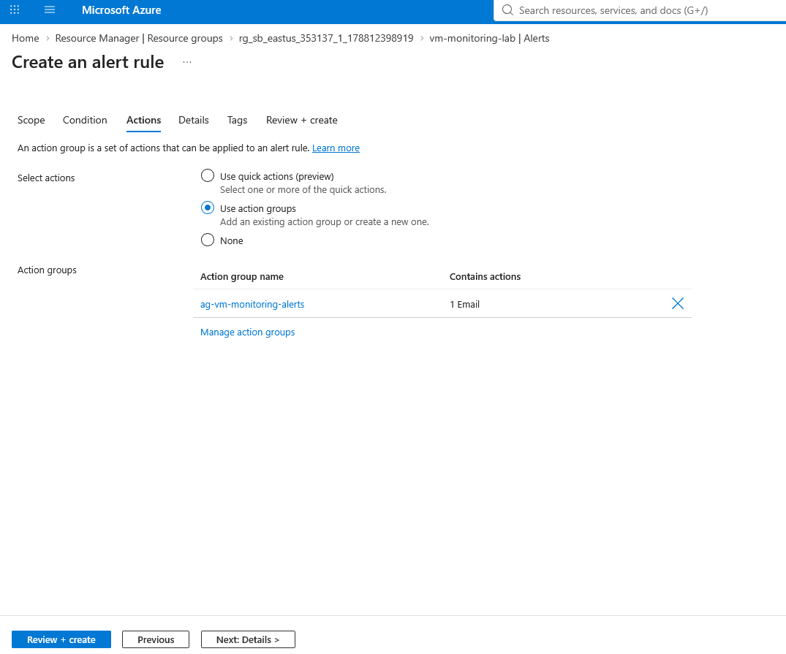

*Azure Monitor Action Group associated with the high-CPU alert rule and configured with an email notification.*


### 9. Validate Alert Notification

The alerting workflow was tested to confirm that the configured monitoring rule and Action Group operated correctly.

During the test, the VM's average CPU utilization exceeded the configured **70% threshold**. Azure Monitor detected the condition and changed the alert state to **Fired**.

The alert details showed an actual average CPU value of approximately **73.02%**, confirming that the metric crossed the configured threshold.

The associated Action Group was triggered automatically and an email notification was successfully delivered to the administrator.

This validated the complete detection and notification workflow:

- VM CPU utilization exceeded the threshold
- Azure Monitor evaluated the metric condition
- `alert-vm-high-cpu` entered the **Fired** state
- `ag-vm-monitoring-alerts` was triggered
- An email notification was delivered

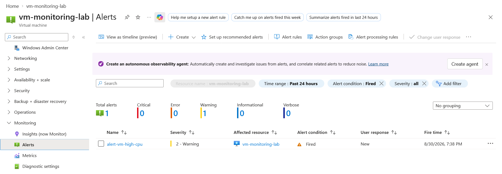

*Azure Monitor alert in the Fired state after average CPU utilization exceeded the configured 70% threshold.*

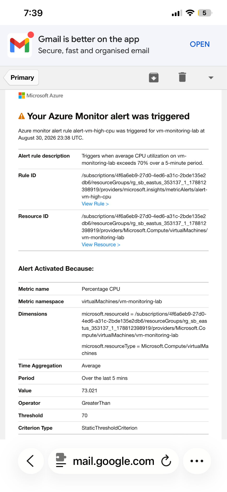

*Email notification generated by the Azure Monitor Action Group after the high-CPU alert fired.*

### 10. Validate Automatic Alert Resolution

After the CPU utilization returned below the configured threshold, Azure Monitor automatically changed the alert state from **Fired** to **Resolved**.

The alert history showed the complete lifecycle of the monitoring event:

- The high-CPU condition was detected
- The alert entered the **Fired** state
- The Action Group was triggered
- CPU utilization later returned below the threshold
- The alert automatically changed to **Resolved**
- A resolution notification was sent through the Action Group

This confirmed that the alert rule was able to detect both the start and the end of the performance condition without requiring manual intervention.

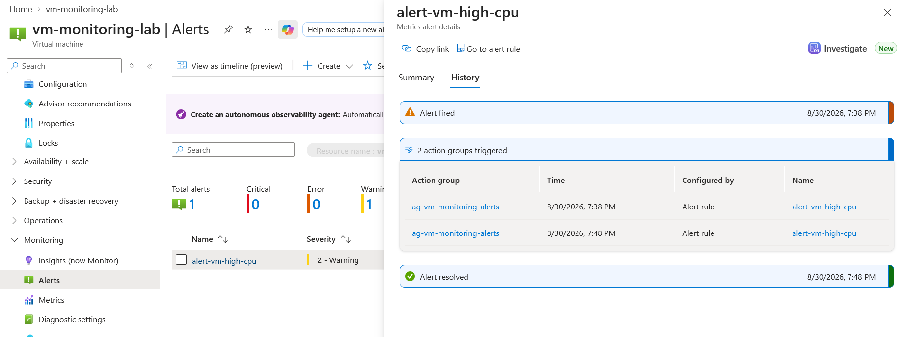

*Azure Monitor alert history showing the transition from Fired to Resolved and the associated Action Group activity.*

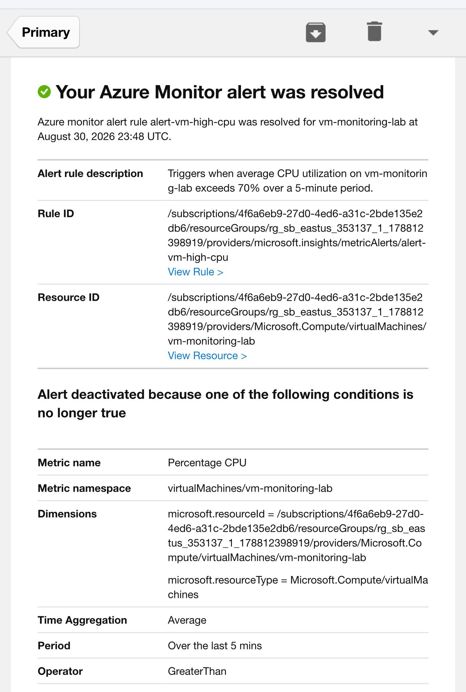

*Email notification confirming that the Azure Monitor alert automatically resolved after CPU utilization returned below the configured threshold.*

## Results

The monitoring solution successfully captured and correlated VM performance activity during a realistic Windows Update workload.

The project validated that:

- Azure Monitor detected measurable increases in CPU, network, and disk activity
- A centralized dashboard provided a clear operational view of VM performance
- The high-CPU alert triggered when average CPU utilization exceeded the configured 70% threshold
- The Action Group successfully delivered an email notification
- The alert automatically transitioned from **Fired** to **Resolved** after CPU utilization returned below the threshold
- A resolution notification was also successfully delivered

The end-to-end monitoring workflow was successfully tested from workload generation through detection, notification, and recovery.

## Skills Demonstrated

- Azure Virtual Machine administration
- Azure Monitor Metrics
- Performance monitoring and troubleshooting
- Azure Dashboard creation
- Azure Monitor alert rules
- Azure Monitor Action Groups
- Email alert notifications
- Alert lifecycle validation

## Key Takeaways

This project demonstrated how Azure monitoring can be used not only to observe resource performance, but also to proactively detect abnormal conditions and notify administrators.

Analyzing multiple metrics together provided better context than relying on a single performance indicator. CPU, network, and disk activity could be correlated with the Windows Update workload to explain the observed behavior.

The alerting workflow also demonstrated the importance of proactive monitoring. Rather than waiting for a user to report degraded performance, Azure Monitor can automatically detect sustained resource utilization, notify administrators, and confirm when the condition has recovered.
